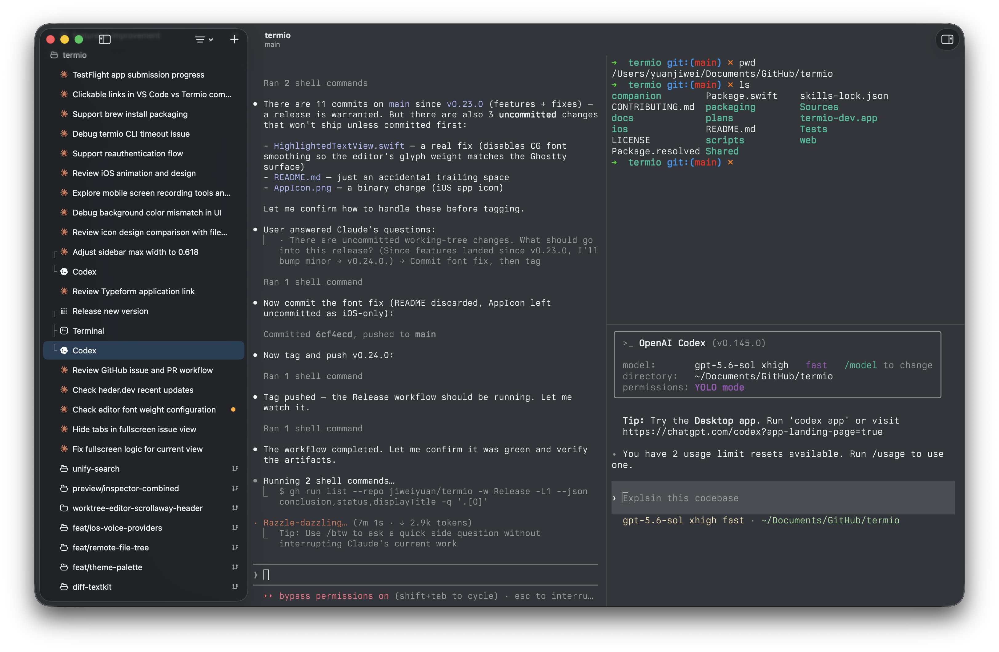
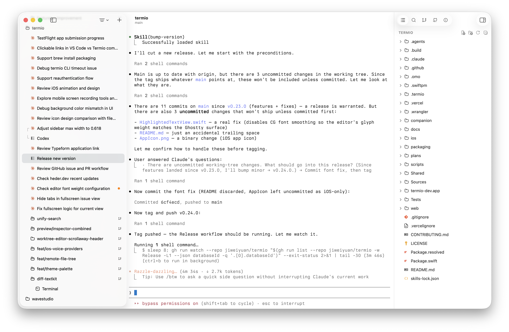
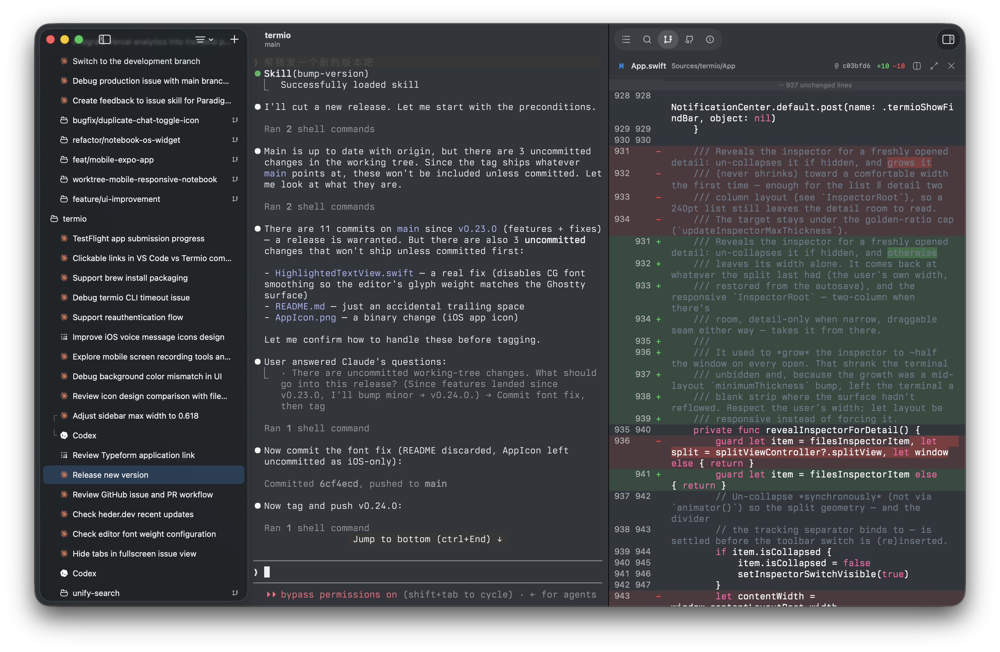
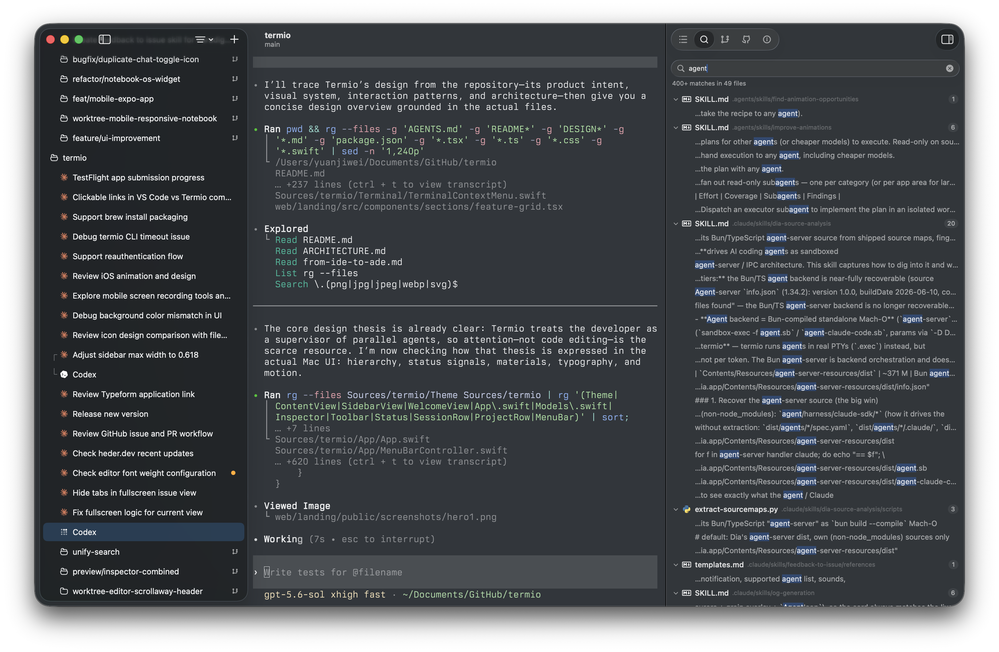
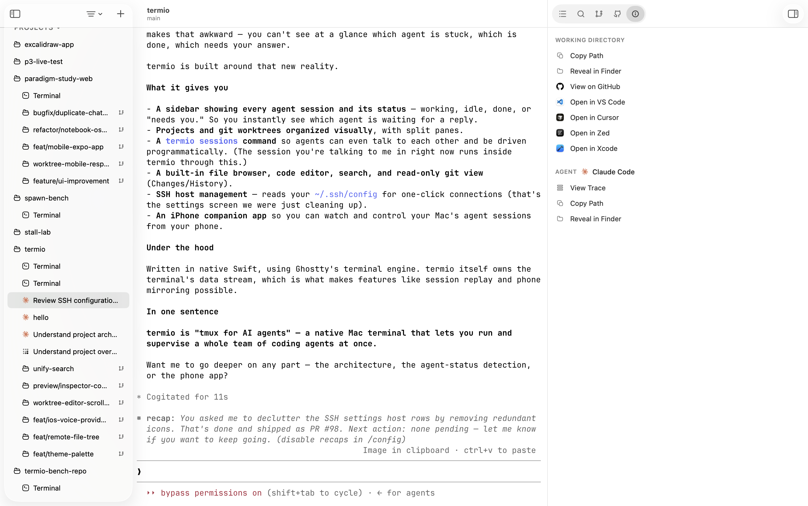
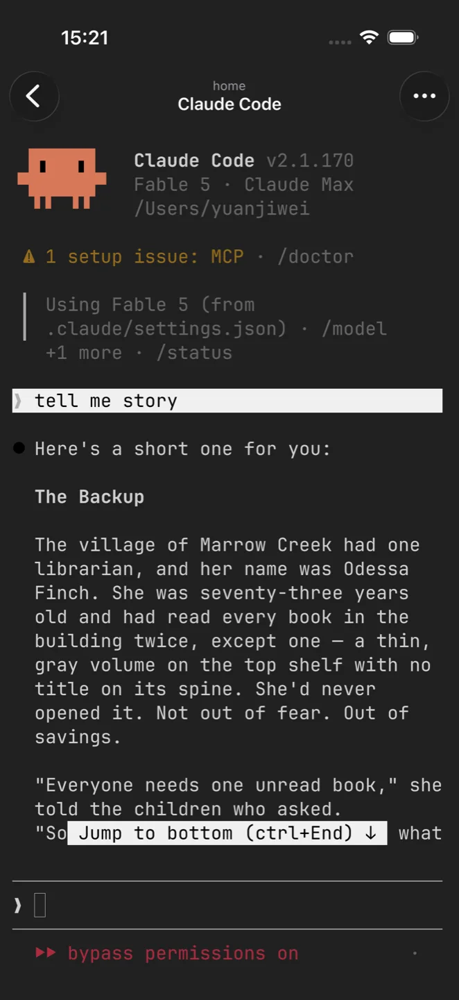
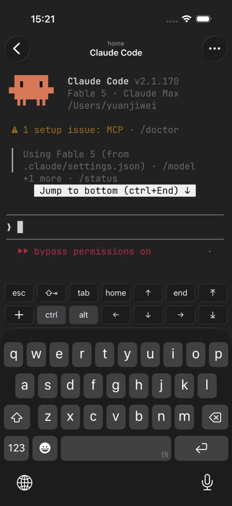
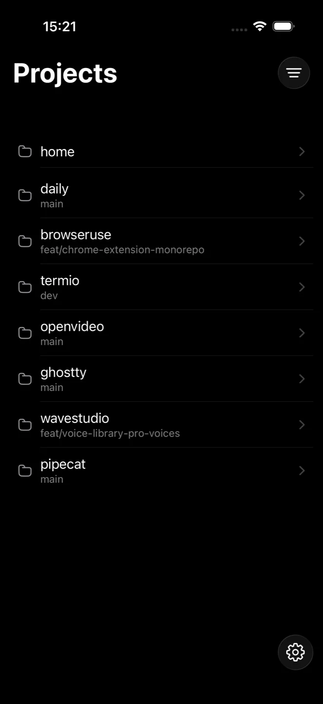

> 번역에서 고칠 부분이 있다면 PR을 보내주세요.

<div align="center">


### 터미널 퍼스트 에이전트 개발 환경

[](https://github.com/termio-sh/termio/releases)
[](LICENSE)
[](https://discord.gg/H9DKVwsE5f)

<p><a href="README.md">English</a> | <a href="README.zh-CN.md">简体中文</a> | <a href="README.zh-TW.md">繁體中文</a> | <a href="README.ja.md">日本語</a> | 한국어</p>

<br />

Claude Code, Codex를 비롯한 어떤 CLI 에이전트든 진짜 Mac 터미널에서 나란히 실행해보세요 —<br />
Swift와 libghostty, Electron은 없습니다. 누가 여러분을 기다리는지 메뉴바 점이 알려주고,<br />
자리를 비운 사이에는 iPhone이 지켜봅니다.

<br />

[**macOS용 다운로드**](https://downloads.termio.sh/termio.dmg) &nbsp;&bull;&nbsp; [웹사이트](https://termio.sh) &nbsp;&bull;&nbsp; [문서](https://termio.sh/docs) &nbsp;&bull;&nbsp; [변경 내역](https://termio.sh/changelog) &nbsp;&bull;&nbsp; [Discord](https://discord.gg/H9DKVwsE5f)

<br />



</div>

## 설치하기

**[macOS용 Termio 다운로드](https://downloads.termio.sh/termio.dmg)** —
무료이고 계정도 필요 없어요. macOS 14 이상에서 동작해요.
[Homebrew](https://brew.sh)로도 설치할 수 있어요:

```sh
brew install --cask termio-sh/tap/termio
```

**iPhone에서는** [TestFlight](https://testflight.apple.com/join/1Arf1UKR)에서
컴패니언 베타를 받은 뒤, Mac 앱의 Settings ▸ Mobile에 뜨는 QR 코드를
스캔해서 페어링하면 돼요.

## 에이전트로 개발하는 시대를 위해 만들었어요

IDE는 사람이 직접 코드를 타이핑하던 시절에 맞춰 만들어졌어요. 에이전트가
대부분의 코드를 쓰는 시대에는 개발 환경의 역할도 달라져요. 에이전트가
일하는 곳이자, 여러분이 지시하고, 검토하고, 막힌 곳을 풀어주는 곳이어야
하죠. Termio가 바로 그 환경이에요. 에이전트가 이미 살고 있는 터미널을
중심에 두고, 새로운 작업 방식에 맞춰 만들었어요 — 여러 에이전트가 동시에
달리고, 대부분은 알아서 잘 굴러가는데, 하나쯤은 막혀 있는 그런 상황이요.
(더 긴 이야기는 [*From IDE to ADE*](docs/essays/from-ide-to-ade.md)에서
읽어보세요.)

- **웹 뷰가 아니라 진짜 터미널이에요.** [libghostty](https://ghostty.org)
  (Ghostty의 터미널 코어) 위에 Swift + AppKit으로 만들었고, Metal로
  렌더링해요. Electron도, xterm.js도 없어요.
- **프로젝트 → 세션.** 사이드바가 실제 일하는 방식을 그대로 반영해요.
  프로젝트마다 자기 터미널과 에이전트를 품고, 병렬 작업용 git 워크트리가
  그 아래에 중첩돼요.
- **설정 없이 되는 상태 표시.** Termio가 에이전트마다 고유의 훅을 알아서
  연결하고, 에이전트가 원래 내보내는 신호를 읽어요. 작업 중인지, 대기
  중인지, *needs you*인지 세션마다 점으로 보여주고, 메뉴바 트레이는 평소엔
  잠잠하다가 에이전트가 일할 때 은은하게 깜빡이고, 여러분의 답을 기다리며
  막혀 있을 때 울려요.
- **자리를 뜨지 않고 검토해요.** 읽기 전용 git 패널(변경 사항, 히스토리,
  통합 diff), 클릭하면 바로 고칠 수 있는 에디터가 딸린 파일 트리, 프로젝트
  전체 내용 검색까지 — 커밋은 여전히 터미널에서 해요.
- **무료예요.** 계정도, 라이선스 키도, 유료 등급도 없어요. MIT
  라이선스예요.

## 기능

<table>
<tr>
<td width="50%" valign="middle">

### 나란히 놓인 세션

프로젝트마다 자기 터미널과 에이전트 세션을 따로 가져요. 사이드바에서 바로
전환할 수 있고, 각 세션은 다른 곳을 보는 동안에도 계속 도는 살아 있는
PTY예요.

</td>
<td width="50%">
  
</td>
</tr>
<tr>
<td width="50%" valign="middle">

### 에이전트가 여러분을 찾는 순간을 알아요

세션 점이 작업 중 / 대기 중 / needs-you 상태를 보여주고, 이걸 한데 모은
메뉴바 트레이는 어떤 앱을 쓰고 있든 흘끗 확인할 수 있어요. 트레이에서
세션을 고르면 Termio가 그 세션을 앞으로 가져와요.

</td>
<td width="50%">
  
</td>
</tr>
<tr>
<td width="50%" valign="middle">

### 분할 패널

세션 안에서 Ghostty 스타일로 화면을 나눌 수 있어요: 왼쪽엔 에이전트,
오른쪽엔 개발 서버와 셸을 놓는 식으로요.

</td>
<td width="50%">
  
</td>
</tr>
<tr>
<td width="50%" valign="middle">

### 파일과 내장 에디터

터미널 옆에 파일 트리가 있어요. 파일을 클릭하면 구문 강조와 자동 저장을
갖춘 에디터로 그 자리에서 바로 편집할 수 있어요. 이미지와 PDF는 Quick
Look으로 열리고, 에이전트가 출력한 경로는 ⌘-클릭하면 미리 볼 수 있어요.

</td>
<td width="50%">
  
</td>
</tr>
<tr>
<td width="50%" valign="middle">

### 인스펙터

지금 보고 있는 세션의 모든 것이 한곳에 모여요: 통합 diff가 딸린 git 변경
사항과 히스토리, 프로젝트 전체 내용 검색, 읽기 좋게 정리된 에이전트 대화
트레이스, 그리고 작업 디렉토리 액션까지요.

</td>
<td width="50%">
  
</td>
</tr>
<tr>
<td width="50%" valign="middle">

### 커맨드 팔레트

검색창 하나로 어떤 세션, 프로젝트, 액션으로든 바로 이동해요.

</td>
<td width="50%">
  
</td>
</tr>
</table>

**이 밖에도 들어 있어요:**

- **Git 워크트리** — 사이드바에서 워크트리를 만들면 프로젝트 아래 중첩
  폴더로 나타나요. 병렬 작업마다 브랜치 하나씩이죠. CLI로 만든 워크트리도
  같이 표시돼요.
- **Chats** — 어떤 프로젝트에도 속하지 않는 임시 에이전트 대화를 키 입력 한
  번으로 시작할 수 있어요.
- **사용량 미터** — Claude와 Codex 플랜 한도를 각자의 자격 증명에서 로컬로
  읽어 Settings → Usage에 보여줘요.
- **테마** — 라이트, 다크, 그리고 시스템을 따라가는 글래스 모드가 있어요.
- **자동 업데이트** — Sparkle 업데이트가 들어간 공증된 DMG예요. 새 버전이
  알아서 설치돼요.

## 쓰던 에이전트 그대로 동작해요

Claude Code, Codex, Gemini CLI, Grok, Cursor Agent, Copilot, Amp, OpenCode,
Pi, Kimi — 그 밖의 어떤 CLI 에이전트든 쓸 수 있어요. 세션이 그냥 진짜
터미널이니까요. 내장 지원되는 에이전트는 Termio가 각각의 훅이나 플러그인을
자동으로 설치해서, 처음 실행하는 순간부터 상태 감지가 동작해요.

## 터미널에서 조종하기

Termio는 `termio` CLI를 함께 제공해서 세션을 스크립트로 다룰 수 있어요 —
에이전트 스스로도요. Termio 안에서 돌고 있는 에이전트가 형제 세션을 띄우고,
작업을 넘기고, 답을 읽어올 수 있어요:

```sh
termio sessions list                       # 누가 작업 중이고, 대기 중이고, 당신을 기다리는지
termio sessions spawn "fix the flaky test" # 프롬프트로 새 에이전트 세션 시작
termio sessions send claude@ab12cd34 "1"   # 형제 세션의 권한 프롬프트에 답하기
termio sessions watch                      # 상태 변화를 실시간으로 스트리밍
```

## iPhone에서

컴패니언 앱이 Mac의 모든 세션을 휴대폰에 실시간으로 미러링해요 — 채팅
요약이 아니라 TUI 전체를 그대로요. 키 바가 esc, tab, ctrl, 화살표 키를
키보드 위에 놓아주고, 길게 눌러 말하면 음성이 그대로 프롬프트에 입력돼요.
무료이고 공개 베타 중이에요:
[TestFlight에서 참여해주세요](https://testflight.apple.com/join/1Arf1UKR).

<table>
<tr>
<td width="33%">
  
</td>
<td width="33%">
  
</td>
<td width="33%">
  
</td>
</tr>
</table>

## 로드맵

- **Linux 원격 서버** — VPS나 개발 머신 등 내 Linux 머신에서 세션을 돌리고,
  Mac 앱에서 관리할 수 있어요.
- **Mux 서버** — 세션이 연결이 아니라 머신에 살아 있는 영속 세션 호스트예요.
  노트북을 덮어도 에이전트는 계속 일하고, 다시 붙으면 화면이 그대로 돌아와요.
- **이슈 트리아지** — GitHub, GitLab, Linear 이슈를 앱 안에서 보고 바로
  에이전트에게 맡겨요.
- **모바일 TUI → GUI** — 라이브 미러 위에 에이전트 세션을 GUI로 보여주는
  옵션이에요.
- **Windows 지원** — 네이티브 Windows 앱이에요. 같은 철학, 같은 터미널 코어로,
  Electron 포팅이 아니에요.
- **웹 지원** — 어느 브라우저에서든 세션에 붙을 수 있어요. 터미널은 링크로
  공유할 수 있고요.

진행 상황은 [GitHub Issues](https://github.com/termio-sh/termio/issues)에서 지켜보거나 의견을 남겨 주세요.

## 커뮤니티

**Termio는 오래 함께할 메인테이너를 찾고 있어요.** Termio를 즐겨 쓰고 있고 위
로드맵의 한 영역 — Linux 원격 서버, 웹 클라이언트, Windows, iOS 컴패니언 앱 —
을 맡아 보고 싶다면, Discord에서 인사하거나 이슈를 하나 집어 보세요.

- **[Discord](https://discord.gg/H9DKVwsE5f)** — 개발자, 다른 사용자들과 이야기 나눠요
- **[GitHub Issues](https://github.com/termio-sh/termio/issues)** — 버그 제보와 기능 요청은 여기로요

## 기여자

<a href="https://github.com/termio-sh/termio/graphs/contributors">
  
</a>

## 라이선스

Termio는 [MIT](LICENSE) 라이선스예요.
