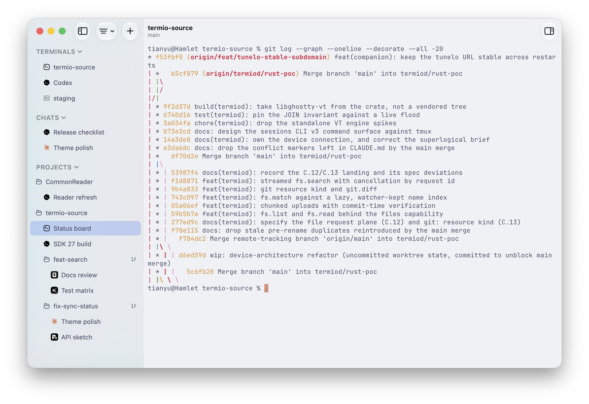
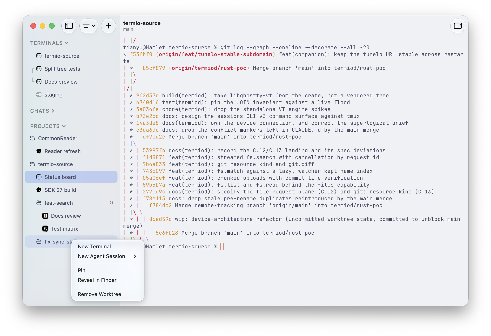
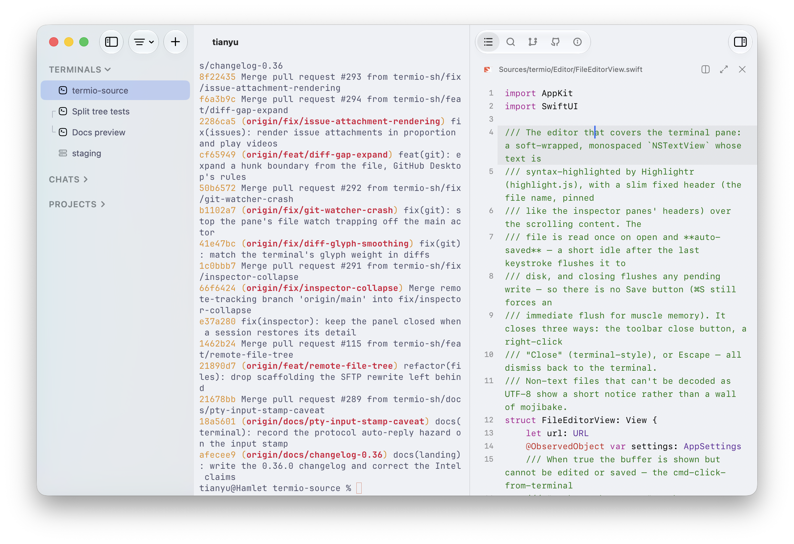
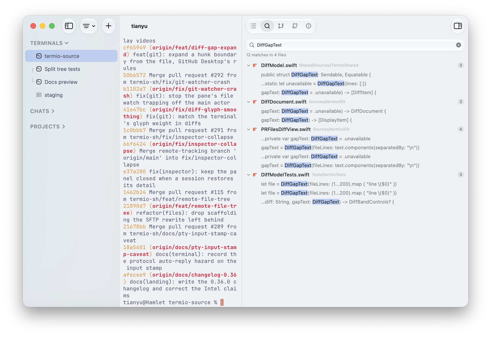

<div align="center">


### The Terminal-first Agentic Development Environment

[](https://github.com/termio-sh/termio/releases)
[](LICENSE)
[](https://discord.gg/H9DKVwsE5f)

<p>English | <a href="README.zh-CN.md">简体中文</a> | <a href="README.zh-TW.md">繁體中文</a> | <a href="README.ja.md">日本語</a> | <a href="README.ko.md">한국어</a></p>

[**Download for macOS**](https://downloads.termio.sh/termio.dmg) &nbsp;&bull;&nbsp; [Website](https://termio.sh) &nbsp;&bull;&nbsp; [Docs](https://termio.sh/docs) &nbsp;&bull;&nbsp; [Changelog](https://termio.sh/changelog) &nbsp;&bull;&nbsp; [Discord](https://discord.gg/H9DKVwsE5f)


</div>

## What it is

Termio is a native Mac app for coding agents. Sessions run on this Mac or on a Linux VPS you own, survive closing the window, and show up on your iPhone.

### Terminal-first ADE

When agents write most of the code, the environment's job is to run them and to tell you which one needs you. Termio is that environment, and it's a real terminal because that's where the agents already live.

It wires up each agent's own hooks on first launch. A session reports working, idle, or *needs you* — a dot in the sidebar, a menu-bar tray that rings when one is blocked, the same signal on your phone. Claude Code, Codex, OpenCode, Pi, Amp, Cursor, Copilot, Kimi, Antigravity, Crush, Grok, and any other CLI agent.

The longer argument: [*From IDE to ADE*](docs/essays/from-ide-to-ade.md).

### A tmux alternative

This is the reason people tell you to learn tmux. You don't have to. Every session's shell lives in `termiod`, a daemon, so quitting the app only detaches. Close the laptop, reopen Termio — the agent is where you left it, same process, same scrollback. Only Close Session (⌘W) ends one.

Splits are ⌘D, zoom is ⇧⌘↩. No Ctrl-b prefix: a ⌘ shortcut never reaches the program in the pane, so nothing collides with vim or a TUI. Scroll, select, copy with the trackpad and ⌘C. There is no copy-mode.

### Remote VPS

Any Linux VPS you can `ssh` to. Termio reads `~/.ssh/config` and never rewrites it. Settings ▸ Devices ▸ Set Up copies one binary into `~/.local/bin` over SSH, starts the daemon, and installs the agents' hooks there. Local and remote sessions run through the same host.

The session lives on the box, not in the connection. Drop the link and the agent keeps working; reattach restores the exact screen. Zed Remote and VS Code Remote keep remote work inside a live connection.

## Compared with

**[Ghostty](https://ghostty.org)** is the terminal. Termio uses its core, [libghostty](https://ghostty.org), for rendering — it is not a fork. Ghostty does not track agents, persist sessions, or run them on a VPS. If you want a fast terminal, that is Ghostty. Termio is the environment the agents run in.

**[cmux](https://cmux.com)** is the closest cousin: native Swift, libghostty, notification rings when an agent needs you, an iPhone companion. cmux remote is an SSH workspace — a relay on the box, tmux if you want it — and the phone pairs with the Mac. In Termio every session runs on `termiod`, this Mac or a Linux VPS, and the phone attaches to that host directly. Termio also puts status in a menu-bar tray, and projects and worktrees in the sidebar. cmux has an in-app scriptable browser and reads your Ghostty config; Termio does not.

**[herdr](https://herdr.dev)** is a multiplexer that runs inside the terminal you already use. Same persistence idea — a server owns the PTYs — and it marks each agent working, blocked, or idle. It is tmux-shaped: prefix keys, a TUI, attach over SSH, macOS / Linux / Windows. Termio is a native Mac app with Mac shortcuts, an iPhone companion, and the VPS as a workspace in the sidebar, not a TUI you attach to.

**[Otty](https://otty.sh)** is a native Mac terminal tuned for agents: tab badges, a composer, session restore that resumes Claude / Codex / OpenCode. It sits between a terminal and an ADE. Termio is the ADE side of that: the session lives in `termiod`, survives quitting the app, and is the same object on a Linux VPS and on your iPhone.

## Install

**[Download Termio for macOS](https://downloads.termio.sh/termio.dmg)** — free,
no account, macOS 14+. Or with [Homebrew](https://brew.sh):

```sh
brew install --cask termio-sh/tap/termio
```

**On iPhone**: get the companion beta on
[TestFlight](https://testflight.apple.com/join/1Arf1UKR), then pair it by
scanning the QR code in the Mac app's Settings ▸ Mobile.

## What you get

<table>
<tr>
<td width="50%" valign="top">
<h3>Projects hold sessions</h3>
<p>One project per checkout, its terminals and agents underneath. Chats sit above that — scratch agent sessions that don't belong to any project.</p>

</td>
<td width="50%" valign="top">
<h3>Git worktrees</h3>
<p>One branch per parallel task, created from the sidebar. Worktrees nest under the project they came from.</p>

</td>
</tr>
<tr>
<td width="50%" valign="top">
<h3>Split panes</h3>
<p>⌘D splits right, ⇧⌘D splits down. An agent, a dev server, and a shell in one window.</p>

</td>
<td width="50%" valign="top">
<h3>Status at a glance</h3>
<p>Working, idle, done, or <em>needs you</em> — a mark on every row. The same list is <code>termio sessions list</code>.</p>

</td>
</tr>
<tr>
<td width="50%" valign="top">
<h3>File editor</h3>
<p>Click a file in the tree. Syntax highlighting, autosave. The terminal stays the place where you commit.</p>

</td>
<td width="50%" valign="top">
<h3>Changes</h3>
<p>A read-only git pane with the current unified diff. Commit, push, and PR stay in the terminal.</p>

</td>
</tr>
<tr>
<td width="50%" valign="top">
<h3>Search</h3>
<p>Project-wide content search, jumping to the matching line in the editor.</p>

</td>
<td width="50%" valign="top">
<h3>Command palette</h3>
<p>⌘⇧P. Split, focus, anything you'd hunt a menu for.</p>

</td>
</tr>
</table>

## Drive it from the terminal

The `termio` CLI drives the running app. An agent inside Termio can spawn a sibling, hand it a task, and read back the reply:

```sh
termio .                                    # open the current directory as a project
termio sessions list                        # who's working, idle, or waiting on you
termio sessions spawn "fix the flaky test"  # start a new agent session on a prompt
termio sessions run "pnpm test --watch"     # start a plain terminal session on a command
termio sessions send ab12cd34 "1"           # answer a sibling's permission prompt
termio sessions read ab12cd34 --lines 40    # print what's on a session's screen
termio sessions watch                       # stream status changes as they happen
termio sessions focus ab12cd34              # bring a session forward in the app
termio sessions close ab12cd34              # close it
termio notify "the migration finished"      # post a macOS notification
```

`--wait` blocks until the turn settles and comes back with the final status and the transcript range to read. `--json` makes any `sessions` command machine-readable. `--agent` picks which agent `spawn` starts. `--direction` / `--ratio` decide where the new pane lands and how big it is.

```sh
termio sessions spawn "run the migration" --agent codex --wait
```

Session control installs a `termio` [agent skill](https://termio.sh/skill.md) into each agent's skills folder (`~/.claude/skills`, `~/.codex/skills`) and keeps it current on every launch. Any other agent can install the same skill from this repo:

```sh
npx skills add termio-sh/termio --skill termio
```

## On your iPhone

The companion mirrors every session live — the full TUI, not a chat summary. A key bar puts esc, tab, ctrl, and arrows above the keyboard, and hold-to-speak transcribes into the prompt. Public beta on [TestFlight](https://testflight.apple.com/join/1Arf1UKR).

<table>
  <tr>
    <td></td>
    <td></td>
    <td></td>
  </tr>
</table>

## Architecture

Every session lives in `termiod`. Clients only attach. Closing a client does not kill the agent. One protocol; only the pipe changes.

```
  ┌──────────────┐  unix   ┌────────────┐         ┌─────────────────┐
  │ Mac app      │────────►│            │         │                 │
  ├──────────────┤  unix   │            │         │                 │
  │ Windows *    │────────►│            │         │                 │
  ├──────────────┤  wss    │            │         │                 │
  │ iPhone       │────────►│  termiod   │── PTY ─►│  shell / agent  │
  ├──────────────┤  unix   │   (Mac)    │         │                 │
  │ TUI *        │────────►│            │         │                 │
  ├──────────────┤  wss    │            │         │                 │
  │ Android *    │────────►│            │         │                 │
  └──────────────┘         └────────────┘         └─────────────────┘

  ┌──────────────┐  ssh    ┌────────────┐         ┌─────────────────┐
  │ Mac app      │────────►│            │         │                 │
  ├──────────────┤  ssh    │            │         │                 │
  │ Windows *    │────────►│            │         │                 │
  ├──────────────┤  wss    │            │         │                 │
  │ iPhone       │────────►│  termiod   │── PTY ─►│  shell / agent  │
  ├──────────────┤  ssh    │  (Linux)   │         │                 │
  │ TUI *        │────────►│            │         │                 │
  ├──────────────┤  wss    │            │         │                 │
  │ Android *    │────────►│            │         │                 │
  └──────────────┘         └────────────┘         └─────────────────┘

  * coming soon
```

The phone attaches to `termiod` on the box, not through the Mac. A session on a VPS is the same object as one on your laptop.

The reasoning is in [`termiod/ARCHITECTURE.md`](termiod/ARCHITECTURE.md).

## Roadmap

- **Issue triage** — GitHub, GitLab, and Linear issues inside the app, ready to hand straight to an agent.
- **TUI client** — attach from any terminal, the way you would to tmux.
- **TUI → GUI on mobile** — an optional GUI rendering of agent sessions on the phone, built on top of the live mirror.
- **Android** — the same companion as iPhone.
- **Windows support** — Termio as a native Windows app. Same idea, same terminal core, no Electron.
- **Web support** — attach to your sessions from any browser, with terminals you can share by link.

Follow along or weigh in on [GitHub Issues](https://github.com/termio-sh/termio/issues).

## Community

**Termio is looking for long-term maintainers.** If you love using it and would like to own an area of the roadmap above — the web client, Windows, or the iOS companion — join the Discord and say hi, or just pick up an issue.

- **[Discord](https://discord.gg/H9DKVwsE5f)** — chat with the developer and other users
- **WeChat group** — Chinese-speaking users, scan the QR code below
- **[GitHub Issues](https://github.com/termio-sh/termio/issues)** — bugs and feature requests


The WeChat code expires every few days. If it has, ask in Discord and it gets refreshed.

## Contributors

<a href="https://github.com/termio-sh/termio/graphs/contributors">
  
</a>

## License

[MIT](LICENSE).
