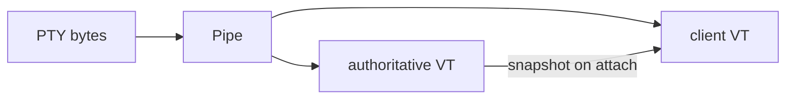
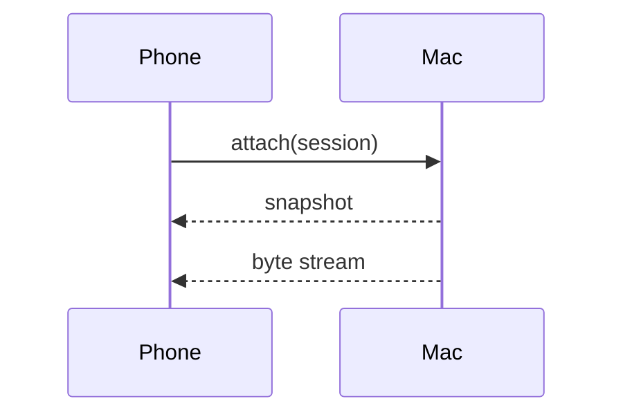

# Markdown feature sheet

Open this file in termio's Markdown preview to see every construct the renderer handles.
Anything that renders as literal source here is a regression.

## Headings and anchors

Every heading carries a GitHub-style slug id, so a table of contents works:

- [Alerts](#alerts)
- [Code and syntax highlighting](#code-and-syntax-highlighting)
- [Mermaid diagrams](#mermaid-diagrams)
- [Math](#math)
- [Footnotes](#footnotes)
- [Raw HTML](#raw-html)
- [Duplicate](#duplicate) and [the second one](#duplicate-1)

#### Fourth-level heading

##### Fifth-level heading

###### Sixth-level heading

## Alerts

> [!NOTE]
> Useful information a reader should notice even when skimming.

> [!TIP]
> An optional shortcut. Alerts keep their inner markup — `code`, **bold**, and
> [links](https://termio.sh).

> [!IMPORTANT]
> Information necessary for success.

> [!WARNING]
> Content that needs immediate attention.

> [!CAUTION]
> Possible negative consequences of an action.

A plain quote is still a plain quote:

> Not an alert. No colored rule, no label.
>
> > A quote inside a quote.

## Links

Bare URLs autolink: https://github.com/termio-sh/termio and www.termio.sh both become
links. Sentence punctuation stays out of them — see https://termio.sh/docs.
A link in parens (https://termio.sh/docs) keeps its closing paren outside.

Emails do not autolink: hi@termio.sh, but an explicit [mailto: link](mailto:hi@termio.sh)
works. Markdown links win over autolinking: [https://a.example](https://termio.sh).
Relative links resolve against this file's folder: [the test suite](../MarkdownHTMLTests.swift).
In-page anchors jump within the document: [back to the top](#markdown-feature-sheet).

## Emoji

Shortcodes render as characters: :rocket: :tada: :warning: :white_check_mark: :bug:.
Ordinary colons survive: the build starts at 10:30 and `:rocket:` in code stays literal.

## Code and syntax highlighting

```swift
struct Session: Identifiable {
    let id: UUID
    var title: String   // highlighted with the editor's own theme
    func attach() throws -> PTYProcess { try PTYProcess(rows: 24, columns: 80) }
}
```

```python
def collatz(n: int) -> int:
    return 1 if n == 1 else collatz(3 * n + 1 if n % 2 else n // 2)
```

```diff
- let backend = .exec
+ let backend = .inMemory
```

An unknown language stays plain, never mis-colored:

```notalanguage
{ this is not any language highlight.js knows }
```

A fence with no language at all stays plain too:

```
plain preformatted text
    indentation preserved
```

Shell fences keep their dollars: `echo $PATH` inline, and in a block:

```sh
echo "$HOME and $USER are not math"
```

## Mermaid diagrams

Diagram fences are drawn as SVG, in the app's colors. A diagram that fails to parse keeps
its source instead, so a typo costs you the picture and nothing else:





## Math

Inline math flows with the prose: the mass–energy equivalence $E = mc^2$ and the
golden ratio $\varphi = \frac{1 + \sqrt{5}}{2}$ sit on the text baseline.

Display math gets its own line:

$$\sum_{i=1}^{n} i = \frac{n(n+1)}{2}$$

A fenced `math` block renders the same way:

```math
\int_{-\infty}^{\infty} e^{-x^2}\,dx = \sqrt{\pi}
```

Prices are not math: it costs $5 and $6 more later.

## Footnotes

Byte delivery never blocks on the host-side VT parse[^anti100x], and state syncs only at
boundaries[^boundaries]. The first reference gets number 1 even when its definition comes
second, and a note can be referenced twice[^anti100x].

[^boundaries]: Snapshots on attach, resize and resync — never per frame.
[^anti100x]: The anti-100× invariant. Any per-frame grid encoder between the PTY and the
    pipe rebuilds the tmux tax.

## Lists

1. Ordered list
2. Second item
   1. Nested ordered item
   2. Another one
3. Third item

- Unordered list
  - Nested bullet
    - Third level
- Back to the top level

- [x] task list, checked
- [ ] task list, unchecked
- [x] tasks mix with **bold**, `code`, and [links](https://termio.sh)

## Tables

| Construct | Where it renders | Notes |
| --- | --- | --- |
| Alerts | reader, trace, issues | five kinds |
| Math | reader, trace, issues | MathML, no web fonts |
| Highlighting | reader, trace, issues | 192 languages |

## Images

Relative paths resolve against this file's folder:


## Raw HTML

Whitelisted markup passes through the sanitizer, so README layout works:

<details>
<summary>A collapsed section</summary>

Hidden until you open it. Markdown inside still renders: **bold** and `code`.

</details>

<table>
<tr>
<td width="50%"></td>
<td width="50%">The screenshot-grid idiom: a layout table keeps its cell ratios instead of
shrink-wrapping to content.</td>
</tr>
</table>

Script tags do not: <script>alert(1)</script> renders as visible text.

## Inline odds and ends

~~strikethrough~~, **bold**, *italic*, ***both***, `inline code`, <kbd>⌘</kbd><kbd>K</kbd>,
H<sub>2</sub>O, x<sup>2</sup>, and an entity: AT&amp;T.

Escapes hold: \*not emphasis\* and \$not math\$.

A hard line break ends this line with two spaces,  
so this sentence starts on its own line.

---

## Duplicate

First section with this name.

## Duplicate

Second section with the same name — its anchor is `#duplicate-1`.
