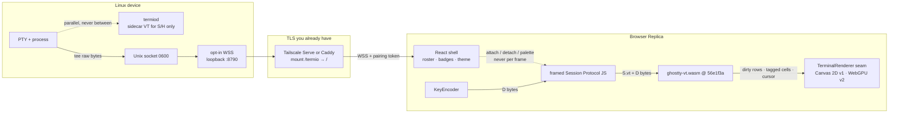
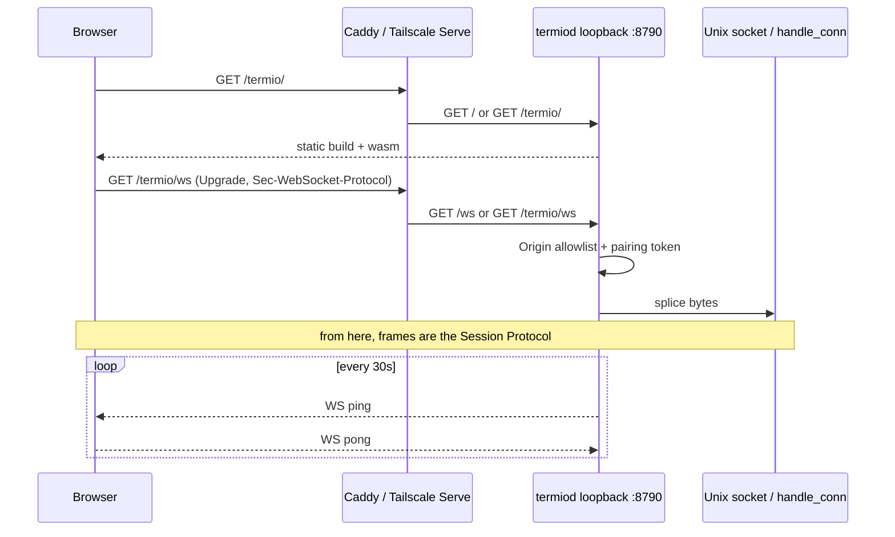
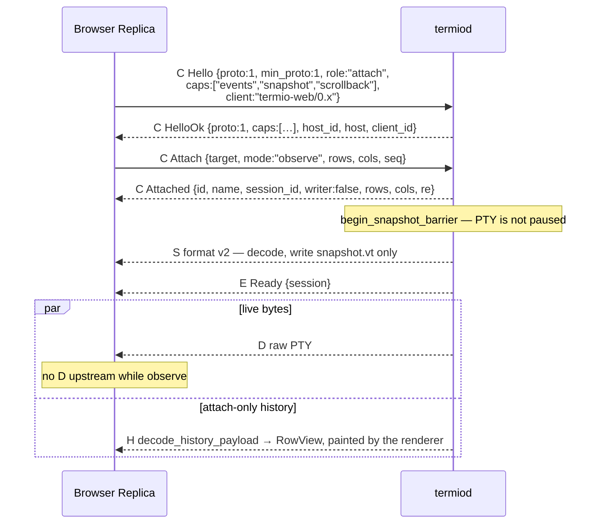

# Termiod web client on official Ghostty WASM (Linux first)

> The browser is a Replica. It speaks the existing Session Protocol over WSS to a Linux `termiod`, runs official `ghostty-vt.wasm` as its VT, and paints through a renderer seam we own — Canvas 2D in v1, WebGPU in v2. React owns the shell and never the frame. No second protocol, no host-side grid encoder, no WebTransport.

**Author:** —  
**Date:** 2026-08-18  
**Status:** Draft

---

## Overview

A Linux box already runs `termiod` and already speaks the framed Session Protocol over a Unix socket and over `ssh … termiod stdio`. What it cannot do is talk to a browser: browsers have no Unix sockets and must not embed SSH. This RFC is the missing *implementation* design for that last pipe.

The protocol work is done. [termiod-session-protocol.md](20260730-termiod-session-protocol.md) §D already names WSS as a binding of the same messages. [termiod-hot-path-and-client-classes.md](20260805-termiod-hot-path-and-client-classes.md) §D.3 already decided the web client is a **Replica**: official `libghostty-vt` as standalone Wasm, raw `D` in steady state, no fourth client class. `grid_diff` is not selected on the grounds that the client is a browser. WebTransport stays refused because a Replica needs ordered bytes, not datagrams.

What this document decides is how the browser loads `ghostty-vt.wasm`, **who paints and through what seam**, **where React's boundary is**, how WSS binds on a Linux box without becoming a second protocol or a DIY TLS stack, how a pairing token authenticates that bind, and what we will not invent.

Linux is first because that is the VPS / devbox case: the session already lives on the box, and a phone or a borrowed laptop reaching `https://box/termio` is one hop to that device, not a hop through a Mac.

**The renderer decision, up front, so nothing below has to hedge:** v1 paints with a Canvas 2D renderer we own, written directly against the official render-state C ABI, behind an explicit `TerminalRenderer` seam. **WebGPU is v2** — scheduled, specified, implementing the same seam, with a capability probe that falls back to the v1 renderer when `navigator.gpu` is absent. The reasoning, including why we are not borrowing anyone's renderer, is in [Renderer](#renderer-one-seam-two-implementations) and [Alternatives](#alternatives-considered) §G / §H.

---

## Background & Motivation

### Current state

`termiod` is a Unix-socket daemon. `daemon::serve` (`termiod/src/daemon.rs`) binds `$XDG_RUNTIME_DIR/termiod/termiod.sock` (or `TERMIOD_SOCK`) at mode `0600` and never a TCP port. [DEPLOY.md](../../termiod/DEPLOY.md) is explicit: no public bind, SSH is the access-control boundary, whoever can `ssh` as that user can reach the daemon.

Three pipes already carry the same 5-byte framing (`[kind:u8][len:u32be][payload]`, `termiod/src/protocol.rs`):

| Pipe | How | Who uses it |
| --- | --- | --- |
| Unix socket | `UnixListener` in `serve()` | local CLI, Mac app |
| SSH stdio | `termiod stdio` splices stdin/stdout onto the socket (`client.rs`) without parsing a single frame | Mac app / CLI via `ssh <host> termiod stdio` |
| WSS | **not built** | this RFC |

Attach is already the Replica shape. A client that advertises `snapshot` + `scrollback` in `Control::Hello` gets `Control::Attached`, then one `S` (format v2, VT sequences with `palette: false`), then `Event::Ready { session }`, then newest-first `H` chunks interleavable with live `D`. Resize is the same barrier (`SessionMsg::Resize` + `Snapshot` adjacent on the sidecar FIFO). `grid_diff` exists and is legal only under pressure. None of this changes.

### Why the web client is now cheap

Two things landed outside this repo in August 2026:

1. Ghostty ships a pre-built `ghostty-vt.wasm` in GitHub releases (Mitchell, 2026-08-14). Every major browser can load it. It is VT parse + terminal state only. It does not ship a renderer.
2. Several independent projects already wire that Wasm into a page (`coder/ghostty-web`, `@wterm/ghostty`, Restty, browstty). The recurring shape is identical: host sends bytes, JS writes them into the Wasm, a renderer paints from the render state, a client-side `KeyEncoder` turns key events back into bytes.

A third thing is more important than either, and it is what changed the renderer decision in this revision: **libghostty-vt's public C ABI already contains a render-state API designed for exactly this job, and it exists at the commit `termiod/vt` pins.** See [What the official ABI already gives us](#what-the-official-abi-already-gives-us). We are not guessing at exports any more.

The July 8 daemon architecture still described the wire as host-side grid diffs with ghostty-web's 16-byte cell as the frame. That was **superseded** on 2026-08-08 by the raw-`D` Replica model. This RFC follows the later protocol. ghostty-web remains useful as a *reference* for the JS/Wasm calling pattern. It is not a description of what rides the socket, and — as of this revision — it is not the renderer either.

### Pain

A user with a VPS can already `termiod remote open ukvps` from a Mac. They cannot open the same session from a browser on that box, from a Chromebook, or from a phone that is not a satellite of a Mac. Device architecture §2.1 forbids the Mac-in-the-middle path. The companion WebSocket is a second protocol and the cautionary tale ([session-protocol.md](20260730-termiod-session-protocol.md) §H #9). WSS of *this* protocol is the remaining pipe.

---

## Goals & Non-Goals

### Goals

1. A browser Replica attaches to a Linux `termiod` over WSS and renders a live session with official `ghostty-vt.wasm` pinned to the same ghostty commit as `termiod/vt`.
2. The bytes on that WSS are the existing framed Session Protocol. A recorded Unix-socket transcript must replay against the WSS binding (the §C.9 acceptance test, one more pipe).
3. Auth is a pairing token, an Origin allowlist, plus optional Tailscale Serve / Caddy in front. No accounts. No hosted control plane.
4. Theme is viewer-injected. One snapshot fed to a light page and a dark page must look different, **and a theme switch after load must re-resolve every visible cell** (device architecture §4).
5. Paint goes through one `TerminalRenderer` seam. Replacing the Canvas 2D implementation with a WebGPU one changes one file and no caller.
6. React owns the shell. No terminal cell, cursor position, dirty row, or byte count is React state, and the surface component renders once per attach, not once per frame.
7. Linux VPS deploy is documented on top of the existing `termiod remote deploy` + linger unit, including a durable WSS start path that survives `spawn_daemon` and the systemd unit.

### Non-goals

- Replacing the Mac or iOS apps.
- A chat UI. The terminal is the interface.
- Implementing SSH, TLS, or any crypto in the browser or in `termiod`.
- A hosted Termio cloud, a relay that terminates `hello`, or any control plane we run.
- Selecting `grid_diff` on the grounds that the client is a browser or the pipe is remote.
- Forking Ghostty, or waiting for Superlogical to open-source their renderer.
- **WebGPU in v1.** It is v2, with a dated seam and a measured entry trigger, not an open-ended "later quality investment." See [Renderer](#renderer-one-seam-two-implementations).
- **A glyph atlas, text shaping, ligatures, subpixel/LCD antialiasing, procedural box-drawing geometry, and Kitty graphics in v1.** These are the WebGPU bill of materials, not incidental polish; they arrive with v2 or not at all.
- A WebGL2 renderer. Two implementations of the seam, not three. See [Alternatives](#alternatives-considered) §H.
- Clipboard, image paste, or Superlogical-style extra data channels, unless the existing protocol already has the verb (it does not, for clipboard).
- A nested window manager in the page that the host knows about. Splits, if any, are a later client concern and never cross the wire.
- Server-side rendering, a Node runtime on the box, or any React framework. The web root is a static build.
- Channel-id multiplexing (device architecture §5.1 / §8.7 step 4c). One WebSocket is one channel. We do not wait for 4c to ship the first attach.
- Serving a plain tty / compat sink.

---

## Prior art survey

Research date: 2026-08-18. Superlogical wire details stay **Unknown**; nothing below guesses at them.

### Official Ghostty

- **2026-08-14, Mitchell Hashimoto** ([x.com/mitchellh/status/2088378990998524206](https://x.com/mitchellh/status/2088378990998524206)): pre-built `ghostty-vt.wasm` now ships in Ghostty GitHub releases. Fastest optimized builds. Compatible with every major browser going back years.
- **2026-08-14, Mitchell** ([x.com/mitchellh/status/2088380975118250065](https://x.com/mitchellh/status/2088380975118250065)): libghostty-vt is VT parse + terminal state only. **It does not ship a web renderer.** Superlogical built their own on the Wasm; "out of scope for libghostty-vt"; "We might open source it. I'm not sure yet. We use libghostty for our web interface (which is fully working already)."
- **2026-08-17, Mitchell** ([x.com/mitchellh/status/2089351136839090387](https://x.com/mitchellh/status/2089351136839090387)): Wasm memory pool replaced Zig `std.heap.MemoryPool`; 75% less required terminal memory, no throughput hit.
- Published benches vs xterm.js (M4 Max, 80×24): IO long-lines 1023 vs 144 MB/s; mixed 543 vs 121; reflow ~9000 vs 1605 resizes/s; incremental scroll 76923 vs 19084 render-state updates/s. These are **library** numbers, not mux numbers, and they measure the VT, not paint.
- Mitchell's harness comparing libghostty-vt to xterm.js via the *same* xterm.js WebGL renderer (to isolate VT cost) is "pulled out in its own repo but I haven't published it yet" (2026-08-17).

### What the official ABI already gives us

Verified 2026-08-18 by reading the headers **at `56e1f3a`**, the exact commit `termiod/vt/Cargo.toml` pins (committed 2026-08-17). This is the load-bearing survey result: the previous revision of this RFC treated "does the pinned Wasm export enough?" as an open question and borrowed a renderer to route around it. It exports enough.

| Header @ `56e1f3a` | What it gives the browser |
| --- | --- |
| `include/ghostty/vt/render.h` | The whole render-state API. Two-phase update (`begin_update` / `end_update`) so the parse side is never blocked by paint. Global dirty as `FALSE` / `PARTIAL` / `FULL`. Per-row dirty flags. A row iterator and a per-row cells iterator. `ghostty_render_state_clean()` to clear both dirty layers after a frame. |
| `render.h`, row-cells data kinds | `…_ROW_CELLS_DATA_STYLE` → the cell's **unresolved** `GhosttyStyle`. `…_DATA_HAS_STYLING` → a cheap predicate so unstyled cells never materialise a style. `…_DATA_GRAPHEMES_UTF8` → the full grapheme cluster as UTF-8 into a caller buffer. `…_DATA_SELECTED` per cell, and `…_ROW_DATA_SELECTION` as a row-local range (the header itself recommends the range for span renderers). |
| `render.h`, `…_ROW_DATA_CELLS_RAW` | A borrowed view of a whole row's raw cell values in **one call**, documented as the bulk path "for callers with expensive call boundaries (e.g. WebAssembly embedders)." This is the Wasm-boundary batching lesson, now an official export instead of folklore. |
| `include/ghostty/vt/style.h` | `GHOSTTY_STYLE_COLOR_NONE` / `_PALETTE` / `_RGB`. A tagged colour, one-for-one with `WireColor` in `termiod/src/protocol.rs`. |
| `render.h`, `GhosttyRenderStateColors` | Default fg/bg, cursor colour + `cursor_has_value`, and the active `GhosttyColorRgb palette[256]`. |
| `render.h`, `GhosttyRenderStateCursor` | Viewport x/y with a `viewport_has_value` guard, wide-tail flag, visible, blinking, password-input, and visual style (bar / block / underline / hollow block). |
| `include/ghostty/vt/key/encoder.h`, `key/event.h` | The KeyEncoder as a public C API. ghostty-web already drives exactly these symbols (`ghostty_key_encoder_new` / `_setopt` / `_encode`), so their code is a worked example of calling the official thing, not a patch we need. |
| `include/ghostty/vt/wasm.h` | `ghostty_wasm_alloc` / `_free` / `_alloc_opaque` / `_take_opaque`, plus `ghostty_type_json` for discovering pointer width, `size_t` width, byte order, and struct sizes at runtime. |
| `include/ghostty/vt/modes.h` | `GHOSTTY_MODE_SYNC_OUTPUT` = mode 2026. Synchronized output is queryable, not something the adapter has to infer. |

Two of these deserve to be called out because they change design decisions elsewhere in this document.

**The colour trap has an official name.** The same row-cells iterator exposes `…_DATA_BG_COLOR` and `…_DATA_FG_COLOR`, and its own doc comment says they resolve "palette indices through the palette." That is the resolution the presentation boundary forbids. `termiod/vt/src/lib.rs` already hit this and already documented the fix in Rust: *"Reads the unresolved style rather than the render state's `fg_color`/`bg_color`, which flatten palette indices through the host's palette and substitute the host's defaults — the exact resolution this boundary must not perform."* The browser renderer is a direct port of that choice. Reading `…_DATA_STYLE` is correct; reading `…_DATA_FG_COLOR` is a design regression with a constant name attached to it.

**"Resize detaches TypedArray views" has an official mitigation.** `wasm.h` documents it precisely: an exported function may grow linear memory; numeric pointers and handles stay valid, but any `ArrayBuffer` / `DataView` / typed array created before the growth may not cover live memory. The rule it gives is *reacquire `exports.memory.buffer` immediately before every host-side access, and recreate cached views whenever buffer identity **or** byte length changes*. That is a discipline in the binding layer, not only a reason to pause the render loop. We do both: the binding never caches a view across an allocating call, **and** the render loop still quiesces for the resize barrier, because the barrier exists for protocol reasons (`R` → `S` → `ready`) independent of memory growth.

### The recurring web-terminal shape

Nobody who can load the Wasm puts the VT in JavaScript. The library never owns the socket. Resize is a barrier. The Wasm is fetched (~400 KB), not inlined. Scrollback is often a **byte budget**, not a line count. OSC 8, OSC 10/11, and mode 2026 have to be plumbed through the adapter.

```
PTY / session host
    │  raw bytes (or a thin framed protocol)
    ▼
browser JS: term.write(bytes)
    │
    ▼
libghostty-vt.wasm   ← parse + grid + scrollback + modes
    │  render state: dirty rows, tagged-colour cells, cursor
    ▼
renderer (Canvas 2D / WebGPU)   ← NOT in libghostty-vt
    │
keyboard → KeyEncoder → onData → bytes back to host
```

### Concrete packages

1. **Official `ghostty-vt.wasm`** (ghostty-org releases, August 2026). The long-term VT binary and, per the table above, the long-term render-state and key-encoder ABI. This is the source of truth *at a pinned commit* — see [VT source](#vt-source).

2. **`coder/ghostty-web`** — [github.com/coder/ghostty-web](https://github.com/coder/ghostty-web). MIT, 2727★, last push 2026-07-02. Drop-in xterm.js API. ~400 KB Wasm, zero runtime deps, Canvas 2D renderer, built for Coder Mux. **Zero WebSocket / PTY inside the library.** Builds from Ghostty source + `patches/ghostty-wasm-api.patch`; the README says it "will eventually consume a native Ghostty WASM distribution once available." KeyEncoder is client-side and already calls the official `ghostty_key_encoder_*` symbols. `lib/renderer.ts` is one 1001-line `CanvasRenderer`: dirty rows via `isRowDirty(y)` / `clearDirty()`, per-row redraw that also repaints the row above and below to survive glyph overflow, `requestAnimationFrame` for paint, resize pauses the loop.

   **And its cell model is pre-resolved 24-bit RGB.** `GhosttyCell` carries `fg_r/fg_g/fg_b` and `bg_r/bg_g/bg_b`. The palette is handed to the Wasm once, at `ghostty_terminal_new_with_config` (`palette[16]` as `u32×16`). `setTheme()` rebuilds a JS-side `this.palette` array and nothing else, so cells already parsed keep the construction-time palette; the renderer even sniffs `bg_r === 0 && bg_g === 0 && bg_b === 0` as "this is the default background." A page built on this passes the light/dark test at load and fails the theme-switch test forever after. This is the `palette: false` trap in a second place, and the previous revision of this RFC picked it as the v1 renderer without noticing. Retained here as a **reference implementation**, not a dependency.

3. **Restty** — [github.com/wiedymi/restty](https://github.com/wiedymi/restty). MIT, 392★, last push 2026-07-17, 521 commits, self-described "early-release." libghostty-vt in Wasm + **WebGPU with a WebGL2 fallback** + TypeScript text shaping, with an xterm.js compatibility wrapper. The closest existing art to a WebGPU terminal on this VT, and the reason this RFC can cost a WebGPU renderer from a bill of materials instead of a guess. Detailed below.

4. **`@wterm/ghostty`** — [wterm.dev/ghostty](https://wterm.dev/ghostty). `GhosttyCore.load({ wasmPath, scrollbackLimit, foregroundColor, backgroundColor })`. Builds libghostty from ghostty-org source (v1.3.1 in `zig/build.zig.zon`); patches `page.zig` / `PageList.zig` to replace posix.mmap / Mach VM with `std.heap.wasm_allocator` behind `isWasm()`. Thin export layer `zig/src/wasm_api.zig` (~300 lines, ~20 JS functions). Commits the Wasm so consumers do not need Zig. TypeScript bindings + `TerminalCore` adapter; DOM renderer stays core-agnostic. ~400 KB fetched. Cells come as **pre-resolved 24-bit RGB**; theme must be injected at load. Scrollback limit is **bytes**, default 10000 (too small). Reports discarded oldest rows so a DOM renderer can keep anchors. Mode 2026 generation is exposed.

5. **browstty** — Zig Wasm module wrapping libghostty.

6. **webterm** (rcarmo) — dashboard + live tiles on ghostty-web. Useful as a "many sessions at once" UI reference, not as a protocol.

7. **RemoteTTYs** — ghostty-web + Go agent, no open ports / NAT traversal. Different trust story than termiod (we already have SSH / tailnet).

8. **vscode-bootty, obsidian-ghostty-terminal, onyx-shell, jupyterlab-ghostty-terminal** — same Wasm-in-the-page pattern inside a host app.

9. **X, 2026-08-15**: [@sujeetgholap](https://x.com/sujeetgholap/status/2088580266143199680) embeds a TUI (`/mcp`) inside Pi-web-UI inside **wterm running WASM-compiled ghostty**. No need to port the TUI to HTML.

10. **X, 2026-08-11**: @tanaysoni_ — `@wterm/ghostty` packages Ghostty's core; libghostty-vt parses escapes and keeps cursor, colours, alt screens, Unicode, scrollback.

11. **awesome-libghostty** web section: [github.com/Uzaaft/awesome-libghostty](https://github.com/Uzaaft/awesome-libghostty).

### Restty, read properly

Restty is the existence proof that WebGPU on libghostty-vt works, and it is also the invoice. Findings, from the repository tree and its own `docs/internals/`:

**Pipeline.** Four passes per frame: background quads plus selection rectangles; glyphs as textured quads from a shared atlas, instanced; decorations (underline, strikethrough, overline); cursor (block / bar / underline, with blink state). WebGPU is primary, WebGL2 is the fallback, and the two "maintain the same data layout" with equivalent shaders — but they are still two shader languages and two render-tick code paths (`src/renderer/shaders/glyph-wgsl.ts` and `glyph-gl.ts`; `render-tick-webgpu*.ts` and `render-tick-webgl*.ts`).

**Atlas.** Grayscale raster atlas with hinting, optional LCD subpixel atlas behind a separate shader. **No SDF/MSDF** — a deliberate decision recorded in `docs/internals/decisions.md`. Atlas resizing plus LRU eviction when full. Uploads via `queue.writeTexture` (WebGPU) or `texSubImage2D` (WebGL). A separate colour-glyph atlas exists for emoji.

**Damage.** "If the RenderState exposes dirty rows, only update instance buffers for dirty rows." Full redraw on palette change, resize, or the full-dirty flag. That is the same dirty-row contract `render.h` exports, which is why the seam below can be identical for both implementations.

**Shaping and ligatures.** Ligatures on by default, drawn as shaped glyphs across cell ranges with the per-cell glyph suppressed inside the run. Cursor and selection are drawn as **overlays** precisely so they do not break a ligature run. Around it: `ligature-runs.ts`, `fallback-layout.ts`, `glyph-coverage.ts`, a font-resource store, a font picker with classification, and Nerd Font range/metric constraint tables.

**Box drawing is not a font problem.** `src/renderer/shapes/` draws box drawing (including dashed, diagonal, rounded corners), block elements, braille, and powerline **procedurally**, with a classifier and a fallback. Ten-plus files, because monospace fonts do not cover these consistently and Ghostty itself draws them.

**What that adds up to.** Restty is ~970 files. The WebGPU pixels are a small fraction of it; the glyph pipeline, the font machinery, and the shape geometry are the bulk. It also ships a pane manager, a plugin host, a search UI, IME handling, scrollbars, context menus, and Kitty graphics — a second application framework, most of which collides with what React owns here and with "no nested window manager."

**Why we cannot vendor it, specifically.** Two hard blockers, neither about quality:

- Its Wasm is built from a **patched ghostty submodule** — `docs/internals/decisions.md` records stubbing `BoldColor` in `style.zig`, removing `build_config` imports, and skipping font imports in `quirks.zig` — at an unpinned commit. That is a second VT at a different revision from `termiod/vt`, which is the divergence [Alternatives §A](#a-xtermjs-as-the-vt-and-the-renderer) rejects xterm.js for.
- **The compiled Wasm is base64-inlined into the JS bundle.** `src/wasm/embedded.ts` is 2,789,665 bytes. This RFC budgets ~400 KB *fetched* and served as `application/wasm`, versioned in the web root next to a pinned ghostty sha. Inlining is the opposite of that on every axis.

Restty's palette handling, by contrast, is the shape we want and better than either JS-cell library: its Zig wrapper exports `restty_set_palette`, `restty_set_default_colors`, and `restty_reset_palette`, and it ships the full Ghostty theme catalogue. That is a *design* we adopt — the palette lives on the client side of the boundary and is replaceable at runtime — implemented against the official ABI rather than a patched one.

### WebGPU availability, measured against a Linux-first document

From the GPU for the Web working group's own [Implementation Status](https://github.com/gpuweb/gpuweb/wiki/Implementation-Status), read 2026-08-18:

| Browser | Windows | macOS | Linux | Mobile |
| --- | --- | --- | --- | --- |
| Chrome / Edge | ✅ 113+ | ✅ 113+ | ⚠️ **behind flags** — needs `--enable-unsafe-webgpu --ozone-platform=x11 --use-angle=vulkan --enable-features=Vulkan,VulkanFromANGLE` | ✅ Android 121+ (GPU-dependent) |
| Firefox | ✅ 141+ | ✅ 145+ (Apple Silicon), 147+ (Intel) | 👷 **Nightly only**; Mozilla "expects to ship on Linux in 2026" | 👷 behind a flag |
| Safari | — | ✅ 26+ | — | ✅ iOS / iPadOS 26+ |

Read that table against this document's own title. The RFC is Linux first, and its Pain section names, as a case to fix, "a browser **on that box**." On that box today, neither stable Chrome nor stable Firefox gives you WebGPU without command-line flags. The phone (Safari 26), the Chromebook, and a borrowed Mac or Windows laptop all have it; the Linux desktop that the daemon is deployed on does not.

### Superlogical (context only)

Web client is first-class. Current revs use **websockets over HTTP** so the browser works (2026-07-31, **Announced**). Custom bidirectional data protocol for clipboard etc. (2026-08-17, **Announced**). Their renderer is custom and may or may not become OSS. We do not guess their frames, and we do not wait for the renderer.

### What the July 8 doc got right, and what it did not

§11 of [session-daemon-architecture.md](20260708-session-daemon-architecture.md) correctly extracted six lessons from ghostty-web: transport is not in the library; batch across the Wasm boundary; KeyEncoder is a pure function; resize is a barrier; the client is headless-testable. Those still hold — and three of them are now official exports (`…_ROW_DATA_CELLS_RAW`, `key/encoder.h`, `wasm.h`'s memory-growth rule) rather than lessons we have to remember.

It then said the daemon→client frame *is* ghostty-web's dirty-row `get_viewport()` and that "no protocol invention is required." That sentence described a Mirror. The protocol that shipped is a Replica. The web client consumes `S` + `D`, not a 16-byte cell stream, and putting a grid encoder between the PTY and the browser would violate the anti-100× invariant on purpose.

---

## Proposed Design

### The picture



One hop: browser → (TLS terminator) → loopback WSS → the same accept path `handle_conn` already runs for a Unix socket. The Mac is not on this path. The browser is a client of this device, the same way the Mac app is a client of this device ([device-architecture.md](20260805-termiod-device-architecture.md) §2.1).

### Client class: Replica

The web client negotiates `snapshot` and `scrollback`. It does **not** negotiate `grid_diff` on the grounds that it is a browser. `G` remains legal later if a measured backlog or an explicit "bounded bandwidth" control trips the hot-path §D.4 signals. Illegal: selecting `G` on transport class.

```
hello caps = ["events", "snapshot", "scrollback"]
client     = "termio-web/<version>"
role       = attach   (one WebSocket per session)
```

A second WebSocket with `role: control` lists, creates, and subscribes to the roster. That is the same split `protocol.rs` already has (`ChannelRole::Control` / `ChannelRole::Attach`). We do not invent channel ids for v1. `daemon.rs` currently ignores `role` (`role: _` in `handle_conn`); the web client still sends the honest value.

Control-channel sequence (existing ops, no new verbs):

```
→ C Hello {proto:1, role:"control", caps:["events"], client:"termio-web/…"}
← C HelloOk {host_id, client_id, caps}
→ C List {seq:1}
← C Sessions {sessions, tombstones, re:1}
→ C Subscribe {events:["roster","status"], seq:2}
← C Ok {re:2}
← E Roster {session, action, info}
← E Status {session, status, title?}
```

`Event::Roster` and `Event::Status` already exist (`protocol.rs`). Status values match the CLI: `working` / `idle` / `needs_you` / `done` / `failed` / `unknown`. The page must not poll `list` as its live path.

Steady state on the attach socket is raw `D` in both directions. The host's sidecar VT (`termiod/vt`) is consulted only to build `S` / `H`. The browser's Wasm VT parses the same bytes. Two state machines, one log. That is the anti-100× invariant applied to a third client, not a new architecture.

Default attach mode is **`observe`**. Opening the page while a Mac holds the write token must not steal it (`recompute_writer` promotes the newest `AttachMode::Interact`). A **Take input** control closes the observe attachment and opens a new attach WebSocket with `mode: interact` (there is no promote verb; `Control::Attach` sets mode once per channel). **Release** does the reverse: detach the interact socket and reattach as observe. `claim: "polite"` is specified in the hot-path doc and is **not** on `Control::Attach`; the web client does not invent it.

### VT source

**Pinned binary:** `ghostty-vt.wasm` built from **ghostty `56e1f3a`** — the same commit `termiod/vt/Cargo.toml` names (`libghostty-vt` via `termio-sh/libghostty-rs` @ `04500f9…`, "the same one libghostty-swift ships to the Mac and iOS clients, so the host and its clients run one VT"). An unpinned "latest official release" is a second parser, which is why alternative A rejects xterm.js.

Prefer a Ghostty GitHub-release artifact of that commit when one exists. If the release tarball is a different sha, build the Wasm from `56e1f3a` and put it in the versioned web root. Bumping the host VT means bumping this Wasm in the same change. A skew test feeds one `S` into the host sidecar and the Wasm and diffs the resulting grid.

Fetched as a static asset (~400 KB), served with `Content-Type: application/wasm`. Never inlined into JS. Never embedded in the musl binary. Never base64'd into a bundle (see Restty).

**No forked or patched Wasm, at any point.** The previous revision allowed ghostty-web's patched Wasm as a temporary fallback "if official exports fall short on day one." The exports do not fall short: [What the official ABI already gives us](#what-the-official-abi-already-gives-us) enumerates render state, dirty tracking, tagged colours, cursor, selection, grapheme clusters, the key encoder, the Wasm allocation helpers, and mode 2026 — all present at `56e1f3a`. If a specific gap is found during PR 3, the answer is a Ghostty upstream issue and a named workaround in the binding layer, not a second Wasm binary in the web root.

**The JS binding layer is ours, and it is thin.** One module that owns: instantiate, `ghostty_terminal_vt_write`, render-state update, the row/cell iterators, the key encoder, and the memory-growth discipline from `wasm.h`. It has no DOM, no socket, and no React import, so it is headless-testable — the ghostty-web lesson, kept. ghostty-web's `lib/ghostty.ts` is the worked example for the calling convention; we read it, we do not ship it.

### Renderer: one seam, two implementations

**v1 paints with a Canvas 2D renderer we own. v2 is WebGPU, implementing the same seam. There is no third renderer and no borrowed one.**

#### Why not WebGPU in v1

Three findings, in order of how much they moved the decision.

1. **On the platform in this document's title, WebGPU is not available.** Per the gpuweb status table above: Chrome on Linux needs `--enable-unsafe-webgpu … VulkanFromANGLE`; Firefox on Linux is Nightly-only. A WebGPU-only v1 cannot be demonstrated in a browser on the box it was just deployed to. So "WebGPU in v1" is not one renderer — it is WebGPU *plus* a fallback, in v1, before any human has seen a terminal in this client at all. PR 3 exists to prove the pipe paints; gating that on two renderers inverts the risk order the PR plan is built on.

2. **The cost of a WebGPU terminal renderer is the glyph pipeline, not the GPU.** Restty's own tree is the bill of materials: glyph atlas builder + rectangle packing + LRU eviction + atlas resize; a second colour atlas for emoji; font resource store, font picker, fallback layout, glyph coverage, Nerd Font metric constraints; ligature run shaping with per-cell suppression inside runs; cursor and selection promoted to overlays so they do not break those runs; and ten-plus files of *procedural* box-drawing, block-element, braille, and powerline geometry, because fonts do not cover those consistently. Then four passes and a shader set. None of that is optional for a renderer that looks like Ghostty, and none of it is on the critical path to "the browser can attach to a VPS session."

3. **There is nothing to borrow under our rules.** Restty is the only mature WebGPU implementation on this VT, it is MIT, and it is still unusable here: its Wasm is a patched ghostty submodule at an unpinned commit, and `src/wasm/embedded.ts` base64-inlines 2.79 MB of it into the JS bundle. Taking it means taking a second VT and a second application framework (panes, plugins, search UI, IME). Extracting only its renderer means extracting the glyph pipeline from a codebase whose pipeline is coupled to its own Wasm ABI — which is writing one, with extra steps.

None of that says WebGPU is wrong. It says WebGPU is a **quality investment with a defined bill of materials that should be paid deliberately, against a seam, after the pipe is proven** — not a prerequisite for the first attach. Which is why it is scheduled below rather than described as "later."

#### Why the v1 renderer is ours and not ghostty-web's

The previous revision's answer was "vendor ghostty-web's Canvas." That is now rejected on evidence: ghostty-web's cells are pre-resolved 24-bit RGB, its palette is fixed at terminal construction, and `setTheme()` cannot re-resolve what the Wasm already flattened. Goal 4 and PR 4's own acceptance test ("theme switch does not leave stale RGB") fail against it. Vendoring it would mean either accepting a broken presentation boundary or rewriting its cell path — at which point we have written the renderer anyway, on top of a dependency we now have to maintain a fork of.

Writing it directly on `render.h` is *less* code than that, because the ABI hands us exactly the loop we want: `update()` → check global dirty → walk the row iterator → skip clean rows → per row, take the selection range once and iterate cells → per cell, `HAS_STYLING` then `…_DATA_STYLE` for the tagged colour and `…_DATA_GRAPHEMES_UTF8` for the text → `fillText` → `ghostty_render_state_clean()`. ghostty-web's 1001-line `CanvasRenderer` is the upper bound on that file's size, and it carries link detection, scrollback, and selection management that live elsewhere in our design.

#### The seam

One interface. Both implementations satisfy it; nothing above it knows which is loaded.

```ts
// shape, not a shipped API
type TaggedColor =
  | { tag: "default" }
  | { tag: "palette"; index: number }   // 0–255, unresolved
  | { tag: "rgb"; r: number; g: number; b: number };

interface Palette {                      // the VIEWER's theme, never the host's
  background: Rgb;
  foreground: Rgb;
  cursor?: Rgb;
  ansi: Rgb[];                           // 256 entries
}

interface RenderFrame {
  dirty: "none" | "partial" | "full";
  cols: number; rows: number;
  cursor: CursorState;                   // style, blink, visible, wide-tail, viewport x/y + has_value
  rows_: RowView[];                      // dirty flag, row-local selection range, cells
}

interface TerminalRenderer {
  measure(font: FontSpec): CellMetrics;               // cellWidth, cellHeight, baseline
  setGeometry(g: Geometry): void;                     // cols, rows, cell metrics, devicePixelRatio
  setPalette(p: Palette): void;                       // forces a full redraw
  draw(frame: RenderFrame, history?: RowView[]): void;
  dispose(): void;
}
```

Rules that make the swap a swap:

- **The renderer resolves colour; the Wasm never does.** It reads `…_ROW_CELLS_DATA_STYLE` and resolves the tag against the `Palette` it was given. Reading `…_DATA_FG_COLOR` / `…_DATA_BG_COLOR` is forbidden and is a reviewable line in a diff. A `{ tag: "default" }` cell paints the viewer's default, not black.
- **The renderer never owns state it can be told about.** No socket, no Wasm handle, no React import, no `setTimeout` loop of its own. It is called; it does not call.
- **Damage comes in, never derived.** The renderer does not diff grids. `dirty: "full"` and `setPalette` mean repaint everything; `dirty: "partial"` means repaint flagged rows (plus the neighbours needed for glyph overflow, which is the renderer's business).
- **History and viewport are the same cell shape.** Pre-attach `H` rows decode to `WireColor`, the viewport decodes to `GhosttyStyle` colours, and `TaggedColor` is both. The renderer paints them with one code path, which is what resolves the old open question about how `H` reaches the screen — see [Theme / palette](#theme--palette).
- **No view outlives an allocating call.** The `wasm.h` rule lives in the binding, and `RowView`/cell data is valid only for the duration of one `draw()`. A renderer that stashes a typed array across frames is the detached-view bug with extra latency.
- **The seam is frozen when PR 4 lands.** If the WebGPU implementation needs a signature change, that is evidence the v1 seam was wrong; fix it in v1 and re-land, do not branch the interface.

#### Canvas 2D, v1

One file. `fillText` per run of same-style cells, a background pass per row before text, per-`(codepoint, style)` glyph caching only if measurement shows it pays, `devicePixelRatio`-aware backing store, dirty-row repaint including the row above and below (ghostty-web's glyph-overflow lesson, which we take even though we do not take their code). Selection and cursor as overlays drawn after text, so the v2 ligature rule is already respected by the v1 layout. Box drawing comes from the font in v1.

Where it will hurt, said plainly so nobody is surprised: a full-viewport repaint at large geometry — a fast `cat`, an agent dumping a build log, a `tmux`-style full-screen redraw — is `cols × rows` `fillText` calls, and Canvas 2D text is the slow path in every browser. This is the specific thing v2 fixes.

#### WebGPU, v2

Same seam, new implementation, plus the pipeline Restty documents: grayscale raster glyph atlas with LRU eviction and resize (no SDF), instanced textured quads, background/glyph/decoration/cursor passes, shaped ligature runs with cursor and selection as overlays, procedural box-drawing and block/braille/powerline geometry, and a separate colour atlas for emoji.

**Availability is a probe, never a requirement.** At startup: `navigator.gpu?.requestAdapter()`. Null adapter, thrown error, or lost device at any later point → construct the Canvas 2D renderer and continue. The page never shows a "your browser does not support WebGPU" wall and never tells a user to relaunch their browser with Chromium flags; a Linux Firefox user gets a working terminal and does not learn that a second renderer exists. Device loss mid-session recreates through the seam and repaints from `dirty: "full"`, since the terminal state lives in the Wasm and not in the renderer.

**The entry trigger is measured, not calendar-based.** v1 ships with a frame-time counter behind the existing observability rules (stderr-parseable client-side counters, no metrics system). WebGPU is scheduled when either holds on the reference geometry (200×50, `devicePixelRatio` 2):

- p95 full-redraw frame time exceeds 16.7 ms, or
- sustained scroll (a `find /` class output at link speed) holds below 30 fps for more than a second.

Both are expected to trip. The point of writing them down is that PR 6 lands against a number, and that if they do not trip, we have learned something worth knowing before spending the atlas.

**WebGL2 is not on this path.** Restty ships WebGPU + WebGL2, and their equivalence is real — but a third implementation means a third set of glyph-pipeline bugs, and the fallback we need for correctness already exists as v1. If measurement after v2 shows the Canvas fallback is the *common* case rather than the edge (plausible if Linux-desktop browsers dominate the traffic), that is the moment to reconsider, with data.

### React: where the boundary is

React owns the shell. It does not own the frame. The rule that decides every case below: **anything that changes at PTY rate lives behind a ref; anything that changes at human rate is React state.**

**React owns:** the session list from the control channel, roster and `Event::Status` tint on rows, the writer / observer badge, Take input and Release, the theme toggle, connection and reconnect state, the empty and error surfaces (`Event::Resynced`, `Event::VtStale`, `error { code }`, failed Wasm instantiation), and layout.

**React never owns:** a cell, a row, a dirty flag, cursor position, scroll offset, byte counters, or anything else read out of the render state. None of these are `useState`, none are in a context, none are props.

#### The surface component

```tsx
// shape, not a shipped API
const TerminalSurface = memo(function TerminalSurface({ sessionId, wsUrl }: Props) {
  const canvasRef = useRef<HTMLCanvasElement>(null);
  const handleRef  = useRef<SurfaceHandle | null>(null);   // wasm + renderer + encoder + socket

  useEffect(() => {                                        // attach / detach
    let disposed = false;
    const handle = createSurface({ canvas: canvasRef.current!, wsUrl, sessionId });
    handleRef.current = handle;
    return () => { disposed = true; handleRef.current = null; handle.dispose(); };
  }, [sessionId, wsUrl]);                                  // identity only — never per-frame values

  useLayoutEffect(() => {                                  // geometry → resize barrier
    const observer = new ResizeObserver(() => handleRef.current?.fit());
    observer.observe(canvasRef.current!.parentElement!);
    return () => observer.disconnect();
  }, []);

  return <canvas ref={canvasRef} />;                       // exactly one node, no children
});
```

- `SurfaceHandle` owns the Wasm terminal, the `TerminalRenderer`, the `KeyEncoder`, the WebSocket, and the `requestAnimationFrame` loop. React holds a ref to it and nothing else.
- The effect dependency array is `[sessionId, wsUrl]` — identities, not values that move. A prop that changes per frame is the bug this whole section exists to prevent, and `memo` makes it visible rather than merely slow.
- **`dispose()` must be idempotent and complete**: close the socket, free the Wasm terminal, cancel the rAF, disconnect observers. React 19 StrictMode double-invokes effects in development; a surface that leaks a socket or a `ghostty_terminal_free` on the first mount/unmount/mount cycle will leak one per session switch in production too. There is a test for this.
- **Changing session remounts.** `<TerminalSurface key={sessionId} …>`. Session identity follows the surface; we do not try to re-point a live handle at a different attach.

#### Data flowing out of the loop

The loop needs to tell React a few things — writer flag, authoritative dims, title, status, connection state, last error. These go through one subscription read with `useSyncExternalStore`, coalesced, at human rate:

- The handle keeps a plain mutable snapshot object and a listener set.
- It notifies on *transitions* only — writer changed, title changed, `Resynced` arrived — never on `D`, never per frame.
- Anything that would notify more than a few times a second is throttled at the handle, not in a React effect.

#### Theme

Theme switching is an imperative call, not a re-render: `handleRef.current?.setPalette(palette)` in an effect keyed on the theme value. The renderer forces a full repaint and re-resolves every tagged colour. No cell is re-created, no Wasm terminal is torn down, and the canvas does not remount. This is the mechanism that makes Goal 4's second half — "a theme switch after load must re-resolve every visible cell" — a one-line call instead of a reload.

#### Input

The canvas is focusable and takes `keydown` directly; the handle feeds the event to the `KeyEncoder` and writes the resulting bytes as `D`. React never sees a keystroke. IME goes through a hidden, visually-clipped `<textarea>` positioned at the cursor by the handle — the standard web-terminal shape — with `compositionstart` / `compositionend` handled in the handle, not in React state.

#### Why React at all

`web/landing` already ships React 19.2.8 and the repo already has conventions for it. The shell is a list, a few badges, a toggle, and some error surfaces — genuinely small — but it is exactly the kind of small that grows a hand-rolled DOM-diffing layer if you refuse a framework. One framework, one set of conventions, vendored the same way everything else is. React is also the right shape for the boundary this section draws: the escape hatch to imperative code (a ref plus effects) is a first-class, well-understood pattern rather than a workaround.

**No framework beyond React.** No router (one page, one origin, `?session=` on the URL), no state library (one subscription), no component library, no CSS framework, no CDN. Vendored under the same rule as `Sources/termio/Editor/Highlightr/`: upstream license in a vendor `README.md`.

### Theme / palette

The host already does the right thing on `S`. `VtTerminal::format_vt` (`termiod/vt/src/lib.rs`) sets `.with_palette(false)` so the payload carries `38;5;N` indices and never OSC 4. The prologue is inside `snapshot.vt` (`SNAPSHOT_PROLOGUE`). Decode the `S` frame first (`decode_snapshot_payload`); write **only** `snapshot.vt` into the Wasm. Do not write the 12-byte header, the title, or the length prefix, and do not prepend `ESC[2J ESC[H`.

The chain is now tagged end to end, and every link is verifiable in source:

```
program's SGR
  → host libghostty-vt: StyleColor::{None,Palette,Rgb}   (termiod/vt/src/lib.rs::style_color)
  → wire: WireColor::{Default,Palette,Rgb}               (termiod/src/protocol.rs, 16-byte cell)
  → browser libghostty-vt: GHOSTTY_STYLE_COLOR_{NONE,PALETTE,RGB}   (style.h @ 56e1f3a)
  → TerminalRenderer.setPalette(viewer's theme) resolves to pixels
```

Nothing in that chain resolves a palette index except the last step, which holds the viewer's theme. Two ways to break it, both named so they are reviewable:

- Reading `…_ROW_CELLS_DATA_FG_COLOR` / `…_DATA_BG_COLOR` from the render state. They are resolved by definition; the header says so.
- Passing a palette into the Wasm at construction and treating the result as the client's colours — the ghostty-web / `@wterm` trap. We pass the viewer's palette to the *renderer*, not to the terminal.

The test is device architecture §4's: feed one `S` to a light page and a dark page; they must look different. Plus the half that previously had no mechanism behind it: switch theme on a live attached page and every visible cell must change, including palette-indexed ones, without a reload.

**History (`H`) resolves the same way, and this is no longer an open question.** `H` is packed cells, not VT: `HISTORY_FORMAT_VERSION = 2`, header `version:u8, cols:u16be, first_offset:u32be, row_count:u16be`, then 16-byte cells with `WireColor` tags (`0` default / `1` palette index / `2` rgb). Decode with `decode_history_payload`. Do **not** feed the `H` payload to the Wasm. Because `WireColor` and `GhosttyStyle`'s colour tag are the same three cases, decoded `H` rows are already the seam's `RowView` shape: the renderer paints them above the viewport, in the viewer's palette, from its own scrollback buffer, through the same code path as live rows. The Wasm owns only what it parses after `snapshot.vt`. Resize snapshots do not restage `H` (protocol §C.6); that hole is named, not fixed here.

`attributes` on the wire cell is reserved-zero today (`termiod/vt/src/lib.rs`: *"Bold, underline, italic and the rest still ride the `S` VT payload rather than these bits"*). So `H` rows paint without bold/underline/italic while viewport rows carry full styling from `GhosttyStyle`. That asymmetry is visible on screen at the history boundary. It is a wire-format gap to close additively later, not a renderer bug, and the renderer must not invent styling to hide it.

### Input

Client-side KeyEncoder against the official `key/encoder.h` + `key/event.h`. Structured `KeyboardEvent` → escape bytes, including DECCKM / kitty flags the Wasm is already tracking. The host accepts raw PTY bytes on the attach write path (`SessionMsg::Input` in `run_attach`). There is no structured-key verb to invent.

The **write token** is `AttachMode`, not the pairing secret. `mode: interact` claims it (newest-claim-wins, `recompute_writer`). `mode: observe` never claims. Observer `D` / `R` is answered `error { code: "not_writer" }`. No CRDT.

### Resize

The same barrier as the Mac. Required in the first PR that paints a terminal (PR 3), for two independent reasons: the protocol needs it, and `wasm.h` documents that an allocating export may grow linear memory out from under any cached typed array.

1. Quiesce the render loop.
2. If this attachment is the writer, send an `R` frame (`rows u16 BE · cols u16 BE`).
3. Wait for a fresh `S` and `Event::Ready`.
4. Decode `S`, write `snapshot.vt`. Resume `D`.

The binding layer additionally never caches a view across an allocating call, per `wasm.h`: reacquire `exports.memory.buffer` and rebuild any view whose backing buffer identity **or** byte length changed. The barrier and the discipline are both required; neither substitutes for the other.

Observers do not send `R`. They parse at the authoritative dims on `Control::Attached { rows, cols }` and on `Event::Resized`, and letterbox their CSS viewport. Parsing at the window size is a conformance bug, not a protocol one (hot-path §D.5).

React's part in this is `ResizeObserver` in a `useLayoutEffect` calling `handle.fit()`. The barrier runs in the handle. No React state changes during a resize.

### Scrollback budget

`@wterm/ghostty`'s default of 10_000 *bytes* is a toy. The host already stages at most `SCROLLBACK_STAGE_MAX_BYTES` (1 MiB) of encoded `H` (`session.rs`). The Wasm scrollback budget is 1 MiB as well, measured in bytes, not lines. Ghostty pages internally; we do not pretend we know the line count. The renderer's own `H` buffer is bounded by the same 1 MiB, because that is all the host will ever stage.

### Synchronized output and hyperlinks

Mode 2026 is `GHOSTTY_MODE_SYNC_OUTPUT` in `modes.h` at the pin, so the binding queries it rather than inferring it: while the mode is set, the render loop coalesces and paints one frame at the end of the block. OSC 8 hyperlinks are plumbed so links are clickable, following the same `@retroactive` policy the Mac app uses for opening them (preview or browser, never a silent navigation). Neither is a protocol change.

### Where WSS lives

**Opt-in listener inside `termiod`, loopback only.** TLS stays in Tailscale Serve or Caddy. `termiod` does not grow a TLS stack. Default port is **8790**, not the companion ports (8787 release / 8788 dev).

```
termiod serve --wss 127.0.0.1:8790 --wss-origin https://box.tailnet.ts.net [--web-root DIR]
```

Without a WSS bind (no flag, no env, no `wss.bind` file), behaviour is unchanged: Unix socket only, the DEPLOY.md contract.

**Bind rule:** parse the address as `IpAddr` and refuse anything for which `is_loopback()` is false (`127.0.0.0/8` and `::1`). `--wss 0.0.0.0:…`, `[::]:8790`, `192.168.1.10:8790`, and a hostname that resolves off-loopback are all refused at flag parse, with the same wording in `--help` and in `DEPLOY.md`. This is stronger than "refuse `0.0.0.0`."

**Path map:** the GET/Upgrade handler accepts an optional `/termio` prefix and then the same tree. `GET /ws` and `GET /termio/ws` are the same Upgrade. `GET /` and `GET /termio/` are the same `index.html`. A second `/termio` after that is `404`, not a loop.

| Public URL | What termiod accepts |
| --- | --- |
| `https://box/termio/` | `GET /` **or** `GET /termio/` |
| `https://box/termio/ws` | `GET /ws` **or** `GET /termio/ws` (Upgrade) |
| `https://box/termio/ghostty-vt.wasm` | `GET /ghostty-vt.wasm` **or** `GET /termio/ghostty-vt.wasm` |

Caddy `handle_path /termio/*` strips, so termiod sees `/` and `/ws`. Tailscale Serve `--set-path=/termio` is a public mount, not a strip ([tailscale#6571](https://github.com/tailscale/tailscale/issues/6571) is still open for prefix stripping). Those requests arrive as `/termio/` and `/termio/ws`. The optional-prefix rule is why the recommended Serve one-liner stays `--set-path=/termio` and still works. Do not tell the operator to add a rewrite.

`GET /termio` (no slash) 302s to `/termio/`. The React build is emitted with a relative base so every asset — bundle, Wasm, font — resolves under whichever prefix served `index.html`. Absolute `/assets/…` paths break the Tailscale Serve mount and are a build-config bug, not a runtime one. Empty-state: "Couldn't load the terminal engine. Check that `ghostty-vt.wasm` is served as `application/wasm`."

**Durable start.** `Cmd::Serve` is a unit variant today (`main.rs`). `client::spawn_daemon()` execs `termiod serve` with no arguments. The documented systemd unit is `ExecStart=%h/.local/bin/termiod serve`. A flag that only lives on one foreground argv dies on the next crash restart.

PR 1 lands this, not PR 5:

1. `serve()` reads a bind, in order: `--wss`, then `TERMIOD_WSS`, then `state_dir()/wss.bind`. First present valid loopback address wins. Missing all three → no TCP listener.
2. Explicit `serve --wss ADDR` **with** `pair.token` writes `state_dir()/wss.bind` (mode `0600`) so the next `spawn_daemon` / bare `termiod serve` brings WSS back.
3. Explicit `serve --wss ADDR` **without** `pair.token`: do **not** write `wss.bind`, print `run termiod pair`, exit non-zero. The operator asked for a WSS process that cannot authenticate; refuse the whole start.
4. Inherited bind (`TERMIOD_WSS` or `wss.bind`) **without** `pair.token`: bind the Unix socket, skip TCP, log `wss skipped: no pair.token`. `spawn_daemon` and a crash restart must not take down `handle_conn`.
5. `TERMIOD_WSS` overrides the file for one process (tests, a one-shot).
6. Removing the file and the env and the flag turns WSS off. `termiod pair --wss-off` deletes the file.
7. `DEPLOY.md` gains the linger unit snippet with `ExecStart` and `Environment=` shown below.

Why in-process rather than a second binary:

- `termiod stdio` (`client.rs`) is already the splice we need: it copies bytes onto the socket and understands no frames. WSS is the same splice with an HTTP Upgrade and a pairing check in front. The WSS handler copies to a connected `UnixStream` the way `stdio` does, so `handle_conn` stays Unix-only.
- One daemon process is the VPS story. Deploy now copies a versioned web root *next to* the binary; it still does not add a second long-running unit.
- A sidecar that only bridges is a valid *deployment*, not a second product: Caddy or Tailscale Serve *is* that sidecar. We do not write a `termiod-wss` crate.

The WebSocket is a reliable ordered byte pipe. Binary messages are chunks of the same 5-byte framed stream and are concatenated on both ends. We do **not** map one WebSocket message to one protocol frame — that would be a second framing, and a recorded Unix-socket transcript would not replay. Text messages are a protocol error; close the socket. Max frame stays 16 MiB; `D` should stay ≤ 64 KiB (`MAX_DATA_FRAME_SIZE`).

**Idle:** `termiod` sends a WebSocket ping every 30 seconds. A missing pong is a detach (close the splice), not a `kill`. Quiet shells produce no `D` for long stretches; Tailscale Serve and Caddy both idle-timeout upstreams. Transport pings are how a tab left open stays a live attachment.

One WebSocket is one channel (protocol §D). Several sessions in one page open several sockets. Head-of-line on one stream is accepted: a Replica needs ordered bytes. Multi-session HOL is N sockets, which browsers permit. That is why WebTransport stays refused.



### Auth

No accounts. No hosted IdP. The Unix socket stays `0600` and is not exposed.

The pairing token authenticates the *pipe*. It is not the write token.

- 24 random bytes, base64url, minted **only** by `termiod pair`. `--wss` never mints.
- Stored `0600` at `state_dir()/pair.token` (beside `host.id`, `termiod/src/paths.rs`), so two daemons on two sockets do not share a secret.
- `termiod pair` prints the current token, minting if the file is missing.
- Missing `pair.token` is split:
  - Explicit `serve --wss`: refuse to write `wss.bind`, print `run termiod pair`, exit non-zero.
  - Inherited `wss.bind` / `TERMIOD_WSS`: bind Unix, skip TCP, log `wss skipped: no pair.token`. Never take down `handle_conn`.
- `termiod pair --rotate` writes a new token. The WSS task watches `pair.token` with `notify` (already in `termiod/Cargo.toml`). On change it reloads the secret and closes every live splice (detach, not kill). Future Upgrades must present the new secret. If no daemon is running, `--rotate` just writes the file; the next `serve` picks it up. No new control op.
- Presented on the WebSocket *before any frame is forwarded*, as `Sec-WebSocket-Protocol: termiod.<token>`. The canonical page URL is `https://box/termio/#t=<token>` (trailing slash). `GET /termio` 302s to `/termio/`. JS reads `location.hash`, stashes the secret in `sessionStorage`, clears the hash, and offers the secret as the subprotocol. **`?t=` is not accepted on `/ws` or `/termio/ws`.** A query string on the Upgrade line is the log leak the subprotocol exists to close. `Sec-WebSocket-Protocol` still appears in proxy header logs; rotate remains the mitigation.
- Origin check, in addition to the token. Algorithm:
  1. Reject a missing, `null`, or `file://` Origin.
  2. If `--wss-origin` / `TERMIOD_WSS_ORIGIN` is set (repeatable / comma-separated), Origin must match one entry exactly (scheme + host + port, with default 80/443 filled in).
  3. Else default "same-origin": parse Origin and the request `Host` as authorities. Compare host case-insensitively and port (Origin default 80 for `http`, 443 for `https`; `Host` without a port is 80 on an http listener). `Host` is `host[:port]`, not a raw string equal to Origin's host. Reject if the host is a raw bind address (`127.0.0.1`, `localhost`, `[::1]`) unless Origin's host is also loopback.
  4. A TLS terminator in front **must** pass `--wss-origin https://<public-host>`. Default same-origin against `Host: 127.0.0.1:8790` rejects `Origin: https://box.tailnet.ts.net`. That is the recommended product path, so the recipes below include the flag.

  Worked examples:

  | Request | Config | Result |
  | --- | --- | --- |
  | `Origin: http://127.0.0.1:8790`, `Host: 127.0.0.1:8790` | no `--wss-origin` | allow (host `127.0.0.1` = `127.0.0.1`, port 8790 = 8790, both loopback) |
  | `Origin: https://box.tailnet.ts.net`, `Host: 127.0.0.1:8790` | no `--wss-origin` | reject (public Origin vs loopback Host) |
  | `Origin: https://box.tailnet.ts.net`, `Host: 127.0.0.1:8790` | `--wss-origin https://box.tailnet.ts.net` | allow (step 2 exact match; default port 443) |
  | `Origin: https://box.tailnet.ts.net:443`, same Host | `--wss-origin https://box.tailnet.ts.net` | allow (443 is the default, so the entries match) |
- Unauthenticated sockets get silence and a short close. We do not reuse `CompanionControl` or that wire.

SSH keys never enter the browser. TLS is Tailscale Serve (borrowed tailnet identity) or Caddy (the operator's own certificates). `termiod` does not ship a CA, pin a cert, or speak HTTPS.

`CreateSpec.env` / `argv` / `D` still must not traverse a third-party relay in the clear (protocol §C.8). Tailscale Serve and a Caddy on the same box are user-owned legs. A public relay that terminates TLS and can read frames is out of v1.

### Linux deploy

Existing path is unchanged ([termiod/DEPLOY.md](../../termiod/DEPLOY.md)), then WSS is layered on. PR 1 updates `DEPLOY.md`; do not leave the unit snippet to PR 5.

```sh
termiod remote deploy my-vps          # binary + versioned web root (see Data Model)
ssh my-vps loginctl enable-linger $USER
ssh my-vps ~/.local/bin/termiod pair  # mint; prints the token
```

Linger unit (`~/.config/systemd/user/termiod.service`), the form that survives `spawn_daemon` and a crash:

```ini
[Unit]
Description=termiod session host
[Service]
ExecStart=%h/.local/bin/termiod serve --wss 127.0.0.1:8790 --wss-origin https://box.tailnet.ts.net --web-root %h/.local/share/termiod/web/current
Environment=TERMIOD_WSS=127.0.0.1:8790
Restart=on-failure
[Install]
WantedBy=default.target
```

`ExecStart` writes `wss.bind` on first start (only if `pair.token` exists); `Environment=` covers a `spawn_daemon` child that execs bare `termiod serve`. Either alone is enough; both is what the canary ships. If `web/current` is missing, `serve` logs and serves no files; WSS can still bind. Today's `remote deploy` only scp's `~/.local/bin/termiod` — the versioned web root is new work in PR 5, not a layout that already exists.

Recommended front: **Tailscale Serve**. It is borrowed identity, no DIY certificate, and it is the same trust plane the protocol doc already wants for QUIC later. Serve proxies only `http://127.0.0.1` — which matches the loopback bind.

```sh
tailscale serve --bg --https=443 --set-path=/termio http://127.0.0.1:8790
```

`--set-path=/termio` stays. Serve does not strip, so those requests arrive as `/termio/` and `/termio/ws`; termiod accepts both `/ws` and `/termio/ws`. Caddy is the fallback for an operator who already terminates TLS. `handle_path` *does* strip `/termio`:

```
# /etc/caddy/Caddyfile — do not ship Caddy
box.example {
    handle_path /termio/* {
        reverse_proxy 127.0.0.1:8790
    }
}
```

The operator still passes `--wss-origin https://box.example` (or `https://box.tailnet.ts.net`). The user opens `https://<host>/termio/#t=<token>` (trailing slash; `/termio` redirects). The control socket lists sessions, and the page opens one attach WebSocket as **observe**. Detach is closing the tab; it is not `kill`.

### What the page is

A small React app: session list (control `list` + `subscribe`), one `<TerminalSurface>`, theme toggle, a visible writer / observer badge, Take input / Release. Not a rewrite of the Mac sidebar. Not a chat column. Workstream `Event::Status` can tint a row because those events already exist; we do not invent a new status source.

Deep links stay `termio://session/<uuid>` on native clients. The web equivalent is a query on this origin (`?session=<id>` on the page URL, not on `/ws`), not a new scheme.

Do not open the build as `file://`. `file://` Origins are `null` and fail the Origin check.

### Clipboard and extra channels

Out of v1. The protocol has no clipboard frame. The transfer plane (`upload.open` / `U` / `upload.commit`) is for file bytes, not for a browser clipboard API. Superlogical's custom bidirectional data protocol is **Unknown** and stays unused.

---

## Attach sequence

Same messages as Unix and SSH. Real names from `termiod/src/protocol.rs`.



Take input is a second attach on a new socket (`mode: interact`); the observe socket closes first. Writer resize then follows the existing barrier (`R` → `Resized` → `S` → `Ready`).

Notes that bite if the JS is sloppy:

- The web client must send `hello` first so it can negotiate `snapshot`+`scrollback`. A first frame that is not Control is `proto_error`. A first Control that is not `hello` is the legacy v0 path (`negotiated: false` in `handle_conn`) and will not receive `S`.
- Decode the `S` payload (`decode_snapshot_payload`); write `snapshot.vt` into the Wasm. The reference CLI and the Mac already apply that body without a client-side prelude (`session.rs` `finish_snapshot`, tests in `termiod/tests/snapshot_prologue.rs`).
- `Event::Ready` is what ends the barrier. Do not resume the render loop on the first `D`.
- `H` is attach-only cells and never goes into the Wasm. A later `Event::Resynced` restores the screen and leaves history as a hole (hot-path §F.4 / D10). The page should not pretend otherwise.
- `Event::VtStale` means snapshots fall back to the 128 KiB ring and can open mid-escape. Surface it in the React chrome, not only in the console.
- Authoritative dims are on `Attached` and `Resized`, not on the CSS size of the canvas.

A protocol-smoke page (PR 2, no Wasm, no renderer) is the control sequence plus this attach sequence with frame kinds logged. If that page can `hello` / `list` / `attach` / print `S` then `ready` then a `D`, the pipe is real.

---

## API / Interface Changes

### `termiod` CLI

| Addition | Purpose |
| --- | --- |
| `termiod serve --wss 127.0.0.1:8790` | Opt-in loopback WebSocket. Writes `wss.bind` only when `pair.token` exists. Refuses any non-loopback `IpAddr`. Without a token: no write, print `run termiod pair`, exit non-zero. |
| `TERMIOD_WSS` / `state_dir()/wss.bind` | Durable bind so `spawn_daemon` and bare `serve` keep listening. Missing token: Unix still binds, TCP skipped. |
| `termiod serve --web-root DIR` | Tiny GET jail. Unit/deploy point this at `…/web/current`. Optional; Caddy can serve files instead. |
| `termiod serve --wss-origin ORIGIN` / `TERMIOD_WSS_ORIGIN` | Repeatable allowlist. Required in front of a TLS terminator. |
| `termiod pair` | Mint if missing, print the token. |
| `termiod pair --rotate` | New token. Running WSS task (`notify` on the file) closes live splices. No daemon: just write the file. |
| `termiod pair --wss-off` | Delete `wss.bind`. Next `serve` is Unix-only. |

No new `hello` capability. WSS is a pipe. The Replica's caps are the ones that already exist: `events`, `snapshot`, `scrollback`.

`Control::Attach` does not gain fields. `claim: "polite"` stays a later additive change from the hot-path doc.

### Browser surface (not a new wire)

A small JS codec that already has a twin in Rust (`read_frame` / `write_control` / `write_data` / `write_resize` / `decode_snapshot_payload` / `decode_history_payload`). Port the 5-byte framing and the `S` v2 / `H` v2 layouts. Do not invent JSON-over-WS for `D`.

```js
// shape, not a shipped API — page URL is https://host/termio/#t=…
const token = location.hash.replace(/^#t=/, "");
const u = new URL("ws", new URL(".", location.href));
u.protocol = location.protocol === "https:" ? "wss:" : "ws:";
const ws = new WebSocket(u, ["termiod." + token]);
ws.binaryType = "arraybuffer";
// concatenate binary messages → read_frame loop
// write_control({ op: "hello", proto: 1, min_proto: 1, role: "attach",
//                 caps: ["events", "snapshot", "scrollback"],
//                 client: "termio-web/0.1.0" })
// on S: const snap = decode_snapshot_payload(payload); term.write(snap.vt)
```

Four modules, four responsibilities, no cycles:

| Module | Owns | Must not know about |
| --- | --- | --- |
| `protocol/` | framing, control JSON, `S` / `H` decode | DOM, Wasm, React |
| `vt/` | Wasm instantiate, write, render-state read, key encoder, memory-growth discipline | sockets, DOM, React |
| `renderer/` | `TerminalRenderer` — `canvas2d.ts` in v1, `webgpu.ts` in v2 | sockets, Wasm handles, React |
| `app/` | React shell, `SurfaceHandle`, rAF loop, wiring | the inside of any of the above |

### Web build

- **Vendored, no CDN.** React and React DOM are vendored into the web source tree with upstream licenses in a vendor `README.md`, same rule as `Sources/termio/Editor/Highlightr/`. Match the version `web/landing` already ships (React 19.2.8) so there is one React in the repo.
- **Static output only.** No SSR, no Node runtime on the box, no framework server. The build emits `index.html`, hashed `.js` / `.css`, `ghostty-vt.wasm`, and at most one `.woff2`. Nothing else is served.
- **Relative base.** Assets resolve relative to whatever prefix served `index.html`, so `/termio/` under Tailscale Serve and `/` under Caddy `handle_path` are the same build.
- **No source maps in the web root.** The GET jail's MIME map has no entry for `.map`, so a stray one 403s rather than leaking sources; the build should not emit them into the deployed tree in the first place.

### Host rustc surface

New dependency:

```toml
tokio-tungstenite = { version = "0.26", default-features = false, features = ["handshake"] }
```

No `connect`, no `native-tls`, no `rustls`. The listener is `tokio::net::TcpListener` on a loopback address. This is the WS framing, not a crypto stack.

`--web-root` is a tiny GET handler in the same accept loop, not a framework:

- Root-jailed to `DIR`. Reject `..` and any path whose canonical form escapes `DIR` (including symlink escape).
- Strip one optional `/termio` prefix, then route. `GET /ws` and `GET /termio/ws` Upgrade. `GET /termio` 302s to `/termio/`.
- Explicit MIME map: `html` → `text/html`, `js` → `text/javascript`, `css` → `text/css`, `wasm` → `application/wasm`, `svg` → `image/svg+xml`, `woff2` → `font/woff2`, `ttf` → `font/ttf`. Anything else is `403`.
- No directory listing. `GET /` and `GET /termio/` → `index.html`.
- Missing `DIR` / missing `current`: log, serve no files, WSS can still bind.

`handle_conn` stays on `UnixStream`. The WSS task authenticates, then splices onto a connected `UnixStream`. That keeps the accept path `tests/stdio_bridge.rs` already covers. WSS replay is a **new** test (`termiod/tests/wss_bridge.rs`): a rustc client that does HTTP Upgrade + subprotocol and replays the same framed transcript `stdio_bridge.rs` uses. Do not pretend that file talks WebSocket.

### What does not change

Framing. `HOST_CAPABILITIES`. `CreateSpec`. Writer policy. Snapshot prologue. Sidecar FIFO / JOIN. `CLIENT_BACKLOG_CAP` (4 MiB). `SIDECAR_QUEUE_CAP` (16 MiB). Ring (128 KiB). Unix socket permissions. SSH as the trust plane.

`remote deploy` **does** change: it copies the versioned web root as well as the musl binary.

---

## Data Model Changes

None on disk for sessions. New files beside `host.id`:

| File | Mode | Writer |
| --- | --- | --- |
| `pair.token` | `0600` | `termiod pair` / `pair --rotate` |
| `wss.bind` | `0600` | `serve --wss` |

Rotating the token does not touch the roster, the graveyard, or any PTY. A running WSS task watching the file drops live splices; a stopped daemon just gets a new file.

Web assets live in a **versioned** directory, e.g. `~/.local/share/termiod/web/<termiod-version>-<ghostty-56e1f3a>/`, with `current` flipped atomically. This layout is **new in PR 5**. Today's `remote deploy` only installs `~/.local/bin/termiod` (device arch §6 specified content-addressed binaries; that install path is not shipped). The unit and the deploy contract point `--web-root` at `%h/.local/share/termiod/web/current`. Missing `current` → log, serve no files, WSS can still bind. We do not bake `ghostty-vt.wasm` into the musl binary, and we do not base64 it into the JS bundle.

Nothing about the renderer choice reaches disk. A v2 build with WebGPU ships the same directory layout with a larger bundle; the daemon cannot tell.

No schema migration. Old daemons without a WSS bind stay valid. New clients talking to an old daemon over SSH / Unix are unaffected.

---

## Alternatives Considered

### A. xterm.js as the VT and the renderer

xterm.js is the default web terminal. It parses in JavaScript, ships a well-worn addon ecosystem, and would attach to a byte pump in an afternoon.

It is the wrong VT. The Replica contract is "the same state machine as the host and the Mac." xterm.js will diverge on grapheme width, autowrap, kitty keyboard, and obscure CSI — the exact reason v1 rejected `alacritty_terminal` as the host sidecar and required `libghostty-vt` (`session-protocol.md` §C.6). Mitchell's own benches exist *because* the Wasm VT is the point. We would also be choosing `G` or living with a second parser. Rejected. An unpinned official Wasm is the same rejection; that is why the pin is `56e1f3a`.

### B. ghostty-web as the client, or as the vendored v1 renderer

Ship their demo shape: their Wasm, their Canvas, their `Terminal`, our protocol spliced into `onData` / `write`. Fastest path to pixels, and what the previous revision of this RFC picked.

Three problems, one of which is disqualifying.

- Their Wasm is a fork (`patches/ghostty-wasm-api.patch`) and the long-term binary is the pinned official `56e1f3a` Wasm.
- Their library contains no session protocol — which is correct — but treating the demo's `/ws` byte-pump as a product pipe would be a second protocol, the thing this RFC exists not to do.
- **Their cell state is pre-resolved 24-bit RGB.** `GhosttyCell` is `fg_r/fg_g/fg_b` + `bg_r/bg_g/bg_b`; the palette is fixed at `ghostty_terminal_new_with_config`; `setTheme()` rebuilds a JS array that cannot reach cells the Wasm already flattened; the renderer sniffs `#000000` as "default background." That fails Goal 4's theme-switch half and PR 4's own acceptance test. It is the same `palette: false` trap this document already rejects `@wterm/ghostty` for — we simply had not read far enough into ghostty-web to see it.

**Rejected as the client, as the Wasm, and as the renderer. Retained as the reference implementation** for the Wasm calling convention, the KeyEncoder wiring, the dirty-row + glyph-overflow repaint trick, and the resize barrier.

### C. `@wterm/ghostty` as the VT + DOM renderer

Better selection and accessibility than a raw canvas. Theme fields at `load()`. Mode 2026 already exposed. Scrollback-discard events already exist.

Cells are pre-resolved 24-bit RGB. Their default scrollback is 10 KB. Their Wasm is another patch of an older Ghostty (v1.3.1). Theme injection at load passes the light/dark test *until the user switches theme*, at which point every on-screen cell is stale RGB. **Rejected**, on the same ground as B, which it shares.

### D. Host-side `G` only, selected on transport class

The obvious 2026-07 reading, and the one the hot-path doc exists to kill. A Mirror has no native scrollback or selection beyond the rows the host chose to send. Measured 2026-08-05, `G` cost 8.6× more than raw `D` on a 300-line scroll (50,423 B vs 435,573 B). Selecting `G` on the grounds that the client is a browser is illegal under §D.4. Rejected.

A JS grid encoder *on the host* "to help the browser" is the same idea with the anti-100× invariant broken in our process. Also rejected.

### E. Superlogical-style unpublished custom renderer

Their web UI is real (**Announced**). Their renderer may become OSS. Their frames are **Unknown**. Waiting is not a plan, and copying an unpublished protocol is forbidden (session-protocol §H #10, this repo's evidence policy). If they publish an MIT renderer that consumes libghostty-vt Wasm and lets us inject a palette, we re-evaluate as a *borrow* against the seam. Not an entry ticket.

### F. Sidecar-only WSS, `termiod` stays Unix-socket-only

A tiny process (or Caddy alone) that speaks TLS + WSS and splices to the socket. Cleanest isolation. Extra unit to supervise, extra binary to deploy, and we would still write the pairing check somewhere.

**Accepted as a deployment:** Tailscale Serve / Caddy *is* the sidecar, and `--web-root` is optional because they can serve files. **Rejected as the only bind:** the loopback listener belongs in `termiod` so pairing lives next to `host.id` and `spawn_daemon` can bring WSS back from `wss.bind` without a second process.

### G. Restty as the v1 renderer

The closest existing art, and a serious candidate: MIT, libghostty-vt in Wasm, WebGPU with a WebGL2 fallback, real text shaping, ligatures, procedural box drawing, a full Ghostty theme catalogue, and a palette ABI (`restty_set_palette` / `_set_default_colors` / `_reset_palette`) that is the *correct* shape for our presentation boundary — better than either JS-cell library above.

Rejected for v1 on four facts, none of them about quality:

1. Its Wasm is built from a **patched ghostty submodule** at an unpinned commit (stubbed `BoldColor`, removed `build_config` imports, skipped font imports in `quirks.zig`). That is a second VT at a different revision from `termiod/vt`, which is precisely why §A rejects xterm.js.
2. That Wasm is **base64-inlined into the JS bundle**: `src/wasm/embedded.ts` is 2,789,665 bytes. This RFC serves ~400 KB of Wasm as `application/wasm` from a versioned web root keyed by ghostty sha. Inlining defeats the MIME rule, the cache story, the size budget, and the pin.
3. It is a second **application framework**, not a renderer: pane manager, plugin host, search UI, IME, scrollbars, context menus, Kitty graphics. Its panes collide with "no nested window manager" and with React owning the shell.
4. Its renderer is coupled to its own Wasm ABI, so "extract just the renderer" is "port the glyph pipeline onto a different ABI" — which is writing one.

**Retained as the reference for v2.** Its `docs/internals/rendering.md` and its `src/renderer/shapes/` tree are the bill of materials PR 6 is estimated from, and the decisions it records (raster atlas over SDF; ligature runs with cursor and selection as overlays; dirty-row instance-buffer updates) are the ones we expect to reach independently.

### H. WebGPU as the v1 renderer, with a fallback

The stack this work was directed at, and the alternative that had to be argued rather than assumed. Concretely: build the WebGPU renderer first, probe `navigator.gpu`, and fall back to Canvas 2D (or WebGL2) where it is missing.

Rejected for v1, scheduled as v2, for the three reasons in [Renderer](#why-not-webgpu-in-v1): WebGPU is not available in stable Chrome or stable Firefox **on Linux**, the platform this document is named after and deploys to; a Ghostty-quality WebGPU renderer is a glyph atlas + shaping + font fallback + procedural box-drawing stack, which Restty's tree prices honestly; and there is nothing borrowable under our vendoring rules, so every line is ours to write and maintain.

The decisive framing: because the fallback is mandatory on the primary platform, "WebGPU in v1" is not one renderer — it is **two renderers before the first attach has ever painted**. PR 3's job is to prove the pipe. Doing it behind an atlas inverts the risk order deliberately built into the PR plan, where each PR leaves `termiod` useful if the next never lands.

What we take from this alternative instead of deferring it wholesale: the seam is designed now, in v1, specifically so the WebGPU implementation is a file and not a rewrite; the probe-and-fall-back behaviour is specified now rather than discovered later; and PR 6 exists in the plan with a measured entry trigger rather than the previous revision's "later quality investment."

### I. No UI framework — vanilla DOM for the shell

The shell is a list, three controls, and a few error surfaces. Tempting, and it saves a vendored dependency.

Rejected. The parts of the shell that grow — roster diffs from `Event::Roster`, status tint from `Event::Status`, connection-state transitions, multiple attached sessions — are exactly list reconciliation, and a hand-rolled version of it is a worse React. The repo already ships React 19.2.8 in `web/landing`, so this is one framework across the repo rather than a new one. React also gives the imperative boundary this design needs (`useRef` + effects) as a documented pattern rather than an escape hatch.

Preact and Solid would both work and would both be smaller. They would also be a second framework in the repo for a page this small. Not worth it.

---

## Security & Privacy

| Threat | Severity | Mitigation |
| --- | --- | --- |
| Pairing token in a URL or proxy log | High | Page bootstrap is `#t=` (not sent to the server), read once into `sessionStorage` and cleared from the hash. Upgrade uses `Sec-WebSocket-Protocol` only — no `?t=` on `/ws`. Rotate. Header logs still see the subprotocol |
| Cross-origin page attaching as the user | High | Origin algorithm above; reject `null` / `file://`; `--wss-origin` required behind a terminator |
| Non-loopback TCP bind | High | Refuse any `IpAddr` where `is_loopback()` is false. Default remains Unix-only. DEPLOY.md's "do not socat the socket" still applies |
| DIY TLS / baked certificates | High | Not implemented. Tailscale Serve or the operator's Caddy |
| SSH private key in JS | High | Never. The browser is not an SSH client |
| Token file readable by another uid | Medium | `0600` in `state_dir()`, same rule as the socket and `host.id` |
| Other uids on the box can reach the loopback port | Medium | The Unix socket is `0600` in a `0700` dir; `127.0.0.1:8790` is not. The token carries that ACL alone. Optional `SO_PEERCRED` later. Do not pretend `0600` applies to the TCP listener |
| XSS in the shell exfiltrating the token | Medium | Small app, **vendored** deps (no CDN), React's default escaping, no `dangerouslySetInnerHTML` anywhere, terminal text never reaches the DOM as markup (it is painted to a canvas), `sessionStorage`, GET jail (no `..`, no symlink escape, no listing, no `.map`) |
| Third-party relay reading `D` / `CreateSpec.env` | High | Out of v1. User-owned tailnet or same-box reverse proxy only |
| Public bind without a token (forgotten `pair`) | High | `termiod pair` is the only mint. Explicit `--wss` without a token refuses to write `wss.bind` and exits. Inherited bind without a token skips TCP and still serves Unix |
| Confused deputy: a tab that is an observer sending `D` | Low | Host already answers `not_writer`. Default attach is `observe` |
| Wasm MIME wrong (`application/octet-stream`) | Medium | Explicit `application/wasm` in the GET jail; add a smoke check |
| OSC 8 hyperlink pointing somewhere hostile | Low | Links open through an explicit user action with the target shown, never auto-navigation; same policy as the Mac app |

Threat model in one sentence: possession of the pairing token plus a route to the loopback WSS is shell access as that uid. That is the Unix-socket sentence from DEPLOY.md with two deltas named: the token stands in for filesystem credentials, and every local uid can hit the TCP port.

---

## Observability

The daemon already prints `termiod listening on <sock>` and `termiod: connection error: …`. Extend that, nothing more:

- `termiod wss listening on 127.0.0.1:8790` at start (only after `pair.token` exists).
- `wss skipped: no pair.token` when an inherited bind cannot authenticate; Unix still listens.
- One line per Upgrade: origin, authenticated or rejected, then the `client_id` once `HelloOk` lands. Never the raw token.
- One line when a ping goes unanswered: `wss detach (no pong)` — splice closes, session lives.
- One line on `pair.token` change: `wss rotate: dropped N splices`.
- Existing attach / resize / `resynced` / `vt_stale` / backlog-drop lines apply unchanged; they are session events, not transport events.

No new metrics system. If we need a count, it is `wss_accepts` / `wss_reject_auth` / `wss_reject_origin` / `wss_detach_idle` on stderr, parseable, not a Prometheus endpoint.

Client-side: the protocol-smoke page logs frame kinds and sizes. The React shell surfaces `Event::Resynced`, `Event::VtStale`, and `error { code }` in the chrome, not only in the console. A 400 KB Wasm that failed to instantiate is an empty-state sentence: "Couldn't load the terminal engine. Check that `ghostty-vt.wasm` is served as `application/wasm`."

Renderer counters, because PR 6 needs a number to justify itself: which implementation is loaded (`canvas2d` / `webgpu`), frames painted, full redraws, p50/p95 frame time, and dropped frames — read from a dev-only panel and from the console, never sent anywhere. These are the inputs to the WebGPU entry trigger.

---

## Rollout Plan

No feature flag service. The flag is a missing bind.

1. **Linux VPS canary.** `remote deploy` the new binary *and* the versioned web root. `termiod pair`, then the linger unit with `--wss 127.0.0.1:8790 --wss-origin https://<tailnet-name>`. Tailscale Serve as above. Protocol-smoke page first, then the Wasm Replica. Pair token rotated after the test.
2. **Documented Caddy path** for operators without a tailnet, still loopback, still `--wss-origin`.
3. **Mac local WSS** only if it is useful (browser on the same Mac talking to the local daemon). Same bind rule, same token, same `--wss-origin` if anything fronts it. Sparkle / release-channel concerns do not apply to `termiod`. Do not put WSS on the companion port (8787 release / 8788 dev); the default is 8790 because those ports are a different protocol.
4. **Rollback:** `termiod pair --wss-off` and restart, or drop `--wss` / `TERMIOD_WSS` from the unit. Sessions that were attached via WSS detach; they do not die. The Unix and SSH pipes keep working. `pair.token` can stay; nothing reads it if the listener is down.

Staged rollout of the *client*: PR 2's smoke page can ship to a VPS before any Wasm exists. That is the canary. The renderer has no rollout of its own — v2 is a probe inside one build, not a channel.

---

## Open Questions

1. **What is the honest cell-metric story for a fallback font on a Linux box?** v1 measures with `ctx.measureText` and one bundled `woff2`. A user with a different monospace preference gets whatever the browser resolves. Font selection, local-font access, and Nerd Font coverage are v2 concerns with the atlas; the question is whether v1 needs a font *picker* or just a bundled default. Decide in PR 3 by looking at a real session with powerline glyphs in it.
2. **Does the wire's reserved-zero `attributes` field need to be filled before v2?** History rows paint without bold/underline/italic while viewport rows carry them. It is visible at the history boundary. Filling `attributes` is additive on the wire and cheap on both ends; the question is whether it belongs to this RFC's PR plan or to a protocol change of its own. Not a renderer decision either way.
3. **What is the actual p95 frame time of the Canvas 2D renderer at 200×50?** The WebGPU entry trigger is written against a number nobody has measured yet. PR 3 ships the counter; PR 6 is argued from what it says.

Resolved since the previous revision, recorded here so they are not reopened:

- *"Does the `56e1f3a` Wasm export enough?"* — Yes. Render state with two-phase update and two dirty layers, row and cell iterators, bulk `CELLS_RAW` for Wasm hosts, tagged `GhosttyStyle` colours, cursor struct, row-local selection, grapheme UTF-8, the key encoder, `wasm.h` allocation helpers, and `GHOSTTY_MODE_SYNC_OUTPUT` — all present at the pinned commit. No patched Wasm at any point.
- *"How does `H` enter the Wasm VT?"* — It does not. `WireColor` and the render state's tagged style are the same three cases, so decoded `H` rows are already the seam's row shape and the renderer paints them above the viewport from its own buffer.
- *"`--web-root` vs Caddy-serves-files"* — PR 1 ships the tiny GET jail; Caddy remains a valid way to serve the same tree. Embedding the Wasm in the musl binary stays rejected, and so does base64-inlining it into JS.

Sharing ACLs, phone-direct-over-WSS as a replacement for the companion wire, and `claim: "polite"` are real questions. They belong to the docs that already ask them.

---

## Key Decisions

1. **The web client is a Replica.** `hello` caps are `snapshot` + `scrollback`. Steady state is raw `D`. `G` is not selected *on the grounds that* the client is a browser. `G` stays a measured-pressure valve. There is no fourth client class.
2. **This is not a new protocol.** WSS carries the existing 5-byte framed Session Protocol as a concatenated binary byte stream. One WebSocket is one channel. WebTransport stays refused.
3. **Official `ghostty-vt.wasm` @ `56e1f3a` is the VT, unpatched.** Same ghostty commit as `termiod/vt`. The render-state, style, key-encoder, mode, and Wasm-helper ABIs all exist at that commit, so there is no temporary forked Wasm and no `wasmPath` escape hatch. Fetched as ~400 KB of `application/wasm`; never inlined, never base64'd, never baked into the musl binary.
4. **We own the renderer, behind one seam.** `TerminalRenderer` takes a viewer `Palette`, a damage-tagged `RenderFrame`, and optional decoded `H` rows, and paints. **v1 is Canvas 2D. v2 is WebGPU**, same seam, with `navigator.gpu` probed and the v1 renderer as the fallback — WebGPU is not available in stable Chrome or Firefox on Linux, so the fallback is permanent, not transitional. No WebGL2. No vendored renderer: ghostty-web's cells are resolved RGB and Restty inlines 2.79 MB of patched Wasm.
5. **The seam is frozen at PR 4 and the WebGPU work must not change it.** If it must, the v1 seam was wrong and gets fixed in v1 first.
6. **Theme is resolved by the renderer, from the viewer's palette, at the last step.** The host stays `palette: false` on `S`. The browser reads `…_ROW_CELLS_DATA_STYLE` (tagged) and never `…_DATA_FG_COLOR` / `…_DATA_BG_COLOR` (resolved). A theme switch is `setPalette` + full repaint, not a reload. Adapters that bake a palette we cannot replace are disqualified — which now includes ghostty-web.
7. **React owns the shell and never the frame.** Session list, badges, theme toggle, Take input / Release, error surfaces. The surface component renders one `<canvas>`, holds the Wasm + renderer + encoder + socket in a ref, and re-renders only when the session identity changes. Loop→React updates are coalesced through one `useSyncExternalStore` subscription at human rate. `dispose()` is idempotent because StrictMode double-invokes effects. Vendored React 19.2.8, no CDN, static build, no SSR.
8. **WSS is an opt-in loopback listener inside `termiod`.** Default remains Unix-socket only. Bind must `is_loopback()`. Default port 8790. Durable via `TERMIOD_WSS` / `state_dir()/wss.bind`. TLS is Tailscale Serve or Caddy. `tokio-tungstenite` with `default-features = false, features = ["handshake"]`.
9. **Auth is a pairing token plus an Origin allowlist.** `termiod pair` mints. Explicit `--wss` without a token exits without writing `wss.bind`; an inherited bind skips TCP and keeps Unix up. Page bootstrap is `/termio/#t=`. Upgrade is the subprotocol; no `?t=` on `/ws`. `--wss-origin` is required behind a terminator. No accounts, no DIY PKI, no SSH keys in the browser. Companion wire is not reused.
10. **Input is client-side KeyEncoder** against the official `key/encoder.h`. Host already accepts raw bytes. No structured-key verb.
11. **Resize is the existing barrier**, and the binding never caches a typed array across an allocating call (`wasm.h`). Quiesce, `R`, wait for `S` + `ready`, resume. Required in the first paint PR.
12. **`H` never enters the Wasm.** Decoded `WireColor` rows are the seam's row shape; the renderer paints history above the viewport in the viewer's palette.
13. **Linux first, one hop to the device.** The browser attaches to the box's `termiod`. The Mac is not a gateway. Channel-id multiplexing is not a prerequisite.
14. **Clipboard and extra data channels are out of v1.** Do not invent Superlogical's unpublished protocol.
15. **Pairing token authenticates the pipe. `mode: interact` claims the write token** (newest wins, `recompute_writer`). `mode: observe` never claims. The page defaults to observe and may attach either way. No CRDT.

---

## PR Plan

Each PR is independently mergeable and leaves `termiod` useful if the next one never lands. A broken splice is not debugged through a canvas.

| # | PR | What lands | Done when | Depends |
| --- | --- | --- | --- | --- |
| 1 | **WSS binding + pairing + durable start (Linux)** | Loopback listener (`is_loopback()`), Origin algorithm (authority + port), `pair` / `pair --rotate` / `pair --wss-off`, `notify` watch on `pair.token` to drop live splices, optional `/termio` prefix on GET/Upgrade, `--wss` writes `wss.bind` only when the token exists (else exit, no write); inherited bind without token skips TCP and keeps Unix, `TERMIOD_WSS`, splice onto the Unix socket, 30s WS ping / missing pong = detach, tiny GET jail (`--web-root` → `…/web/current`: root-jailed, no `..`, no symlink escape, MIME map including `woff2` and *excluding* `.map`, no listing), `tokio-tungstenite` `default-features=false, features=["handshake"]`, `DEPLOY.md` unit snippet + Serve `--set-path=/termio` / Caddy `handle_path` recipes with `--wss-origin` and port 8790, `termiod/tests/wss_bridge.rs` | `wss_bridge.rs` does Upgrade + subprotocol against `/ws` and `/termio/ws` and replays the framed transcript; explicit `--wss` without a token exits and does not write `wss.bind`; inherited bind without a token still accepts Unix; `notify` rotate drops a live splice; `GET /` and `GET /termio/` from `--web-root` return `index.html` | — |
| 2 | **Static protocol-smoke page** | Tiny HTML+JS codec, same origin via `--web-root` (no `file://`): control `hello` + `list` + `subscribe`, attach `hello` + `attach mode=observe`, log frame kinds. No Wasm, no React, no renderer | A browser at `https://box/termio/#t=…` (or loopback behind `--wss-origin`) shows `hello_ok`, `sessions`, `attached`, `S`, `ready`, then `D` for a running `top` | 1 |
| 3 | **Pinned Wasm + Canvas 2D renderer behind the seam** | `ghostty-vt.wasm` @ `56e1f3a` in the versioned web root; `vt/` binding (instantiate, write, render-state read, key encoder, `wasm.h` memory-growth discipline); `TerminalRenderer` interface + `canvas2d.ts` reading `…_DATA_STYLE` only; `protocol/` codec; `snapshot.vt` + `D` into the Wasm; KeyEncoder into `D` upstream; **resize barrier** (quiesce → `R` → `S`/`ready`); default observe; 1 MiB scrollback budget; `H` decoded to `RowView` and painted above the viewport; frame-time counters | Attach shows the current screen; window resize does not throw on detached views and repaints correctly; observer cannot type; writer can; history rows appear above the viewport in the viewer's colours; no call site reads `…_DATA_FG_COLOR` / `…_DATA_BG_COLOR` | 2 |
| 4 | **React shell + theme injection; seam frozen** | React 19.2.8 vendored + static build with relative base; session list from control `list` + `subscribe`; roster/status tint; writer/observer badge; Take input / Release (reattach as `interact` / `observe`); `<TerminalSurface>` with ref-held handle, `ResizeObserver`, idempotent `dispose()`; `useSyncExternalStore` for coalesced loop→React updates; theme toggle → `setPalette` + full repaint; host-vs-Wasm `S` skew test | One snapshot looks different in light and dark; **switching theme on a live attach re-resolves every visible cell, including palette-indexed ones, with no reload and no remount**; a `StrictMode` mount/unmount/mount leaks no socket and no Wasm terminal; a render-count test shows `<TerminalSurface>` rendering once per attach while `D` flows | 3 |
| 5 | **Deploy copies the web root** | `termiod remote deploy` scp's `web/<ver>-<56e1f3a>/` and flips `current` (this layout does not exist today); Caddy / Serve recipes verified on a clean VPS | `remote deploy` + Serve + `/termio/#t=` opens a session on a clean VPS without a second repo checkout | 4 |
| 6 | **WebGPU renderer (v2)** | `webgpu.ts` implementing the **unchanged** seam: grayscale raster glyph atlas with packing, LRU eviction and resize; colour atlas for emoji; instanced quads; background / glyph / decoration / cursor passes; shaped ligature runs with cursor and selection as overlays; procedural box-drawing, block, braille and powerline geometry; `navigator.gpu` probe with silent fallback to `canvas2d.ts`; device-loss recovery via full redraw | WebGPU and Canvas 2D produce visually equivalent frames on a fixture corpus; a browser without `navigator.gpu` (stable Firefox on Linux) gets a working terminal and no warning; device loss recovers without a reattach; p95 frame time at 200×50 beats v1 by the margin the counters said it should; **the seam file is unchanged in the diff** | 5, and the PR 3 counters tripping the entry trigger |

PR 1 has no terminal UI. PR 2 has no Wasm. PR 3 is the first time a human sees a terminal, and it must survive a resize. PR 6 is the only PR in this plan that may be deferred indefinitely without stranding anything, which is the whole point of putting the seam in PR 3.

---

## Risks

| # | Risk | Severity | Mitigation |
| --- | --- | --- | --- |
| 1 | Wasm typed-array views detach when an export grows linear memory | High | `wasm.h` discipline in the binding (reacquire `memory.buffer`, rebuild views on identity *or* length change) **and** the PR 3 resize barrier. Neither substitutes for the other |
| 2 | 400 KB Wasm + React + a font on first paint | Medium | Fetch, do not inline; hashed assets and cache headers; smoke page in PR 2 pays none of it |
| 3 | Head-of-line on one WSS stream | Low (accepted) | Replica needs ordered bytes. N sessions = N sockets |
| 4 | Pairing token leakage (logs, Referer, screenshots) | High | `#t=` on the page, read once and cleared; subprotocol on `/ws`; no `?t=`; rotate |
| 5 | Wrong Wasm MIME type | Medium | Explicit `application/wasm` in the GET jail; PR 2/3 smoke |
| 6 | Bundler mangles the Wasm URL or emits absolute asset paths | Medium | Relative base in the build; explicit `wasmPath` resolved from `import.meta.url`; verified behind both Serve (`/termio/`) and Caddy (`/`); no CDN |
| 7 | Scrollback budget too small | Medium | 1 MiB, matching `SCROLLBACK_STAGE_MAX_BYTES`, not wterm's 10_000 |
| 8 | Palette resolved before the viewer's theme is applied | High | Read `…_ROW_CELLS_DATA_STYLE`, never `…_DATA_FG_COLOR` / `…_DATA_BG_COLOR`; host `S` stays `palette: false`; `H` v2 is tagged `WireColor`; PR 4's theme-switch test is the regressor. This is the failure that disqualified ghostty-web and `@wterm` |
| 9 | JS grid encoder on the host "to help the browser" | High | Forbidden. Review any PR that parses VT on the way to WSS |
| 10 | Scope creep into a second companion wire | High | No `CompanionControl`. No JSON `D`. The smoke page is the regressor |
| 11 | React re-renders the surface per frame | High | `memo` + ref-held handle + identity-only effect deps + coalesced `useSyncExternalStore`; a render-count test in PR 4 asserts one render per attach under live `D` |
| 12 | StrictMode double-invoke leaks a socket or a Wasm terminal per session switch | Medium | `dispose()` closes the socket, frees the terminal, cancels the rAF, disconnects observers; PR 4 tests a mount/unmount/mount cycle |
| 13 | `tokio-tungstenite` pulled in with TLS / `connect` | Medium | `default-features = false, features = ["handshake"]` in PR 1 |
| 14 | Auto-start daemon comes back without WSS | High | `wss.bind` + `TERMIOD_WSS`; unit snippet in PR 1 |
| 15 | Idle proxy drops a quiet tab | Medium | 30s WS ping; missing pong = detach |
| 16 | Host VT and Wasm VT diverge | High | Pin both to ghostty `56e1f3a`; skew test on `S` in PR 4 |
| 17 | Canvas 2D is too slow on a fast scroll at large geometry | Medium (expected) | Named, measured, and the entry ticket for PR 6 rather than a surprise. Dirty-row repaint keeps the common case cheap; the trigger is p95 > 16.7 ms or sustained scroll < 30 fps at 200×50 |
| 18 | WebGPU unavailable on the very box the daemon runs on (stable Chrome and Firefox on Linux) | High if v1 depended on it | It does not. v1 has no GPU dependency; v2 probes `navigator.gpu` and falls back silently to the v1 renderer. No warning banner, no "enable this flag" nag |
| 19 | The WebGPU work needs to change the seam | Medium | Treated as evidence the v1 seam was wrong: fix it in v1, re-land, then implement. PR 6's done-when includes "the seam file is unchanged in the diff" |
| 20 | The glyph-pipeline estimate for PR 6 is wrong | Medium | Estimated from Restty's actual tree (atlas + packing + eviction, colour atlas, font fallback and coverage, ligature runs, ten-plus files of procedural shapes, four passes), not from a shader-sized guess. If PR 6 outgrows that, it stops and the trigger is re-argued — v1 keeps working throughout |

---

## References

- [termiod Session Protocol](20260730-termiod-session-protocol.md) — framing, `hello` / attach, `S` → `ready` → `H` / `D`, WSS as a later binding, WebTransport refused
- [Hot path, attach join point, and client classes](20260805-termiod-hot-path-and-client-classes.md) §D.3–D.4 — web client is a Replica; `G` is a pressure valve
- [Device architecture](20260805-termiod-device-architecture.md) — every UI is a client of a device; presentation boundary; WSS as §8.7
- [termiod session mux](20260730-termiod-session-mux.md) — one protocol, Unix / SSH / WSS are pipes
- [Session daemon architecture](20260708-session-daemon-architecture.md) §11 — ghostty-web client lessons; **grid-diff-as-wire superseded 2026-08-08**
- `termiod/src/protocol.rs` — `Control::Hello` / `HelloOk` / `Attach` / `Attached`, `Event::Ready` / `Roster` / `Status`, `SNAPSHOT_FORMAT_VERSION = 3` (packed cells) / `SNAPSHOT_FORMAT_VT = 2`, `HISTORY_FORMAT_VERSION = 2`, `GRID_FORMAT_VERSION = 2`, `SNAPSHOT_CELL_SIZE = 16`, `WireColor` tags `0`/`1`/`2`
- `termiod/src/daemon.rs` — `serve`, `handle_conn` (hello vs legacy v0), `run_attach`
- `termiod/src/session.rs` — `finish_snapshot`, JOIN barrier, `SCROLLBACK_STAGE_MAX_BYTES`
- `termiod/src/client.rs` — `stdio()` splice, `spawn_daemon()`, reference attach
- `termiod/vt/Cargo.toml` — ghostty `56e1f3a` via `libghostty-rs` @ `04500f9…`
- `termiod/vt/src/lib.rs` — `format_vt`, `.with_palette(false)`, `SNAPSHOT_PROLOGUE`, `viewport_cell` (*"Reads the unresolved style rather than the render state's `fg_color`/`bg_color`"*), `attributes: 0` reserved-zero
- **libghostty-vt C ABI @ `56e1f3a`** — `include/ghostty/vt/render.h` (render state, two-phase update, dirty layers, row/cell iterators, `…_ROW_DATA_CELLS_RAW`, `GhosttyRenderStateColors`, `GhosttyRenderStateCursor`, row-local selection), `style.h` (`GHOSTTY_STYLE_COLOR_NONE` / `_PALETTE` / `_RGB`), `wasm.h` (allocation helpers, `ghostty_type_json`, memory-growth rule), `key/encoder.h` + `key/event.h`, `modes.h` (`GHOSTTY_MODE_SYNC_OUTPUT`)
- [termiod/ARCHITECTURE.md](../../termiod/ARCHITECTURE.md), [termiod/DEPLOY.md](../../termiod/DEPLOY.md)
- Official `ghostty-vt.wasm`: Ghostty GitHub releases; Mitchell 2026-08-14 [2088378990998524206](https://x.com/mitchellh/status/2088378990998524206), [2088380975118250065](https://x.com/mitchellh/status/2088380975118250065)
- [coder/ghostty-web](https://github.com/coder/ghostty-web) — MIT; `lib/renderer.ts` Canvas 2D with dirty rows; `lib/ghostty.ts` official `ghostty_key_encoder_*` calls; cells are resolved RGB (`fg_r`/`bg_r`), palette fixed at `ghostty_terminal_new_with_config`
- [wiedymi/restty](https://github.com/wiedymi/restty) — MIT; WebGPU + WebGL2 on libghostty-vt; `docs/internals/rendering.md` (four passes, atlas + LRU eviction, dirty-row instance updates), `docs/internals/decisions.md` (raster atlas over SDF, ligature overlays, patched ghostty submodule), `src/wasm/embedded.ts` (2.79 MB base64-inlined Wasm), `src/renderer/shapes/` (procedural box drawing)
- [@wterm/ghostty](https://wterm.dev/ghostty)
- [awesome-libghostty](https://github.com/Uzaaft/awesome-libghostty) web section
- [gpuweb Implementation Status](https://github.com/gpuweb/gpuweb/wiki/Implementation-Status) — WebGPU per browser and OS; Chrome on Linux behind flags, Firefox on Linux Nightly-only
- Superlogical: **Announced** web-over-WebSocket; renderer and frames **Unknown**
