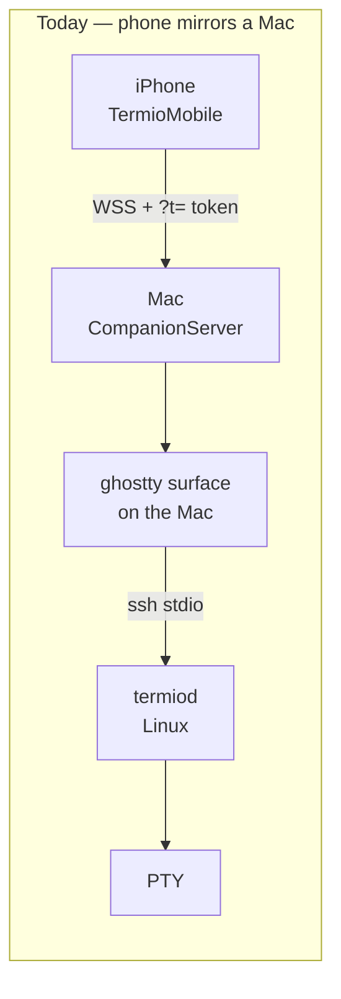
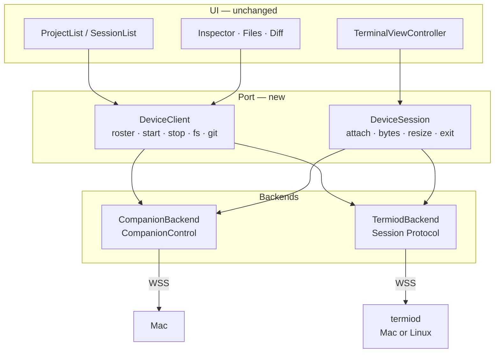

# iOS as a device client

> The phone attaches to the device it is showing. One app, two backends behind a
> single port — the companion wire to a Mac, the Session Protocol to a Linux box —
> and no step in the sequence regresses the shipped path.

## Overview

The phone is the one place the repo contradicts its own architecture. Device
architecture §2.1 says every viewer attaches to the device it is showing and
never through another viewer; the client table at
[`20260805-termiod-device-architecture.md`](20260805-termiod-device-architecture.md)
marks the phone as "**mirrors the Mac** — the live exception to §H #4". Today a
session running on a VPS reaches the phone as `PTY → termiod → ssh stdio → Mac
surface → companion ring → tunnel → phone`.

**Most of what makes the direct path possible is already decided elsewhere, and
this RFC re-decides none of it:**

- The listener, the pairing token, the origin check, and the loopback bind rule
  are [the web-client RFC](20260818-termiod-web-client-ghostty-wasm.md)
  §"Where WSS lives" and §"Auth". iOS is the **second consumer** of that same
  bind, not a second listener.
- The client class is settled:
  [hot-path-and-client-classes](20260805-termiod-hot-path-and-client-classes.md)
  §D.3 — *"The Mac and iOS clients are both Replicas."* The phone already carries
  libghostty, so it needs no `ghostty-vt.wasm` and no fourth class.
- `grid_diff` is not selected because a client is a phone. §D.4 is normative on
  that, and the `G` plane measured 8.6× raw on scrolling.

**What this RFC decides** is the iOS side: the seam that lets one app speak two
protocols, where the codec lives, how a native client satisfies an origin check
written for browsers, and the order the work lands in so the shipped companion
path never breaks.

## Where we are

Two VT parses, two hops, and a geographic detour: phone → tunnel edge → NAT'd
Mac at home → VPS. The Mac must be awake for a session that is not on it.

The target is the phone dialing the device directly, with the Mac appearing as a
*device* and as a *viewer* but never as a waypoint between the phone and a third
machine — making it a transparent relay is rejected by device architecture §9 Q6.

## What has to be true on the device first

Not iOS work, but the iOS work is unsafe without the first and pointless without
the third.

| # | Change | Where | Why it gates |
| --- | --- | --- | --- |
| P0.1 | Per-client byte budget + sequence cursor; drop (v0) or resnapshot (v1) | `termiod/src/daemon.rs` | Risk #10 in the protocol doc: `fan_out` never blocks on a slow consumer and per-client channels are **unbounded**. A backgrounded iPhone with a dead radio is the most likely stalled consumer in the system. |
| P0.2 | `termiod serve --wss` listener, `pair.token`, origin check | web-client RFC PR 1 | The pipe itself. Already specified; iOS adds no requirement except D2 below. |
| P0.3 | Surface `WorkstreamSpec.project` in `Session::info()` | `termiod/src/session.rs:302`, `:335` | The daemon stores a session's project and reads back only `agent_id`. Without it a directly-attached phone is blind above the session level. One field. |

## Decisions

### D1 — One app, two backends behind a port

The UI talks to a `DeviceClient` / `DeviceSession` pair of protocols.
`CompanionBackend` implements them over today's wire; `TermiodBackend`
implements them over the Session Protocol.

**Against, accepted:** the test matrix doubles — every inspector pane now has two
backends behind it. Accepted because the alternative is a second app or a
permanent "remote mode" screen, and both fork the UI instead of the transport.

### D2 — Open: what the origin check is *for*, once a native client exists

The web-client RFC's origin check rejects a missing, `null`, or `file://` Origin.
`URLSession` sends no Origin from a native app, so an unamended rule refuses every
phone. That much is a fact and it has to be resolved before a phone can connect.

What it is **not** is a security decision this RFC can make alone. An `Origin` a
native client sets is a value it chose; it is no more an identity than a browser's
is. The check is a CSRF control that constrains *pages*, and pointing it at a native
client does not give it a second meaning.

So the question belongs to the web-client RFC, which owns the listener: **is
`Origin` a browser-only CSRF control, a required routing value, or a policy check?**
Each answer implies a different rule for native clients, and only the first is what
the current wording describes.

**Provisionally:** the phone sends `Origin` matching the operator's `--wss-origin`
so the shipped check does not refuse it, and the token remains the only thing
authenticating the pipe. **Rejected regardless:** exempting connections that "look
native" — anything a phone can send, a page can send.

### D3 — The token rides the subprotocol, never the query string

Put the token in the negotiated subprotocol, as the web-client RFC specifies —
`URLSession` supports subprotocols directly. Do not add it to the URL. The
companion wire's `?t=` stays where it is on the shipped path and is **not** carried
into the new backend. Neither placement is leak-proof — the web-client RFC records
that `Sec-WebSocket-Protocol` still reaches proxy header logs, and rotation is the
mitigation for both.

### D4 — Enrollment is a ladder, and the Mac may broker it

Pairing with a Mac is solved: `Settings ▸ Mobile` renders a QR of the companion
URL with its token (`MobileSettingsTab.swift:386`) and the phone scans it
(`QRScannerViewController`). A headless box has no screen to render one on, and
that is the whole problem — not the token, the *display surface*.

Three rungs, in the order the app should offer them:

| Rung | When | Flow |
| --- | --- | --- |
| **1. Brokered by a paired Mac** | A Mac is already paired — the common case | The Mac runs `ssh <alias> termiod pair --json` over the SSH it already has, and pushes the result to the phone as a `deviceInvite` on the companion wire. Nothing is scanned or typed. |
| **2. Terminal QR** | No Mac, or a box reached from someone else's machine | `termiod pair --qr` prints a Unicode half-block QR **into whatever terminal the operator is sitting in** — including a termio session on the Mac. The phone scans the screen it is already looking at. |
| **3. Paste** | Screen-reader, screenshot, or a QR that will not scan | `termiod pair` prints a `termio://device?…` URL to copy by hand. |

**Rung 1 is not a §2.1 violation.** The rejected thing is a Mac on the *data*
path. A Mac on the *enrollment* path is the correct use of it: it already holds
SSH, which is precisely what the phone lacks. Once the invite lands, the Mac can
be quit and the phone still reaches the box.

**Where this lives in Settings.**
[20260824-settings-that-know-which-machine.md](20260824-settings-that-know-which-machine.md) §D9
files the whole of `Settings ▸ Mobile` as a machine's **Serving** section, on the
grounds that its port, token, QR, tunnel and paired-client list are all facts
about one machine. A device running `serve --wss` gets the same section — bind,
`pair.token`, `--qr`, allowed origin, paired clients — so the two rungs above are
one feature on two machines rather than a Mac feature and a CLI workaround. The
pairing *action* stays in the command palette and the menu bar, where verbs
belong.

**The invite carries four fields and no more:**

| Field | Why |
| --- | --- |
| `url` | The public endpoint. **Cannot be derived** — the listener binds loopback by design, so the reachable name lives in `--wss-origin` / the tunnel, not in the daemon. If it is unset, `pair --qr` refuses and says so rather than printing a QR to nowhere. |
| `token` | The `pair.token`, presented later as the subprotocol (D3). |
| `host_id` | So a box the phone already knows through another route is recognised, not duplicated. |
| `proto` | So a stale phone says "update the other end" instead of drawing an empty list — the `Wire` minimum-version pattern the companion already uses. |

**No display name.** Device architecture §4 is explicit that the host never
supplies one; the client picks it. The phone names the device, exactly as it
names *This Mac* today.

**Verify before saving.** The flow dials once and waits for `hello_ok` before
persisting. Saving an unverified address is what produced the companion's worst
failure mode — paired, silently unreachable, and indistinguishable from a bug.

A QR encoder in `termiod` is a small pure-data dependency and is not crypto, so
§H #3 is untouched.

### D5 — The codec moves to `Shared/`

`Sources/termio/Terminal/Termiod/TermiodClient.swift` is 2300 lines with the
protocol in identifiable blocks — Framing `:559`, Control payloads `:639`,
Handshake `:1251` — sitting above a `Transport` abstraction (`:388`) that already
has local-pipe and ssh-pipe cases. Roughly 700 lines are pure codec.

Move those to `Shared/Sources/TermioShared/` for the reason `WireProtocol.swift`
already lives there: both ends stay in sync. The Mac gains a third `Transport`
case; iOS gets a WS transport over the identical codec.

**Against, accepted:** `Shared/` becomes load-bearing for a protocol whose Rust
side is still moving, so codec drift becomes a standing maintenance cost. The
alternative — two Swift codecs — pays that cost twice and silently.

### D6 — The rename lands last

`PairedMac` (`ios/Sources/Models.swift:359`), `macID` / `macName` on the roster,
`CompanionLink`, `MockProject` / `MockSession`. Mechanical, wide, and it
conflicts with everything if done before the vocabulary is settled by a second
live backend.

## Attach, end to end

Snapshot-on-attach is a mobile feature before it is anything else: the phone
reattaches every time it unlocks.

## Work plan

P1 and P2 depend on nothing in Rust and are worth shipping on their own merits —
start them while P0 is in flight.

| Phase | Deliverable | Gate |
| --- | --- | --- |
| **P1** | `DeviceClient` / `DeviceSession` protocols; `CompanionBackend` wraps today's two sockets verbatim. The one real edit is the wire-type leak: `InspectorViewController` takes `WireFileEntry` / `WireChange` / `WireDiff` directly (`:133`, `:204`, `:327`, `:353`, `:374`, `:381`), and `FileViewerController` / `DiffViewController` follow it. `RosterStore:148–217` is four call sites. | `./ios/dev-run.sh`; behaviour byte-identical against an unchanged Mac. No wire change. |
| **P2** | One `WebSocketLink` owning connect, backoff, `NWPathMonitor`, foreground retry, the 15 s ping, and auth-first ordering. `CompanionClient` and `CompanionTransport` each reimplement all six today — ~200 duplicated lines, two places for every link fix to land. | Worth doing even if direct attach never ships. That is the test of whether this phase is real. |
| **P3** | Codec extracted per D5. | Mac builds; its remote sessions still work through the moved codec, **before** iOS touches it. |
| **P4** | `TermiodBackend`: `hello` / `hello_ok`, `list` for the roster, `attach` for bytes, `fs.*` / `git.*` for the inspector. `PairedMac` gains a `kind`; the Slack-workspace model — several paired, one active — carries over unchanged. | A phone attaches to a Linux box with the Mac app quit. |
| **P5** | The rename of D6. | — |
| **P6** | Predictive echo; measure reattach cost. | QUIC only if §D's p95 criterion actually fires. |

Predictive echo is the highest-value item in the whole plan and the only one no
transport choice can deliver — protocol doc §C.6 is explicit that it is what
makes a 100 ms link *feel* local.

### P4 follow-ups

Things the landed backend does the weaker way, each because the stronger one
arrived on `main` while P4 was in flight.

**Done — reply correlation.** `TermiodBackend` now keys every in-flight request
by the `re` it was sent with, read back through `Termiod.responseID(of:)` and,
for the bytes behind an `fs_read`, through `decodeFileChunk`'s `request`. It
matched the oldest outstanding request *of that verb* before, which held only
while one of each was ever in flight.

That turned out to be hiding a live defect rather than only a latent one: a
refusal carries the `re` of the request that caused it, but was attributed to
whatever was outstanding — so a refused search cancelled a read that was still
perfectly alive, and the read then hung until the socket dropped. Both are
covered by `TermiodReplyCorrelationTests`.

The remaining two:

- **The ＋ menu offers agents the box may not have.** Rows resolve their agent
  from `foreground_argv`, which is right, but the new-session menu falls back to
  the built-in list. `agents_probed` / `AgentPresence` answers which CLIs are
  actually installed over there — and `present` is `true` when the probe could
  not look, so a machine that cannot answer must not read as one with nothing.
- **Content search, and cancelling it.** The phone's file search is filename-only
  (`fs_match`, one reply off the host's index), so nothing is left running when a
  query is abandoned. The day this pane gains content search it inherits the
  problem `Termiod.CancelOperation` exists for: only `fs_search` registers a
  cancellable request, and an abandoned one leaves `git grep` running until the
  connection drops.

## Non-goals

- **No SSH client on iOS.** Built and removed twice; §H #3 forbids it. The
  transport is the device's listener, not the phone's SSH stack.
- **No relay through the Mac.** Rejected by device architecture §9 Q6.
- **No `G` by default.** Loss- and backlog-triggered only.
- **No fork, no "remote mode" screen, no chat UI.** One app, two backends, one
  UI.
- **The companion wire is not deleted here.** It is retired when the phone and
  the browser both attach directly; this RFC only stops it being the *only* path.
  The retirement has its own ladder:
  [`20260831-companion-second-protocol-retires.md`](20260831-companion-second-protocol-retires.md),
  which picks up the state-ownership questions this document's §Open-questions
  leaves open.

## Open questions

1. **Workspace ownership.** Device architecture §0.6 says the registry belongs on
   the device; [`20260819-device-workspace-project.md`](20260819-device-workspace-project.md)
   §9.1 defers. Wire v2 already ships workspace grouping on the phone
   (`workspaceID` / `workspaceName` / `deviceAlias` on every `RosterProject`), so
   a directly-attached backend needs an answer or a stand-in. **Proposed
   stand-in:** group by project root on the device side; settle ownership later.
2. **Two backends, one roster.** A phone paired to a Mac *and* attached to a VPS
   sees the box twice — once as the Mac's remote workspace, once as its own
   device. Merge by `host_id`, or show both until the Mac path is retired?
3. **Does `--wss-origin` become mandatory** once a native client exists, given
   D2 removes the same-origin default's only working case for phones?
4. **Enrollment secret vs pipe secret.** D4's QR carries the long-lived
   `pair.token`, displayed in a terminal that may be screenshared or recorded.
   **State the consequence rather than defer it: whoever photographs that QR has
   full access to the daemon until it is rotated.** Two answers, and one must be
   picked before `pair --qr` ships — accept that explicitly and document rotation
   as the only revocation, or mint a short-lived enrollment code exchanged for the
   pipe secret. The second is a token type nothing else needs; the first is a real
   cost, not a theoretical one.

## Risks

- **The renderer, not the wire.** Three recorded kill modes on iOS — mailbox
  deadlock, IO-thread death, `EXC_GUARD` on `close(fd 0)`. This work raises the
  ceiling, not the floor.
- **Backgrounding.** iOS suspends the socket; every foreground is a reattach.
  P0.1 is what keeps that from becoming the daemon's problem.
- **Skew.** Two Swift ends and one Rust end, versioned separately. The `Wire`
  minimum-version handshake pattern from the companion wire should carry over
  rather than be reinvented.
