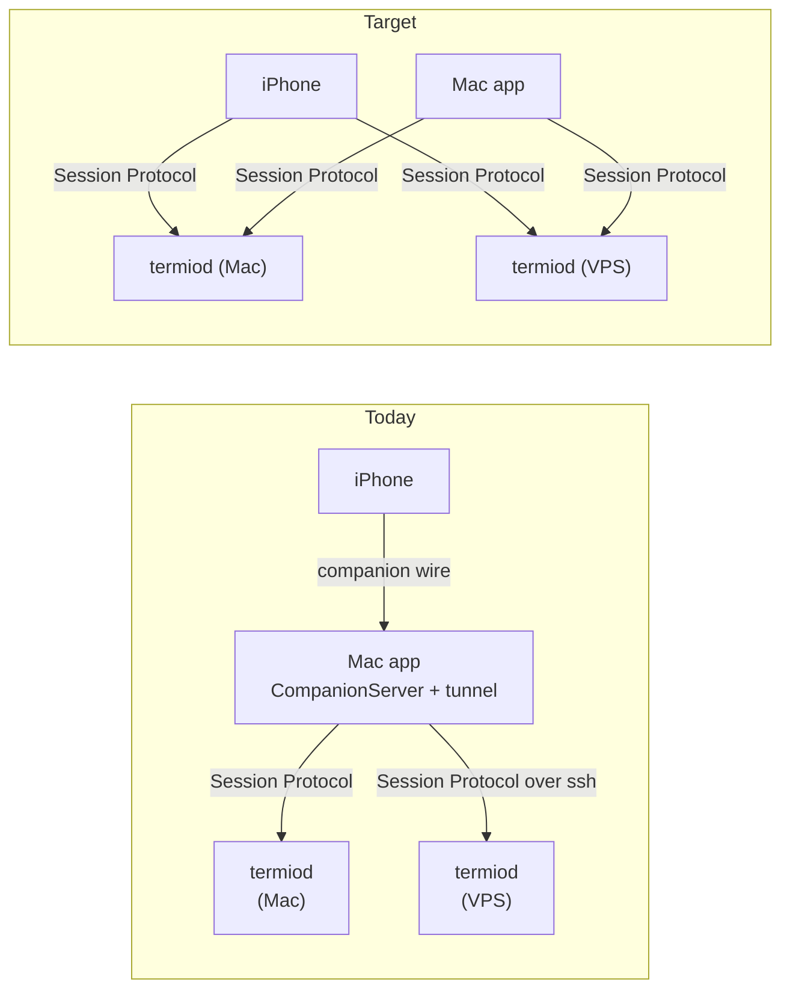

# Retire the companion's second protocol — the phone attaches to a device

> Invariant #4 says one protocol, versioned and transport-agnostic. The companion
> wire is the last place the repo says otherwise. This is the ladder that deletes
> it — eight stages, each shippable alone, starting with the plane whose absence
> would make direct attach a downgrade.

---

## 0. What this decides, and what it does not

Three documents already own pieces of this and are **not** re-decided here:

| Document | Authoritative for |
| --- | --- |
| [`20260818-termiod-web-client-ghostty-wasm.md`](20260818-termiod-web-client-ghostty-wasm.md) | The listener. `--wss`, loopback-only bind, the origin check, `pair.token`. iOS and the browser are both *consumers* of that one bind. |
| [`20260824-ios-as-device-client.md`](20260824-ios-as-device-client.md) | The iOS **seam**: `DeviceClient` / `DeviceSession`, two backends behind one port, the codec in `Shared/`, the enrollment ladder. P1–P4 have landed. |
| [`20260805-termiod-device-architecture.md`](20260805-termiod-device-architecture.md) | The invariants: §4 the presentation boundary, §4.1 what each side owns, §5 the four planes, §5.1 the connection as an object. |

iOS-as-device-client stops exactly where this one starts. Its own non-goals say
it: *"The companion wire is not deleted here. It is retired when the phone and
the browser both attach directly."* It made a second path possible. It did not
say what happens to the state the first path was carrying, and every remaining
question is of that shape — **not transport, ownership**.

So this document decides three things and nothing else:

1. **Where each piece of phone-visible state lives** once the Mac app is a peer
   client rather than a server (§3, §4).
2. **The order the pieces move in**, as stages with gates that run (§5).
3. **The four planes the companion wire carries that no other document has
   placed**: notifications, the permission broker, transfer, and Usage (§6).

---

## 1. The contradiction, stated once

The Mac app is two things at once: a **client** of `termiod` and a **server** to
the phone. The second half is the whole of `Sources/termio/Companion/` — 2,777
lines — plus `Shared/Sources/TermioShared/WireProtocol.swift` (821), a second
framing, a second versioning scheme (`Wire.current`), a second auth story, and a
second set of verbs for `fs.*` and `git.*` that `termiod` already answers.

This is not a duplicate implementation to tidy. It is a **topology** claim: that
the phone reaches a VPS by way of a Mac at home. Device architecture §2.1
rejects it, §9 Q6 rejects the Mac as a transparent relay, and the cost is
concrete — two VT parses, a geographic detour, and a Mac that must be awake for
a session that is not on it.

**What is different now, and why this ladder is writable at all:** the second
backend exists. `ios/Sources/TermiodBackend.swift`, `DeviceClient.swift`,
`WebSocketLink.swift` and `TermiodChannel.swift` are on `main`. A phone can
already attach to a Linux box with the Mac app quit. The remaining work is not
"build the path" — it is "move what the old path was carrying, then delete it."

---

## 2. Ground truth, measured 2026-08-31 at `37a0164`

| Claim | Command | Result |
| --- | --- | --- |
| The companion server is the Mac's second server | `wc -l Sources/termio/Companion/*.swift` | 2,777 |
| The second protocol | `wc -l Shared/Sources/TermioShared/WireProtocol.swift` | 821 |
| The phone can already speak the first one | `ls ios/Sources/TermiodBackend.swift` | present |
| …and already subscribes to device status | `grep -n 'events: \["roster", "status"\]' ios/Sources/TermiodBackend.swift` | 1 hit |
| The hook contract already reports to the daemon | `termio agent report` → `termiod set-status` | `termiod/src/bin/termio.rs:615` |
| The daemon already parses status regex | `grep -n status_rules termiod/src/agent/manifest.rs` | `:77`, `:81` |
| …and never matches them | `grep -rn 'regex' termiod/Cargo.toml` | 0 |
| The screen half of status is Swift-only | `TermioStore+AgentStatus.swift` | 793 |
| Per-client backlog budget (P0.1) landed | `termiod/src/session/backlog.rs` | 160 |
| Attach replay is already bounded | `const RING_CAP` (`session.rs:20`) | 128 KiB |

The last row settles an inherited open question outright; see §7.1.

---

## 3. The reversal: agent status is the device's

Unify-server-plane §4.1 lists `OSCProgressScanner` and `AgentStatusRules` under
**Stays Swift**, and §8 defers moving them. That list says a future stage
proposing otherwise *"must argue against this list rather than around it."* Here
is the argument.

### 3.1 The two documents already disagree

Device architecture §4.1 puts **"agent workstream status"** in the *device*
column, next to the PTY and git state. Unify §4.1 puts the *rules that produce
it* in the *viewer* column. Both cannot be right once there are two viewers.

The disagreement is real and it resolves cleanly, because the two entries are
about different things:

- **The status value** is device state. Two people watching one session from two
  machines expect `working` to mean the same thing on both. That is device
  architecture's test, and status passes it.
- **The rules** were kept Swift on the grounds that *"every client receives the
  same bytes"* and *"reads the rendered viewport, which every client already
  holds."* Both are true. Neither is sufficient, for the reason §3.2 gives.

### 3.2 Why "every client already holds it" fails with two clients

Identical inputs do not produce identical outputs, because the rules are not
functions of the bytes. They are functions of the bytes **and five pieces of
per-client state**:

| Input the rules read | Where it lives on the Mac | What the phone has |
| --- | --- | --- |
| the rendered viewport | `readViewportText()` — follows *this* client's scroll | a different scroll position |
| `lastUserInputAt` | this Mac's keystrokes | the phone's keystrokes, which the Mac never sees as input |
| `lastHookReportAt` | the daemon's `E status` | the same — this one agrees |
| `promotionStreak` | this client's tick history | its own, started when it attached |
| `isViewing(id)` | this window's selection | its own selection |

Run the same rules on two clients and they disagree by construction. The
Swift comment on `makeStatusTap` already names the defect in single-client form:
*"scrolling an inline agent's pane up feeds stale rows to the classifier."*
Scrolling on the **phone** would do that to the **Mac's** verdict too, once both
derive independently.

And the failure is not symmetric. A phone attached directly to a device today
gets `E status` and nothing else — no title channel, no progress channel, no
screen rules, no stall probe, no promotion, no stale-working sweep. For an agent
with no hook system, that is *no status at all*. The phone's home screen is a
**Needs You** strip. Shipping direct attach before this stage makes the phone's
most important column worse than the relay it replaced.

**So the ordering is forced: this is Stage 1, not a deferred cleanup.**

### 3.3 What this does *not* move — the presentation boundary holds

Device architecture §4's own table already draws this line:

> | Status | Host sends **enum values** | Host must not send **human-facing copy** |

The device sends `working` / `needs_you` / `idle` / `done` / `failed` and the
**source** that produced each. It does not send "Working — Bash", it does not
pick a dot colour, and it does not decide whether a finished turn is worth a
badge. Concretely, three things stay client-side and are *not* ported:

- **`statusDescription`** — "Working — Bash", "Waiting for you". Human-facing
  copy, and localized. Stays in `TermioStore`.
- **`isViewing` arbitration.** `done` versus `idle` on a turn that just ended is
  the question *"has this person seen it?"*, which is per-viewer by definition —
  §4.1 puts selection in the viewer column. The device reports the turn boundary;
  each client applies its own focus. §3.5 says how without changing behaviour.
- **argv → glyph.** Unify §4.1: *"the daemon reports argv; which glyph that
  becomes is presentation."* Unchanged. The daemon resolving argv to a *manifest*
  so it knows which regex list to run is not the same act as resolving it to an
  icon, and only the first moves.

The testable form of the rule, from §4: feed one status event to a light-theme
and a dark-theme client and they must still look different. Enum values pass;
copy does not.

### 3.4 The recorded objection, answered

`termiod/src/agent/fixture.rs` says, in a comment written to be found:

> *Invalid regex is not detected here. Swift compiles status patterns with
> `NSRegularExpression` and drops the ones that do not compile; this carries them
> as raw strings because the daemon never matches them, and choosing a Rust regex
> engine would mean choosing a **different accepted language**, which is a worse
> kind of disagreement than none.*

That is correct **while both sides match**. It stops applying the moment only one
does. Two engines with different accepted languages is a silent divergence; one
engine is a language, and a pattern either compiles or is dropped and logged —
which is already what Swift does today (`AgentStatusRules.compile`).

The narrowing is real and bounded, so it is stated rather than glossed:

- `regex` is RE2-shaped: no backreferences, no lookaround. `NSRegularExpression`
  is ICU and has both.
- **Every pattern termio ships is inside the intersection.** The five manifests
  carrying rules (`claude`, `codex`, `crush`, `grok`, `qwen`) use character
  classes, Unicode ranges, non-capturing groups and anchors — nothing else.
- A user's own `~/.termio/config/agents/*.json` could use lookahead. It is
  dropped with a log line naming the agent and the pattern, exactly as an invalid
  pattern is today.
- The fixture gains a duty rather than losing one: it now asserts every shipped
  pattern **compiles** on the Rust side. A manifest whose rules the daemon cannot
  run fails the build.

### 3.5 What the port gains, beyond correctness

Three defects the Swift engine has by construction are gone once the engine sits
beside the sidecar VT rather than behind a client's surface:

1. **The scrolled-viewport bug.** `readViewportText()` returns the *displayed*
   viewport, so scrolling up feeds stale rows to the classifier. The Swift
   comment records this as an upstream ask on libghostty's threading. The
   sidecar VT has no scroll position — it holds the live screen, always. The
   caveat disappears rather than being worked around.
2. **Input from the other client.** `noteUserInput` exists so keystroke echo does
   not read as agent activity. It is fed from the Mac's write path. The daemon's
   PTY write path is the *real* choke point — it sees the phone's keystrokes and
   `termio sessions send` too.
3. **One engine, one verdict.** Every client shows the same dot because there is
   one place that decided it.

### 3.6 Shape: a subscribable resource, like `fs:` and `git:`

`termiod/src/resource.rs` already generalises the mechanism — a stable id, a
monotonic `seq`, a bounded ring, replay-or-gap on resume, and a linger past the
last subscriber. Two kinds ride it (`fs:`, `git:`) behind one `ResourceBatch`
trait. Status is the third:

| | `status:` |
| --- | --- |
| **Id** | `status:` — one per device. Not per session: a client watching a roster wants every row, and one subscription is one cursor. |
| **Batch** | the sessions whose status changed, each with state, source, tool, title, and the stall flag |
| **seq** | monotonic per device |
| **gap** | the client re-reads `list`, which carries current status per session — the same "only the host can rescan" answer `git:` gives |
| **ring** | 256 batches, inherited |
| **linger** | inherited (300 s). A phone that locks and comes back inside five minutes resumes at its cursor. |

`E status` on the session channel is **kept, unchanged**. It is how an attached
client learns about its own session without a second subscription, and removing
it would be a wire break for no gain. The resource is the roster-wide view; the
event is the per-session one, and both are emitted from the one engine.

**Both halves ship together, or neither does.** A resource nothing subscribes to
is a ring nobody writes — `publish_status` returns early when no one has ever
asked — so an unconsumed `status:` would be an advertised mechanism that has
never once run. Stage 1 therefore also moves the phone onto it: `TermiodBackend`
subscribes to `status:` with its last cursor in place of the `status` event
name, so the two paths are one path with a cursor. The `stalled` signal rides
the same batches, so nothing is lost by dropping the broadcast — and a device
too old to know `status:` refuses, which the phone answers by falling back to
the broadcast rather than going dark.

**The resume path has an ordering contract, and both ends hold half of it.**
A subscription resolves on two paths — the ack, and the batches — and the
window between them is where `fs:` and `git:` were each caught once already:

- **Host.** `Registry::attach` queues a subscriber's replay and installs the
  subscriber inside *one* critical section. Before, the subscriber went in under
  the lock and the replay was sent after it was released, so a batch published
  in between reached the client first and the replay landed on top of newer
  truth. This is shared machinery, so `fs:` and `git:` are fixed by the same
  change rather than left one revision behind.
- **Client.** The ack's `seq` names the end of a replay the host is *about* to
  send — a target, not an achievement. A phone that adopted it and then lost the
  link resumed from a future it had never seen, and the batches it named were
  gone for good. The durable cursor therefore advances only for a batch actually
  applied, and only when that batch is the next one; batches arriving before the
  ack are held by `DeviceWatchLedger`, the same staging discipline the Mac's two
  planes use. That type moved to `Shared/` for this — its own comment says a
  second copy of the reasoning is how `fs:` came to be missing it, and this is
  the third plane to need it.

Two marks, not one: the cursor is the highest *contiguous* batch applied, and a
separate per-attempt mark is the highest applied at all. They part only when a
hole appears — the batch applies, because newer truth beats none, while the
cursor stays put so the hole is re-asked for. The per-attempt mark resets on
every new subscribe, because a fresh subscription replays in order from the
cursor: without the reset, the batches spanning the hole would be dropped as
stale on every reconnect and the cursor would never move again.

That rule is `ResourceCursor` in `Shared/`, and it is one rule for three
planes. The Mac's `git:` had the same ack-adopting bug and is fixed with it;
`fs:` never had it — it advances only in `deliver`, for batches that applied —
and now follows the same contiguity rule in place. The pattern is the reason
both this and `DeviceWatchLedger` are shared types rather than three careful
copies: the ledger orders a batch's *arrival* against the ack, the cursor
decides what it is *worth*, and needing one has never implied having the
other.

The Mac stays on `E status`, deliberately. It attaches to each session it shows,
so it already has the per-session channel; a roster-wide cursor is what a client
that watches sessions it is *not* attached to needs, and on the Mac that is
Stage 3's problem, not this one's.

### 3.7 The anti-100× invariant

The status engine runs **on the sidecar thread**, fed by the same tee that feeds
the VT, under the same `SidecarQueue` budget. It is never on the delivery path.
If the sidecar falls behind, status degrades exactly as snapshots do — which is
the invariant's own definition of a safe degrade. A status engine on the byte
path would be a per-frame parse between the PTY and the pipe, which is the
rebuilt tmux tax invariant #1 rejects.

**Stated rather than discovered later:** a VT that goes stale stops being fed,
so the three derived channels stop with it and the session falls back to what
its hooks report. That is the right degrade — the alternative is a status engine
that keeps its own copy of the byte stream, which is a second parse for a signal
whose whole job is to be cheap — but it does mean "the VT went stale" and "the
dot stopped moving" are one event, and `E vt_stale` already says so.

The screen read costs one grid walk per second **per agent session**, and
nothing for a plain shell: `SetStatusWatch` turns the sampler off for a session
with no resolved agent, and asks for the screen *text* only when that agent
declared screen rules. A shell that gets promoted to a hand-started agent turns
it on at the same edge that gives it an identity.

### 3.8 The hook contract does not move, and does not change

`termio agent report <state>` is the public contract users hand-write hooks
against. It already reaches the daemon: `termio.rs:615` execs
`termiod set-status <session> <state>`, addressed by `TERMIOD_SESSION_ID`.

**Hard constraints, restated as gates:**

- Every flag keeps its name and meaning: `--transcript`, `--conversation`,
  `--conversation-from`, `--tool-from`, `--prompt-title-from`, `--reply`.
- A hook fired outside a termiod session stays silent and exits 0.
- `--reply` prints `{}` on every path, including undeliverable.
- The hook command written into a user's global config **never names a path
  inside `Bundle.main`.** It names `machine::daemon_binary()`, resolved on the box
  that owns the file. An app-relative path in `~/.claude/settings.json` breaks the
  day the app moves, and it has broken before.

Nothing in this RFC edits `agent_report`. It is listed here because "the status
engine moved" is exactly the kind of change that quietly rewrites a hook
command, and the gate is a byte-compare of the generated hook line before and
after.

---

## 4. What the phone sees, and who owns it

Every piece of state behind a phone screen today, with a verdict. The test is
device architecture §4.1's: *would two people watching from two machines expect
to share it?*

| State | Owned today | Verdict | Stage |
| --- | --- | --- | --- |
| **Session roster** (id, alive, cwd, pid, argv) | daemon | already the device's | — |
| **Agent status** (working / needs-you / idle / done) | Mac app, `TermioStore+AgentStatus` | **moves** — §3 | **1** |
| **Live title** (`OSC 0/2`) | Mac surface, via libghostty callback | **moves** — the sidecar VT already reports `title` on every `Snapshot` | 1 |
| **Prompt title** (agent's first prompt) | Mac app, from hook payload | **moves** — the daemon already receives it (`StatusDetails.prompt_title`) and drops it | 1 |
| **Tool in use** | Mac app, from hook | already on the wire (`StatusDetails.tool`); the Mac just re-derives the sentence | 1 |
| **Stall verdict** | Mac app | **moves** — §3, and the repo fingerprint it needs is a `git` call on the box, not on the Mac | 1 |
| **Given title** (the user renamed a row) | `StateFile` | **stays a client concern, syncs through the device** — §4.1 |  3 |
| **Project / checkout** | `StateFile` | **moves to the roster** — the daemon already stores `WorkstreamSpec.project` | 3 |
| **Worktree label** (branch of a linked checkout) | Mac `WorktreeService` | **moves** — unify Stage 9 already schedules worktree enumeration in Rust | 3 |
| **Workspace grouping** | `StateFile` | **stays the user's, and follows §4.2** | 3 |
| **Split layout, pane tree** | Mac app | **stays client-side** — invariant #5 | never |
| **Selection, scroll, viewport** | Mac app | **stays client-side** — §4.1 | never |
| **Enabled agents list** (`RosterAgent`) | Mac Settings | **derived from the device** — `probe_agents` answers which CLIs the box has; which are *enabled* is a preference | 3 |
| **Notification delivery** | Mac `TaskNotifications` | **stays this Mac's**, and the phone stops going through it — §6.1 | 4 |
| **Permission answers** | Mac hook socket | **moves** — §6.2 | 4 |
| **Pasted images** | Mac pasteboard read by the agent | **moves to the transfer plane** — §6.3 | 5 |
| **Usage / plan limits** | Mac keychain reads | **stays box-local, becomes a request** — §6.4 | 6 |

### 4.1 The one that is neither — a name the user typed

`givenTitle` fails the two-observers test in one direction and passes in the
other. Renaming a session on the Mac and not seeing it on the phone is a bug.
Renaming it on the phone and having the Mac disagree is the same bug. But the
name is not a fact about the process — a device cannot derive it, and it must
survive the session it names.

**Decision: the device stores it, the client authors it.** `CreateSpec` already
carries `name`, and `SessionInfo` reads it back. A rename is a request to the
device, not a write to `StateFile`. This is the same shape as the fixture
contract: the daemon holds bytes it does not interpret.

**Against, accepted:** the Mac's `StateFile` keeps a copy for offline display, so
there are two records of one string and they can disagree while a device is
unreachable. Accepted because the alternative — no name until the daemon answers
— makes the sidebar blank on every cold launch, and because last-writer-wins on a
reconnect is a rule a person can predict.

### 4.2 Workspaces: the stand-in, promoted

iOS-as-device-client §Open-questions Q1 proposed a stand-in: *group by project
root on the device side; settle ownership later.* Unify §9.7 asks the same
question a different way. Neither is answered here either — but the stand-in is
promoted from "provisional" to **the shipping rule for this ladder**, because
the phone needs *some* grouping the day the Mac stops sending one, and grouping
by project root is derivable on every device with no new state.

What that means concretely: `RosterProject.workspaceID` / `workspaceName` become
**client-derived** from the device's project roots plus the client's own
workspace arrangement, rather than fields the Mac authors and the phone reads.
A workspace is an arrangement — the user's, not the device's — so the client
that holds the arrangement is the one that groups. Two clients with different
arrangements see different groupings of the same sessions, which is correct.

Moving workspace *authority* to the device stays deferred, and stays out of this
ladder's critical path.

---

## 5. Stages

Each stage ships alone, on `main`, with a gate that runs. The order is forced by
what would otherwise regress: **no stage may make the phone worse than the relay
it replaces.**

### Stage 1 — the status plane moves to the device — *this PR*

Port the status engine into `termiod`, beside the sidecar VT: screen-rule
classification, `OSC 0/2` title classification, `OSC 9;4` progress, screen-streak
promotion with every guard, the stale-working sweep, and the four-probe stall
detector. Publish it as the `status:` resource **and** through the existing
`E status`, and move the phone onto the resource so the cursor is exercised
rather than advertised (§3.6). Delete the Swift engine in the same PR — no dual
engines.

Two seams come with it, because both are only visible once a second viewer
derives status from the same device:

- **The viewer's own call.** `E status` and `status:` both carry `source` and
  `turn_ended`, and the Mac and the phone each apply their own focus to a
  derived turn end (§3.3). Without this the Mac shows `done` and a directly
  attached phone shows `idle` for one session at one moment.
- **The clocks cross a handoff** (§7.4).

**Gates, as they actually ran:**

| Gate | Result |
| --- | --- |
| `cargo test` | **349 passed, 0 failed** (40 of them `session::status`) |
| `swift build && swift test` | 959 passed, 0 failed |
| `python3 termiod/tests/cli_compat.py` | **110/110** — the hook and CLI surface is byte-identical against the frozen shell client |
| The real-daemon job, run locally (`TERMIO_TERMIOD_TEST_BIN=… swift test --filter TermiodFilesIntegrationTests --filter TermiodWireOrderIntegrationTests`) | **35 passed, 0 failed** |
| iOS unit tests (`xcodebuild … -only-testing:TermioMobileTests`) | 38 passed, 0 failed (12 new) |
| iOS builds for the simulator | clean |
| No second matcher: `grep -rn 'firstMatch\|NSRegularExpression' Sources/termio/Agents Sources/termio/TermioStore` | 0 |
| The engine is gone, not disabled: `OSCProgressScanner.swift`, `StallProbe`, `StallMeasurement`, `applyScreenDetectedActivity`, `applyTitleActivity`, `applyProgressActivity`, `noteOutputActivity`, `sweepStaleWorking`, `sweepStalledSessions`, `makeStatusTap` | all deleted |
| Every shipped manifest's patterns compile under `regex` | `bundled_status_patterns_compile` |
| The hook contract is untouched | `agent_report` and `agent::install` unchanged |

Two iOS **UI** tests fail — `testInspectorFileTreeShowsLanguageIcons` and
`testScanEntryPresentsScanner`. Both fail identically on `origin/main` with this
branch stashed; neither touches status. Recorded rather than folded into the
count.

#### Which Swift case became which Rust case

The Swift tests are the spec, so the mapping has to be auditable rather than
asserted. Nothing was dropped; three cases were merged where the Rust API made
one assertion cover two, and each is named.

| Swift case | Rust case |
| --- | --- |
| `StallProbeTests.testUnchangedEvidenceAlertsOnceThenHolds` | `unchanged_evidence_alerts_once_then_holds` |
| `…testRepoChangeIsProgressAndReArms` | `repo_change_is_progress_and_rearms` |
| `…testTranscriptBurstIsProgress` | `transcript_burst_is_progress` |
| `…testStreamSuppressorReadsSustainedVolumeOnly` | `stream_suppressor_reads_sustained_volume_only` |
| `…testSlideWindowWithoutBaselineForcesRecapture` | `slide_window_without_baseline_forces_recapture` |
| `AgentTitleStatusTests.testEveryWorkingTitleFrameRefreshesLiveness` | `every_working_title_frame_refreshes_liveness` — **adapted**: the Swift version poked `lastWorkingAt` directly; the Rust field is private, so it asserts through the sweep, which is what that clock is *for* |
| `…testACalmTitleEndsTheTurn` | `a_calm_title_ends_the_turn` |
| `…testClaudeTitleRulesReadBothSpinnerAlphabets` | `claude_title_rules_read_both_spinner_alphabets` |
| `OSCProgressScannerTests.testBusyThenIdle` · `testStringTerminatorClosesSequence` · `testIndeterminateStateIsWorking` | **merged** into `reads_both_terminators_and_both_busy_states` — one assertion per terminator × per busy state |
| `…testBothTransitionsInOneChunkAreReported` | `both_edges_of_one_turn_arrive_in_order` |
| `…testSequenceSplitAcrossChunks` | `a_sequence_split_across_reads_is_tolerated` |
| `…testErrorAndPausedStatesAreIgnored` | `error_and_paused_states_are_not_transitions` |
| `…testProgressLikeNotificationBodyIsRejected` · `testBusyStateValidatesProgressRange` | **merged** into `other_osc_nine_payloads_are_not_progress` |
| `…testKeepalivesInOneChunkCollapse` · `…AcrossChunksAreEachReported` | `every_keepalive_is_reported_within_a_chunk_and_across_them` — **behaviour changed on purpose**: the Swift scanner collapsed duplicates inside one read, this one does not. The arbiter collapses them (`note_progress`), and it refreshes the liveness clock *before* that guard, so each keepalive stays evidence. The observable result is identical; the comment claiming a collapse was wrong and is fixed |
| `…testOverlongPayloadIsRejected` | `an_overlong_payload_is_rejected_rather_than_truncated` — the bound moved from 24 to 1024 because titles now ride the same scanner, so the case also asserts the scanner *recovers* after one |
| `…testProgressAmidstOtherOutput` | `a_report_amidst_other_output_still_lands` |
| `…testClassifyDirect` | `classify_pins_the_grammar` |
| `…testTitleAndNotificationAndPaletteAreIgnored` | `a_title_is_read_and_an_icon_name_is_not` — **narrowed on purpose**: OSC 7 and OSC 4 still fall through, but a title is no longer "ignored". It is read, as a title, and never as progress |

New Rust cases with no Swift ancestor cover what only the daemon can now get
wrong: the arbitration precedence rules, the promotion guards, the `status:`
cursor, agent resolution from argv, and the handoff clocks (§7.4).

**What is not verified, and why.** No device pair was run. The phone's
subscription, its cursor and its focus rule are covered by unit tests against
the daemon's own JSON, and the daemon's half by `cargo test`, but the two have
not been in one room — CI builds the iOS app and does not run its tests. What
that leaves unproven is the wiring between two things each proven separately,
which is exactly what Stage 2's gate is for: a phone driving a session on a Mac
with the app quit.

`AgentStatusRules` stays in Swift **as a type and not as a matcher** — it now
holds pattern *sources*, because the app still parses manifests to render the
agent roster and the fixture contract says both parsers stay
(`termiod/src/agent/fixture.rs`). Its `explain`, its `trace` and its
`NSRegularExpression` compilation are gone.

### Stage 2 — the Mac is a device

`termiod serve --wss` on the Mac, and the app brokers enrollment the way
iOS-as-device-client D4 describes. The Mac app does not stop serving here; the
phone simply gains a second way to reach the same sessions.

**Gate:** a phone attaches to the Mac's own `termiod` and drives a session with
**the Mac app quit**. Not the simulator.

### Stage 3 — the roster is the device's

Project root, worktree branch, given title, agent presence — read from the
device rather than from `StateFile`. §4's table row by row.

**Gate:** `grep -rn 'CompanionRoster' Sources/termio/TermioStore/` → 0. The phone's
project list, worktree labels and titles are identical whether it reaches a
session through the Mac or directly.

### Stage 4 — notifications and permissions leave the relay

§6.1 and §6.2. Both are "the Mac is answering a question about a machine it is
not on", and both have the same shape: a device-side event, a client-side
delivery.

**Gate:** an agent on a VPS blocks on a permission prompt; the phone answers it
with the Mac app quit. Task notifications verified on a **release** build — they
never fire from a dev build.

### Stage 5 — transfer, phone to device

§6.3. Image paste from the phone into an agent on a VPS, over the transfer plane,
with no Mac in the path.

**Gate:** paste a screenshot on the phone into a VPS agent; the agent reads the
file. Resume-at-offset exercised by killing the link mid-upload.

### Stage 6 — Usage is a device request

§6.4.

**Gate:** the Usage tab shows a VPS agent's plan limits with no credential
leaving that box.

### Stage 7 — the Mac app stops serving

Delete `CompanionServer`, `TunnelManager`'s companion role, and the roster
derivation. The Mac app is a client of `termiod` and nothing else.

**Gate:** `wc -l Sources/termio/Companion/*.swift` → only `Usage/` remains.

### Stage 8 — delete the wire

`WireProtocol.swift`, `CompanionControl`, `CompanionRoster`, `Wire.current`,
`CompanionBackend.swift`, `CompanionClient.swift`, `CompanionTransport.swift`.
The rename of iOS-as-device-client D6 lands with it.

**Gate:** `grep -rn 'CompanionControl\|CompanionRoster' Sources ios Shared | wc -l` → 0.
One release on the release channel between Stage 7 and this, because Stage 8's
rollback is a release rollback.

---

## 6. The four planes no other document placed

### 6.1 Notifications, once the Mac is not relaying

**The Mac's Notification Center is this Mac's** — unify §4.1, and it is right.
What is wrong today is the *trigger*: the phone is told about a finished agent
because the Mac app noticed, and the Mac app noticed because it was in the path.

Split the two halves:

- **The event** is device state. It is already on the wire: a `status:` batch, or
  `E status`, carrying a turn boundary. After Stage 1 it is produced by the box
  the agent runs on.
- **The delivery** is per-client and stays local. The Mac posts an `NSUserNotification`
  from its own subscription. The phone raises its own banner from its own
  subscription.

No relay, no fan-out list on the device, and no push service — the phone is
notified because it is subscribed, not because something addressed it.

**What this does not solve, stated rather than hidden:** a phone with a suspended
socket is not subscribed. Waking a backgrounded app needs APNs, which needs a
server that holds a device token — and termio runs no hosted control plane. So
the honest scope is: **banners while the app is live or recently backgrounded;
nothing while it is suspended.** That is what the current relay delivers too, so
this stage is not a regression — but it is not the fix for it either, and calling
it one would be a lie the user discovers at 2 a.m.

### 6.2 The permission broker

The mechanism is a `PreToolUse` hook that blocks, and an answer that unblocks it
(`project_termio_permission_broker`; agent-permission-questions RFC). Today the
block reaches the Mac app's hook socket, and the phone answers by way of the Mac.

Under the device model the same mechanism has a shorter path, and one new
requirement — the request plane needs a **reply that outlives the request**,
because a blocked hook waits for a human.

**Decision: it is a resource, not a request.** A pending permission question is
durable device state with a lifetime longer than any connection: the hook is
still blocked whether or not anyone is attached. So `perm:` joins `fs:`, `git:`
and `status:` on the resource plane — same seq, same ring, same replay-or-gap.
Answering is a `Control` verb addressed by question id.

Three consequences worth stating:

- **A question survives the client that saw it.** Close the app mid-prompt, come
  back, and the question is still there at your cursor. Today it is lost with the
  socket.
- **Two clients may see one question.** First answer wins; the resource batch
  that follows says who answered. This is *not* the writer token — answering a
  permission prompt is not typing — so it does not go through `recompute_writer`.
- **A question must expire.** A hook blocked forever is a hung agent. The timeout
  lives with the hook, not with the daemon, and the daemon reports the expiry as
  a batch like any other.

### 6.3 Image paste, and the transfer plane

Device architecture §4.1 already diagnosed this: pasting a screenshot is not an
upload, it is **crossing the viewer↔device boundary**, and today the crossing
does not exist — the local mechanism is *the agent reading the Mac's pasteboard
itself*, which has no meaning when the agent is on a VPS.

The plane exists (`upload_open` / `U` chunks / commit, `protocol.rs:1051`,
`:1448`) and project uploads already ride it. Two things are missing and both are
in this stage:

- **The phone is a source.** `DeviceClient.upload` exists on the companion
  backend; `TermiodBackend` needs the same over `upload_open`.
- **The paste is an act, not a file.** The agent has to be told a path. That is
  the Mac's current shape too (synthetic input through ghostty's key encoder,
  `project_termio_image_paste`), and it stays: the device stages the bytes under
  `temp:` and returns a path; the client types the path. The device does not
  synthesize input, because the device does not decide presentation and a keypress
  is presentation wearing a keyboard.

**Symmetric on purpose.** Both ends are the user's own machines, so device→viewer
(an agent hands you a rendered PNG) is the same plane run backwards. Not built in
this stage; not designed away either.

### 6.4 Usage stays box-local

The Usage tab reads each agent's OAuth credential off disk and calls that agent's
plan-limit endpoint (`Sources/termio/Companion/Usage/`, one provider per agent).
Two rules, both unchanged:

- **termio never runs a login flow.** Only agents that leave a usable credential
  on disk qualify.
- **A credential never crosses a machine boundary.** The read happens on the box
  that owns it, and the *numbers* travel — not the token.

That second rule is exactly what makes this a request verb rather than a
transport change: `usage` joins `probe_agents` as a capability-gated read, the
daemon runs its providers locally, and the client renders. The provider files
move to Rust with the same one-file-per-agent shape, so supporting another agent
stays a new file plus a line in the list.

**Deliberately last.** It is the only plane here that is a nicety — a wrong
number is a wrong number, not a lost turn — and it is the one with the largest
port surface.

---

## 7. Inherited questions, answered

Unify Stage 6 left three open and told the next document to decide them rather
than let code review do it. Inherited, not re-decided silently.

### 7.1 The attach replay bound — **already bounded; no wire change**

Stage 6 framed the choice as *"either the wire grows a replay bound on `attach`,
or the client truncates what it receives"*, and rejected the second as wasting
bandwidth on the weakest link. It was written against `PTYProcess`, whose ring
was the whole scrollback and whose reflow at a narrow grid was the recorded
allocator-panic trigger.

The daemon's ring is **`RING_CAP = 128 KiB`** (`session.rs:20`) — the exact
number Stage 6 named as what the phone needs. And a client that negotiates
`snapshot` gets `S` at the boundary and **no ring replay at all**
(`session.rs:219`); the ring exists for clients that did not negotiate it.

So: no new field. The bound is a host constant, the phone is a snapshot client,
and the question was about a class of client that no longer exists. Recorded here
so the next reader does not add a `replay_bytes` field to solve it twice.

### 7.2 `jiggleResize` — **deleted; there is a client verb, and no wipe**

A resize to identical dimensions is a daemon no-op, so "make the child redraw"
has no verb, and Stage 6 forbade inventing a host-side redraw op without
argument. There is no argument to make: a host-side redraw is the host deciding
what the client should be looking at.

Split into the two halves, because only one of them exists and the earlier
revision of this section blurred them:

- **"Ask the device for a fresh screen" shipped, and is wired end to end.**
  `request_snapshot` is sent by the Mac (`TermiodClient.requestResyncLocked`,
  gated on `observerRepaintPending`) and by the phone
  (`ios/Sources/TermiodSession.swift`, same flag), both from PR #517's
  grid-before-bytes fix. A client that believes its screen is wrong asks, and
  the device answers with an `S` at a FIFO boundary.
- **"Wipe first" does not exist, and nothing needs it.** `jiggleResize`'s only
  caller was `PTYBridge`, which went with Stage 6. A snapshot is a full repaint
  from a known boundary, so a client that applies one has no stale rows to
  clear first.

So the verb is not coming back, and no stage owes a wipe. If a case ever turns
up where a snapshot alone leaves a client wrong, it is a client-side clear plus
the request that already exists — never a host-side redraw op.

### 7.3 Ownership reconciliation — **settled by PR #517; delete the claims**

`claimCompanionOwnership` / `claimHostOwnership` were an explicit claim; the
daemon's rule is newest-interactive-wins (`recompute_writer`). Stage 6 called
reconciling them "the piece most likely to change phone behaviour visibly."

PR #517 already reconciled them, and in the daemon's favour: **the token moves by
typing only**, on both paths. A grid report never claims. Device reports pass
only from the writer. A demoted surface is laid out at the shared grid — the Mac
letterboxes, the phone scales to fit.

So there is nothing to design. One reference survives, in a comment
(`TermiodClient.swift:1284`), and it goes with the file's next edit.

**This is also the answer to multi-client sizing (§h).** Size-follows-writer is
settled law and this ladder builds on it rather than around it: one PTY, one
authoritative grid, every non-writer laid out at that grid and fitted locally.
The one thing Stage 2 adds is a third simultaneous client class — Mac, phone, and
a browser — and the rule already generalises, because it is stated per-client and
not per-pair.

### 7.4 The status clocks survive an `execve` handoff

Not inherited from Stage 6 — found while building Stage 1, and recorded here
because it is the same class of question.

The daemon upgrades itself in place (`termiod handoff`): same pid, same PTYs, a
new image. The blob carries each session's *status string*, which was enough
while status was derived on the Mac. It is not enough now: a status is a state
plus how long it has been true, and only the second half tells the stale-working
sweep whether a turn has gone quiet. Seeding an adopted session with
`last_working_at = now` restarts that clock, so a box that upgrades its daemon
on a timer defers stale cleanup — and the 20-minute stall window — indefinitely.

`CarriedSession` therefore grows `status_clocks`: elapsed durations, not
instants, because elapsed time is the one form both processes agree on.
Additive with a serde default, so a blob from an older daemon reads as "no
clocks" and starts them fresh, which is the behaviour before this existed.

**The stall baseline deliberately does not cross.** It describes a repo and a
transcript as they were before the exec, and the new process cannot vouch for
either across the gap; the next sweep re-captures against the world as of now.
The *window start* is what carries, and a capture does not move it — so an
already-elapsed window still probes on its next tick rather than waiting out a
second one.

---

## 8. Where this disagrees with an existing document

Stated as diffs, so the older text can be corrected rather than quietly outvoted.

| Document | What it says | What this says |
| --- | --- | --- |
| `20260819-unify-server-plane.md` §4.1 | `OSCProgressScanner` and `AgentStatusRules` stay Swift | They move (§3). The entry should be struck and replaced with the three items that genuinely stay: `statusDescription`, `isViewing` arbitration, argv→glyph. |
| `20260819-unify-server-plane.md` §8 | Moving them is explicitly deferred | Reversed, with the ordering argument in §3.2: deferring it makes Stage 2 a regression. |
| `20260805-termiod-device-architecture.md` client table | The phone "mirrors the Mac — the live exception to §H #4" | The exception has an expiry: Stage 8. |
| `termiod/src/agent/fixture.rs` header | Choosing a Rust regex engine means choosing a different accepted language | True while both sides match; §3.4. The comment needs its second half. |

Nothing here disagrees with `20260824-ios-as-device-client.md`. This is its
sequel, and its non-goal — *"the companion wire is not deleted here"* — is this
document's §5 Stage 8.

---

## 9. Multi-Mac and the relay strategy, folded in

Two shipped decisions this ladder must not contradict.

**Multi-Mac (#229) is a Slack-workspace model:** several paired, one active. That
model is *about pairing*, not about the wire, so it carries over unchanged — the
list simply becomes a list of **devices** rather than a list of Macs. iOS-as-
device-client D6 already schedules the rename (`PairedMac` → device) and puts it
last, correctly: renaming before a second live backend proves the vocabulary is
how you get a name that fits one case.

The open question it leaves — *a phone paired to a Mac and attached to a VPS sees
the box twice* — resolves on this ladder rather than needing a new answer. Both
records carry the daemon's `host_id`; merge on it. The duplicate exists only
between Stage 2 and Stage 7, and disappears when the Mac stops serving.

**The relay strategy is unchanged: BYO tunnel now, `tunelo` later.** Nothing here
adds a hosted control plane, and the ladder is neutral about how the phone
reaches a device — that is the tunnel's job, and the listener's RFC owns the
bind. What changes is *how many hops the tunnel has to cover*: today the phone
tunnels to a Mac which SSHes to a VPS; after Stage 2 it tunnels to whichever box
the session is on. A relay that is rendezvous-only (routing key supplied by the
client, `paseo`-shaped) fits both, because it never has to understand the
protocol it carries.

---

## 10. Open questions

1. **Does `status:` want to be one resource or one per project?** One per device
   is the smallest thing that works and matches how a roster is read. A device
   with two hundred sessions makes every subscriber pay for all of them. Revisit
   with a real fleet, not before.
2. **What is a status `seq` worth across a daemon restart?** Sessions do not
   survive one (decided: unify §8). The resource cursor therefore resets, and a
   client resuming across a restart takes a gap. Correct, and cheap — but it means
   "gap" is not always a network event, and the phone's UI should not say
   "reconnecting" when the honest word is "restarted".
3. **Does the stall probe belong on a device with no git?** Probe 2 fingerprints a
   repo. On a box where the agent works outside version control the probe degrades
   to transcript-growth alone, which is weaker. Unchanged from today; recorded
   because moving it makes it newly visible on machines that never ran it.
4. **Who owns `agentExitStreaks`?** Foreground-poll exit detection is Swift and
   reads `SessionInfo.foreground_argv`, which is device data classified by a
   client rule. Not moved in Stage 1 — the classification is argv→identity, which
   §3.3 keeps client-side — but it interacts with status, and the seam is
   currently a Swift dictionary the ported engine does not see.
5. **The QR carries the long-lived `pair.token`.** Inherited from
   iOS-as-device-client Q4 and *not* answered here. Whoever photographs that code
   has full access until it is rotated. It gates Stage 2 and needs an owner.

---

## 11. Risks

- **Stage 1 changes the dot on every row.** The status engine is the most
  user-visible heuristic in the app, it is tuned against real agents, and a port
  is where tuning goes to die. Mitigation is the test port: the Swift tests are
  the spec, and their cases move first.
- **The regex narrowing bites a user, not us.** Every shipped pattern is inside
  the intersection; a user's own may not be. The failure mode is a dot that stops
  moving, which is silent. The log line is the only warning, and nobody reads
  logs — Settings ▸ Agents should surface a dropped pattern, and does not yet.
- **Eight stages is a long time to run two servers.** Between Stage 2 and Stage 7
  the Mac serves the phone *and* the phone can attach directly, which is more
  surface than either alone. The mitigation is the ordering — no stage is worth
  shipping if it leaves the phone worse — not a flag, because a flag would make
  the double-surface permanent.
- **Notifications are the one thing that gets no better.** §6.1. A suspended
  phone stays unreachable, and the ladder does not change that.
