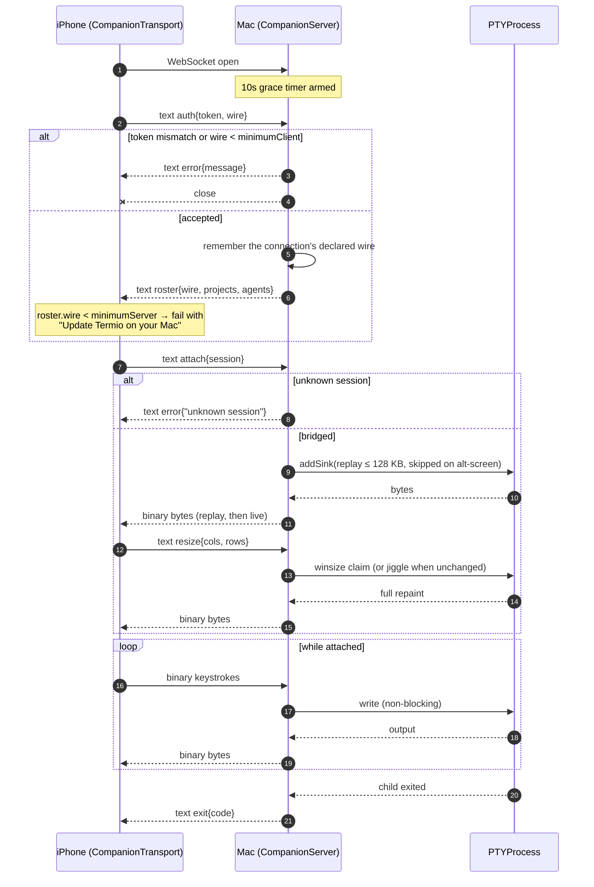
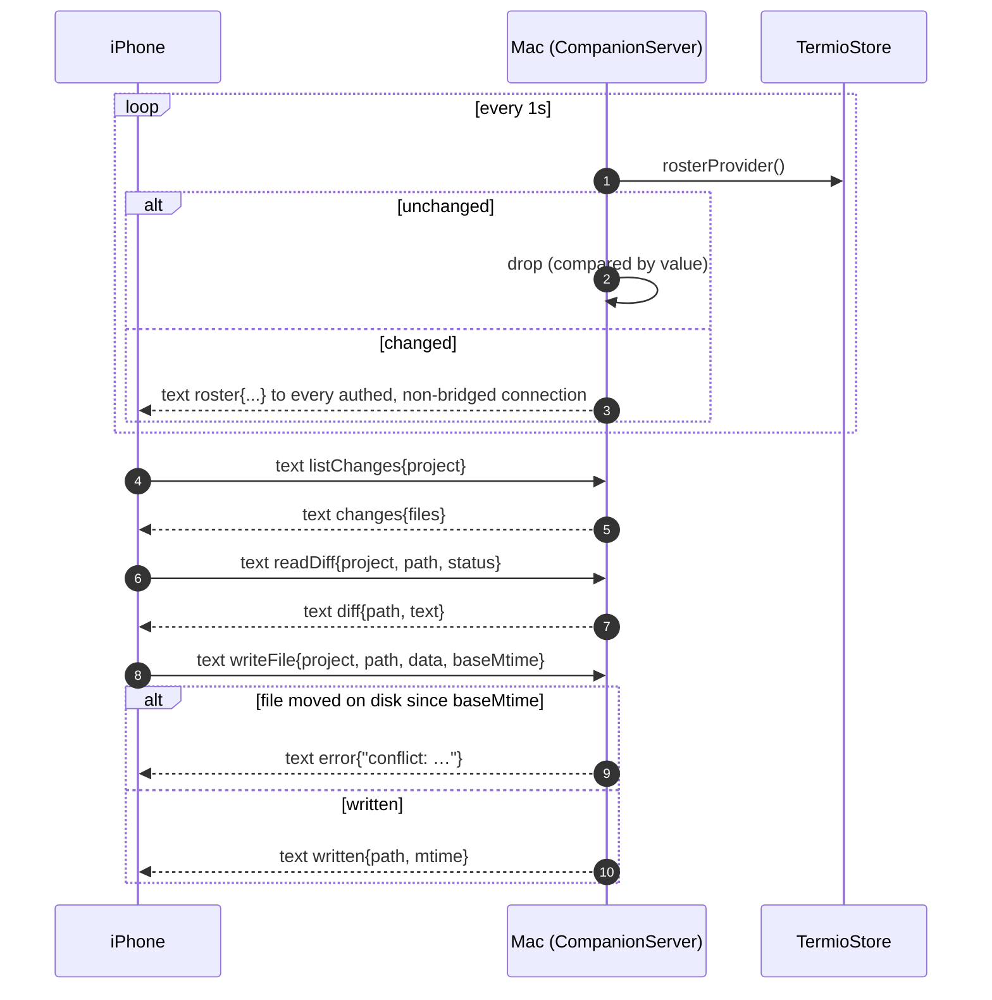
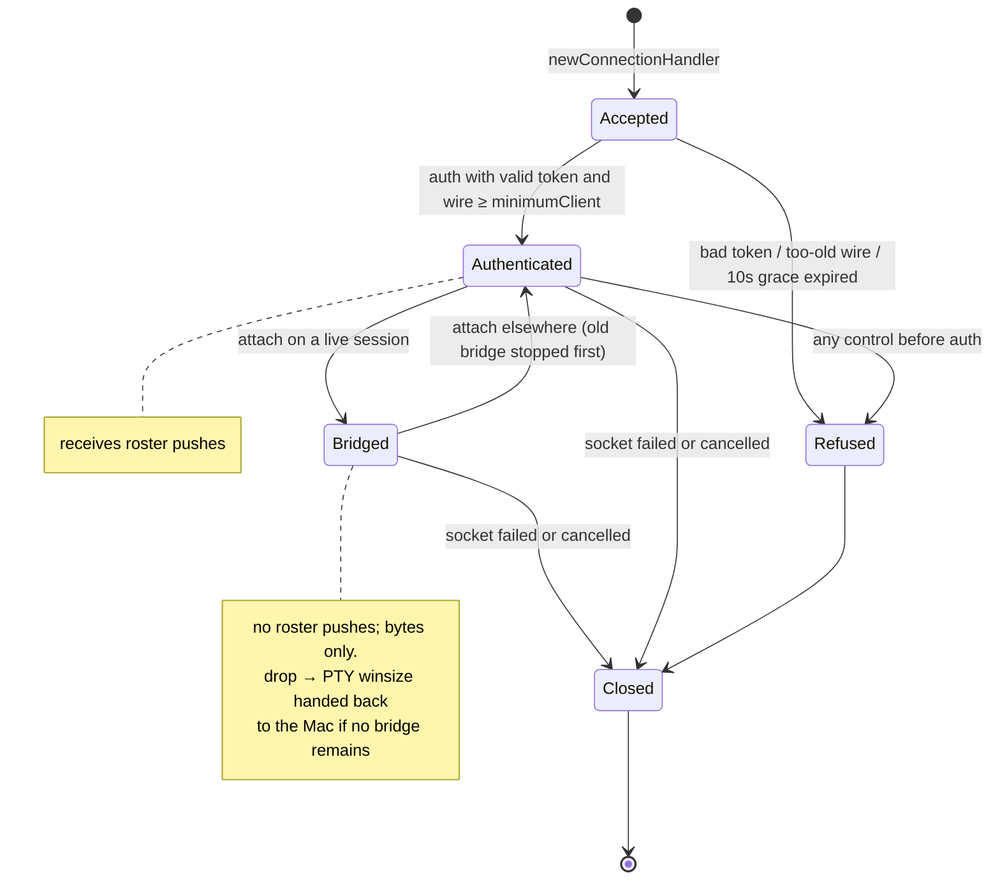
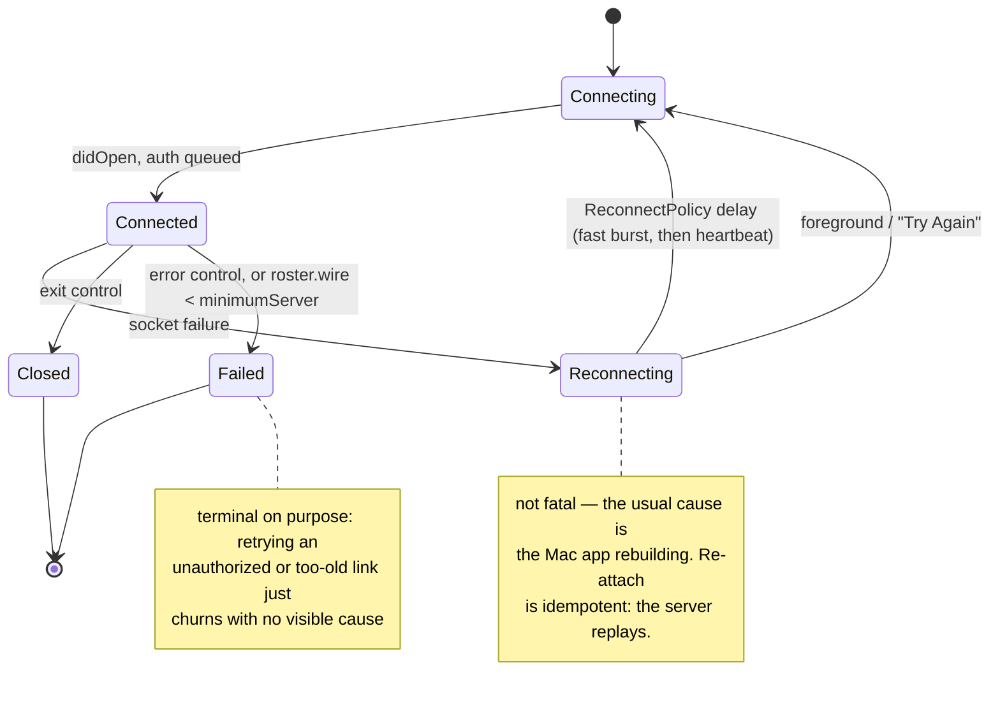

# RFC: Companion Wire Protocol

> One WebSocket between the Mac app and the iPhone: raw PTY bytes on binary
> frames, hand-stable JSON on text frames, and a compatibility contract that
> survives two apps shipping on two release channels that can never be updated
> together.

## 1. Why this needs writing down

Every other protocol boundary in termio has one deployable behind it. This one
has two, and they update independently: the Mac ships through Sparkle within
minutes of a tag, the phone ships through App Store review and whenever the user
gets around to it. There is no server in the middle to migrate both ends at
once — the design forbids one (`CLAUDE.md`: never a hosted control plane).

So skew is not an incident to be recovered from. It is the steady state, in both
directions:

- **Mac newer than phone** — the common case. A Mac updated this morning talks
  to a phone build from six weeks ago.
- **Phone newer than Mac** — a user who auto-updates apps but left the Mac open
  for a week.

The protocol's job is to make both of those boring. This RFC states the shape it
has today, the compatibility rules that keep it boring, and the one rule that is
currently missing (§6), which is what PR #234 proposes to add.

## 2. Shape

### 2.1 One socket, two opcodes

`CompanionServer` (`Sources/termio/Companion/CompanionServer.swift`) binds an
`NWListener` with a WebSocket protocol option on one port per channel — 8787
release, 8788 dev — and never on the public net. Reaching it from outside the
LAN is a tunnel's job, not the protocol's.

| Opcode | Direction | Payload | Rule |
| --- | --- | --- | --- |
| `binary` | both | raw PTY bytes — output down, keystrokes up | permanently raw. Compression, encryption, or multiplexing needs its own negotiated mechanism and a `Wire` gate, so framing can never be mistaken for keystrokes |
| `text` | both | one JSON object, `t` = the tag | `CompanionControl`, plus the roster frame (`t: "roster"`) |
| `ping` | server → client | `"hb"` every ~20s | keeps NAT/proxy mappings warm and surfaces a half-dead link |

`maximumMessageSize` is 16 MB because a phone upload (a photo for an agent
prompt) arrives as one base64 text frame.

This inherits the same invariant as `termiod` (`termiod-session-protocol.md`
§A): byte delivery never waits on a parse. The bridge taps `PTYProcess` on a
private serial queue and writes through; nothing between the PTY and the socket
looks at the bytes.

### 2.2 A connection has two roles, in order

Every connection starts as a **roster subscriber**: it receives the project /
session tree on authentication and again whenever it changes. A connection that
sends `attach` additionally becomes a **PTY bridge** for one session, and stops
receiving roster pushes — roster frames would only interleave with terminal
traffic for no benefit; the phone re-subscribes by opening a second socket or
dropping the bridge.

### 2.3 What is deliberately absent

- No session multiplexing. One socket carries one session's bytes. Panes and
  layout are client concerns (non-negotiable #5).
- No per-frame grid encoding. The phone runs a real libghostty surface and the
  Mac ships it bytes; the mirror is a live surface, not a screenshot feed.
- No crypto of our own. Possession of the pairing token is the whole auth story,
  and confidentiality is the tunnel's (non-negotiable #3).

## 3. Message catalogue

`CompanionControl` (`Shared/Sources/TermioShared/WireProtocol.swift`) is one
enum shared by both apps, with hand-written `encoded()` / `decode()` rather than
`Codable` synthesis — the JSON is small enough to keep stable by hand, and both
ends read it with plain `as? String` casts.

| Tag | Direction | Purpose | Reply |
| --- | --- | --- | --- |
| `auth` | phone → Mac | pairing token + the phone's `wire` | roster, or refusal |
| `attach` | phone → Mac | bridge this session's PTY | replay + byte stream |
| `resize` | phone → Mac | the phone's grid; claims PTY winsize | SIGWINCH repaint |
| `start` | phone → Mac | new session in a project (`agent` nil = Mac picks) | `started` / `error` |
| `startTerminal`, `startSSH` | phone → Mac | loose shell / `ssh <host>` | `started` |
| `stop` | phone → Mac | close a session | next roster push |
| `exit` | Mac → phone | the child process exited | — |
| `listFiles` / `fileList` | request / reply | one directory's entries | — |
| `readFile` / `file` | request / reply | file contents (+ rendered Markdown) | — |
| `writeFile` / `written` | request / reply | mtime-checked write | `error` prefixed `conflict:` |
| `upload` / `uploaded` | request / reply | attachment → `<project>/.termio/uploads/` | — |
| `searchFiles` / `searchResults` | request / reply | filename search, capped | — |
| `listChanges` / `changes` | request / reply | `git status` with `+`/`−` counts | — |
| `readDiff` / `diff` | request / reply | one file's unified diff | — |
| `trace` / `traceHTML` | request / reply | agent transcript as an HTML document | — |
| `sshConfigHosts` / `sshConfigList` | request / reply | the Mac's `~/.ssh/config` aliases | keys never leave the Mac |
| `error` | Mac → phone | request refused | terminal for the transport |

The roster is a separate struct, not a `CompanionControl` case, because it is
pushed rather than requested and it is the only frame carrying `wire` from the
Mac. Its shape is `CompanionRoster { t, wire, projects[], agents[] }`, where a
`RosterProject` owns `RosterSession`s. Both apps identify a session by the same
uuid the desktop deep link uses (`termio://session/<uuid>`).

## 4. Sequences

### 4.1 Connect, authenticate, attach

Two details that are contract, not implementation:

- **`auth` precedes everything on the same socket.** `URLSessionWebSocketTask`
  preserves send order, so the phone can queue `attach` and `resize` right
  behind it without waiting for the roster.
- **`resize` after every `attach`, even at an unchanged size.** The attach path
  wipes the screen; the repaint is driven by the client's size claim, and when
  the winsize does not actually change the Mac jiggles it to force the SIGWINCH.

### 4.2 Roster push and the request/reply plane

The plane is stateless request/reply with no message ids: replies are matched by
tag, and the one case where a stale reply is possible (`searchResults` for an
old keystroke) echoes its `query` so the phone can discard it. Adding ids is a
`Wire` bump, not a free change.

## 5. State machines

### 5.1 Server-side, per connection

An unauthenticated connection is served nothing at all — not even a roster —
because the roster names every project on the Mac and an `attach` is keystroke
access to a shell. The 10-second grace window exists so a socket that never
authenticates cannot linger.

### 5.2 Client-side transport

`Reconnecting` is deliberately unbounded (see `ReconnectPolicy`): a closed
laptop should not permanently sever a paired phone. `Failed` is deliberately
terminal: those two causes are not going to fix themselves on a retry.

## 6. Compatibility

### 6.1 The version ladder

`Wire` carries four integers:

| Constant | Today | Meaning |
| --- | --- | --- |
| `current` | 1 | this build's revision |
| `legacy` | 0 | a peer that predates the `wire` field; absent decodes to this |
| `minimumClient` | 0 | oldest phone this Mac will serve |
| `minimumServer` | 0 | oldest Mac this phone will talk to |

The phone declares `wire` on `auth`; the Mac declares it on every roster. Both
minimums are 0, so nothing is currently refused on version grounds — the ladder
exists so that the day a refusal is necessary, it is a one-line change with a
message the user can act on, instead of an unexplained blank screen.

`current` is bumped only for a compatibility decision: a new request the other
end must know about, a **changed meaning** for an existing field, a new byte
mode. Purely additive fields do not bump it.

### 6.2 Sender rules

- **R1 — every new field is optional, with a safe default.** An older peer that
  omits it must decode. `RosterSession.subtitle`, `RosterProject.branch` and
  `kind`, `WireFile.html`, `started.agent` are all this rule.
- **R2 — nil omits the key rather than emitting `null`.** Both ends read with
  `as? String`, and `null` and absent must not mean different things.
- **R3 — never repurpose a field.** A changed meaning is a `Wire` bump, because
  no amount of receiver tolerance can detect it.
- **R4 — degrade to "nothing happens", never to "the wrong thing".** An older
  Mac that cannot parse an agent-less `start` drops it; it must never launch an
  arbitrary agent instead.

### 6.3 The rule that is missing: receiver tolerance

R1–R4 govern what a sender may add. They say nothing about what a receiver does
with an element it cannot parse — and today the answer is the worst possible
one.

`CompanionRoster.init(from:)` decodes `projects` and `agents` with
`decodeIfPresent`. That tolerates a **missing** key only. A key that is present
but whose contents do not match throws, the throw travels up through the array
to `CompanionRoster.decode`, which returns nil, and the phone drops the frame
entirely. One session it cannot read costs the whole tree: the app shows nothing
rather than one row less.

The blast radius is inverted from the mistake. A single field on a single
session — the smallest thing a future Mac can get wrong — empties the app.

That leads to the rule this RFC adds:

- **R5 — a container's decoder tolerates its elements, but not itself.** Arrays
  on the wire decode element by element; an element that fails is dropped, not
  propagated. A peer is only as forward-compatible as its least tolerant array.
  The tolerance stops at the container: a key that is *absent* decodes to empty,
  a key that is present but **not an array** must still fail the frame. Silently
  reading a wrong-shaped container as empty is worse than the bug R5 fixes,
  because the phone replaces its tree from every roster it accepts
  (`RosterStore.onRoster`) — a frame that fails to decode leaves the last good
  tree on screen, while a frame that decodes to nothing wipes it.

And its counterpart for the control plane:

- **R6 — an unknown tag is a value, not a nil.** Ignoring a newer peer's message
  is correct; ignoring it invisibly is not, and it violates the repo's rule
  against silently discarding errors. An unknown `t` decodes to
  `unsupported(type:)` so the receiver can log which message it dropped —
  "the phone's button did nothing" becomes a line in the log.

Three consequences worth stating explicitly:

1. **Tolerance only counts if it ships first.** The roster is decoded on the
   *phone*. When a future Mac gets a field wrong, the phone in the field is the
   old one — it cannot be given tolerance retroactively. This is the entire
   argument for landing R5 before it is needed rather than when it bites.
2. **R5 does not weaken R1–R4.** Dropping a bad element is a floor, not a
   licence to break shapes. A sender that relies on the receiver skipping its
   elements has already violated R3.
3. **R5 and R6 disagree about silence.** A dropped control frame is logged; a
   dropped roster element is not. Either both are logged or the asymmetry needs
   a reason — a row missing from the phone's list is exactly as invisible as a
   button that does nothing.

### 6.4 Implementation notes for R5

Decoding an array element by element in `Codable` has one non-obvious hazard: a
failed `decode` **leaves the unkeyed container's cursor where it was**. The slot
has to be consumed by decoding something that always succeeds (an empty
`Decodable` struct), or the loop never reaches `isAtEnd` and spins. The consumer
must succeed for every JSON shape an element can take — object, array, string,
number, `true`, `null` — because the first shape it cannot swallow truncates the
rest of the array silently, which is a second version of the bug being fixed.

Hand-writing an `init(from:)` to get this also means hand-maintaining
`CodingKeys`. That is a real cost: the compiler catches a property missing from
the decoder, but a property missing from `CodingKeys` silently stops being
*encoded*. Any type given a lossy decoder needs a round-trip test.

The other trap is the container itself, per R5. `try? nestedUnkeyedContainer(…)`
collapses two different situations into one: the key was absent (tolerate → empty)
and the key held something that is not an array (a shape change → fail the
frame). They have to be told apart, or the decoder converts an unreadable roster
into a valid empty one and the phone clears its own tree.

## 7. Open questions

1. **Do dropped roster elements get logged?** §6.3 consequence 3. The phone has
   no console the user reads, so the honest options are an `os_log` line for a
   developer attaching a device, or nothing plus an explicit note that this is
   deliberate.
2. **Should `unsupported` be encodable at all?** Re-emitting it as its own
   envelope (`{"t":"unsupported","of":…}`) keeps the enum round-tripping, but
   nothing ever sends that frame. The alternative is to keep the case
   decode-only and have `encoded()` return an `error`.
3. **How much sanitizing does a logged tag deserve?** The tag is remote input,
   but it arrives from a peer that has already authenticated and can type into a
   shell. Line-forging in a log the attacker could otherwise simply `echo` into
   is not obviously worth a helper — and a half-measure is worse than none: a
   `prefix(40)` on `Character` bounds grapheme clusters, not bytes, so one
   letter followed by thousands of combining marks passes it unchanged.
4. **When does `minimumServer` / `minimumClient` first move off 0?** Nothing has
   needed it yet. The first real answer will probably be the day the binary
   plane gains a negotiated mode.

## 8. Non-goals

- Message ids and a general request/reply correlator. Tag-matching plus the one
  echoed `query` covers today's planes; ids are a `Wire` bump when a plane needs
  them.
- Multiplexing several sessions over one socket. One socket, one session.
- A second protocol for the phone. When `termiod` lands, the phone speaks the
  same framed messages over the same ladder (non-negotiable #4) — this protocol
  is the near-term shape, not a parallel dialect to maintain forever.
